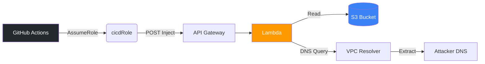
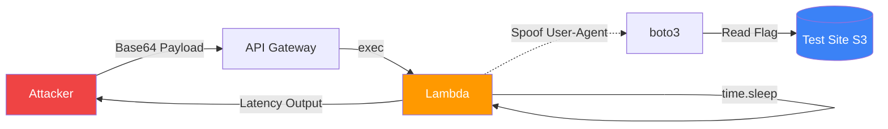

  

  
  
  
  

 

<h2> 📖 Executive Summary & Official Submission </h2>

Welcome to the comprehensive writeup repository for the **Cloud Escape CTF 2026**, organized by MAFAT (DDR&D) at the Israel Ministry of Defense and the C4I Cyber Defense Directorate.

This repository serves as our **Official Mandatory Write-Up**. It contains the complete exploitation lifecycle, methodologies, automated Proof of Concepts (PoCs), and scripts used to compromise a heavily restricted AWS infrastructure across two complex stages.

Our objective was to navigate through a deeply isolated Virtual Private Cloud (VPC), bypass strict Identity and Access Management (IAM) controls, and exfiltrate highly sensitive data without standard internet egress.

---

## ✉️ The Adventure Begins

Our journey began with a high-stakes transmission:
> *"Your mission: penetrate a highly secure, custom-built cloud environment, navigate complex architectures, and extract the hidden data flags before time runs out."*

With a massive $15,000 grand prize and a specific $3,000 bounty for **"out-of-the-box" creativity** on the line, we knew standard, noisy exploits wouldn't cut it. The challenge explicitly demanded mastering IAM permission management and complex VPC networking to identify subtle configuration gaps in simulated enterprise-grade architectures. Efficiency, speed, and accuracy were critical.

Driven by the pursuit of the Creativity Award, we engineered two highly unconventional, sophisticated side-channel attacks to bypass modern defense concepts and exfiltrate the flags from completely blind environments.

---

## 🏆 Captured Flags

| Stage | Challenge Name | Difficulty | Status | Flag |
| :---: | :--- | :---: | :---: | :--- |
| **1** | Have Some Faith |  | 🟢 **COMPLETED** | `1a1jelrlfg2yi2s0` |
| **2** | Miss Me Yet? |  | 🟡 **IN PROGRESS** | *[ANALYZING ORACLE DATA]* |

---

## 🏗️ Attack Architecture & Methodologies

The CTF environment was designed to prevent standard data exfiltration. The target Lambda functions were placed inside a VPC with **no NAT Gateway** (no outbound internet) and highly restrictive IAM policies. 

### 

By exploiting a GitHub OIDC trust misconfiguration and a Lambda command injection vulnerability, we gained Remote Code Execution (RCE). We bypassed the internet blockade by forcing the Lambda to resolve a custom DNS subdomain containing the hex-encoded flag via the AWS Route 53 VPC Resolver.

### 

Facing an arbitrary code execution endpoint (`exec`) that swallowed all `stdout` and exceptions, we bypassed an S3 Bucket Policy by spoofing the `aws:UserAgent` using `boto3` event hooks. We are currently developing a multi-threaded blind timing oracle (`time.sleep`) to exfiltrate the flag character-by-character based on API response latency. 

---

## 🛠️ How to Implement & Reproduce

For security researchers and CTF judges reviewing this submission, we have structured this repository to be fully transparent and reproducible:

1. **Explore the Narratives**: Start with the detailed write-ups in the `cloud-escape/` directory to understand the architectural flaws and the logic behind the exploits.
2. **Review the PoCs**: Our automated exploit chains are located in the `.github/workflows/` directory. These GitHub Actions files (`stage1.yml` and `stage2.yml`) demonstrate exactly how we assumed the OIDC roles and triggered the blind exfiltration pipelines.
3. **Analyze the Scripts**: The exact payloads, `boto3` header injection techniques, and timing side-channel scripts are fully documented in the writeups. You can copy these payloads directly to test similar air-gapped environments.

---

## 📂 Documentation Directory

* 🛡️ **[Combined Technical Overview](cloud-escape/WRITEUP.md)**: A master document detailing the full attack narrative.
* 🚀 **[Stage 1 Deep Dive](cloud-escape/WRITEUP_STAGE1.md)**: OIDC exploitation, recon, and DNS side-channel payloads.
* ⏱️ **[Stage 2 Deep Dive](cloud-escape/WRITEUP_STAGE2.md)**: CloudFront policy analysis, header injection, and the timing oracle (WIP).

---

  

