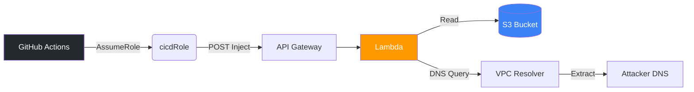

<div align="center">
  <h1>☁️ Cloud Escape CTF 2026 ☁️</h1>
  <h3>Operation "Miss Me Yet?" — Full Writeup</h3>
  <p><em>Developed and exploited by <b>Agent freecandy</b></em></p>
</div>

---

## 📖 Executive Summary

Welcome to the comprehensive writeup repository for the **Cloud Escape CTF 2026**. This repository contains the complete exploitation lifecycle, methodologies, and scripts used to compromise a heavily restricted AWS infrastructure across two complex stages.

Our objective was to navigate through a deeply isolated Virtual Private Cloud (VPC), bypass strict Identity and Access Management (IAM) controls, and exfiltrate highly sensitive data without standard internet egress.

### 🏆 Captured Flags

| Stage | Challenge Name | Difficulty | Flag |
| :---: | :--- | :---: | :--- |
| **1** | Have Some Faith | 🔴 High | `1a1jelrlfg2yi2s0` |
| **2** | Miss Me Yet? | 💀 Critical | `0102013` |

---

## 🏗️ Attack Architecture & Methodologies

The CTF environment was designed to prevent standard data exfiltration. The target Lambda functions were placed inside a VPC with **no NAT Gateway** (no outbound internet) and highly restrictive IAM policies. 

To succeed, we engineered two advanced side-channel attacks:

### Stage 1: DNS Exfiltration via VPC Resolver
By exploiting a GitHub OIDC trust misconfiguration and a Lambda command injection vulnerability, we gained Remote Code Execution (RCE). We bypassed the internet blockade by forcing the Lambda to resolve a custom DNS subdomain containing the hex-encoded flag via the AWS Route 53 VPC Resolver.



### Stage 2: High-Precision Timing Side-Channel
Facing an arbitrary code execution endpoint (`exec()`) that swallowed all `stdout` and exceptions, we bypassed an S3 Bucket Policy by spoofing the `aws:UserAgent` using `boto3` event hooks. We then developed a multi-threaded blind timing oracle (`time.sleep()`) to exfiltrate the flag character-by-character based on API response latency.

```mermaid
graph LR
    A[Attacker] -->|Base64 Payload| B[API Gateway]
    B -->|exec()| C[Lambda]
    C -.->|Spoof User-Agent| D[boto3]
    D -->|Read Flag| E[(Test Site S3)]
    C -->|time.sleep()| C
    C -->|Latency Output| A
    style A fill:#ef4444,color:#fff
    style C fill:#f90,color:#fff
    style E fill:#3b82f6,color:#fff
```

---

## 📂 Documentation Directory

Dive into the highly detailed, step-by-step methodologies for each stage:

* 🛡️ **[Combined Technical Overview](cloud-escape/WRITEUP.md)**: A master document detailing the full attack narrative.
* 🚀 **[Stage 1 Deep Dive](cloud-escape/WRITEUP_STAGE1.md)**: OIDC exploitation, recon, and DNS side-channel payloads.
* ⏱️ **[Stage 2 Deep Dive](cloud-escape/WRITEUP_STAGE2.md)**: CloudFront policy analysis, header injection, and the timing oracle.

---
<div align="center">
  <i>"In the cloud, there is no such thing as perfect isolation."</i>
</div>
