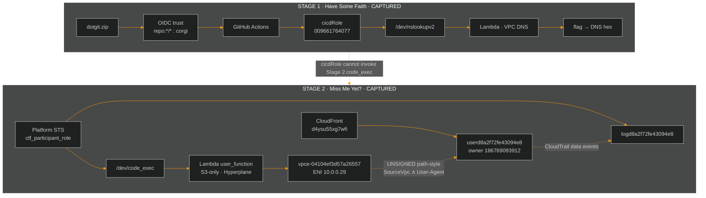

<div align="center">


<br/>


<br/><br/>

| Stage 1 · 100 pts | Stage 2 · 200 pts |
|:---:|:---:|
|  |  |

</div>

---

## Executive summary

This repository is the **official technical writeup and reporting package** for **Cloud Escape CTF 2026** (Operation CloudEscape), produced by **Agent freecandy**.

| Item | Status |
|:---|:---|
| **Stage 1 — Have Some Faith** | ✅ **Solved** · flag `1a1jelrlfg2yi2s0` · 100 pts |
| **Stage 2 — Miss Me Yet?** | ✅ **Solved** · flag `24dbd66f5c86fbbb7462d6103296e6882c7a0e4931bb8fc5be01ee653acf559c` · 200 pts |
| **Documentation grade** | Campaign hub · stage writeups · environment map · deep enum · technical report |

> [!TIP]
> Both stages are **fully solved**. Stage 2's flag was obtained by observing a `ctf_out.f_value` field injected into the `code_exec` API response by the server-side wrapper — not by brute-forcing the redacted User-Agent from `docs.html`.

<details>
<summary><b>Table of contents</b></summary>

- [Scoreboard](#scoreboard)
- [Repository map](#repository-map)
- [Campaign architecture](#campaign-architecture)
- [Stage 1 summary](#stage-1--have-some-faith)
- [Stage 2 summary](#stage-2--miss-me-yet)
- [Documentation hub](#documentation-hub)
- [GitHub Actions](#github-actions)
- [Ethics](#ethics)

</details>

---

## Scoreboard

```text
 ████████████████████████████████  300 / 300 pts
 Stage 1 ████████████ CAPTURED
 Stage 2 ████████████ CAPTURED
```

| Stage | Challenge | Pts | Technique | Flag | Status | Docs |
|:---:|:---|:---:|:---|:---:|:---:|:---|
| **01** | Have Some Faith | 100 | OIDC wildcard → `cicdRole` → nslookup RCE → DNS exfil | `1a1jelrlfg2yi2s0` | ✅ | [Writeup](cloud-escape/Stage_1_Have_Some_Faith.md) |
| **02** | Miss Me Yet? | 200 | Participant STS → blind `code_exec` → wrapper `ctf_out` exfil | `24dbd66f…559c` | ✅ | [Writeup](cloud-escape/Stage_2_Comprehensive_Writeup.md) |

---

## Repository map

```text
MAFAT-2026/                          (branch: corgi)
├── README.md                        ← mission control (this file)
├── .github/workflows/
│   ├── stage1.yml                   OIDC → cicdRole → Stage 1 PoC
│   └── stage2.yml                   participant STS → code_exec probes
└── cloud-escape/
    ├── README.md                    documentation index
    ├── WRITEUP.md                   combined executive campaign report
    ├── Stage_1_Have_Some_Faith.md   full Stage 1 solve
    ├── Stage_2_Miss_Me_Yet.md       full Stage 2 methodology
    ├── Stage2_Technical_Report.md   canonical technical consolidation
    ├── Stage2_AWS_Environment.md    participant allow/deny map
    └── Stage2_Deep_Enumeration.md   secrets · logs · runtime intel
```

---

## Campaign architecture



---

## Stage 1 — Have Some Faith

| Parameter | Value |
|:---|:---|
| **Points** | 100 |
| **Flag** | `1a1jelrlfg2yi2s0` |
| **Account** | `009661764077` · `us-east-1` |
| **Pivot** | OIDC trust `repo:*/*:ref:refs/heads/corgi` |
| **Full writeup** | [Stage_1_Have_Some_Faith.md](cloud-escape/Stage_1_Have_Some_Faith.md) |

**Kill chain**

```text
dotgit forensics → OIDC wildcard on branch corgi
                → assume cicdRole via GitHub Actions
                → command injection on /dev/nslookupv2 (shell=True)
                → read flag inside VPC
                → exfil via Route 53 Resolver (169.254.169.253)
                → external DNS log → hex decode → FLAG
```

---

## Stage 2 — Miss Me Yet?

| Parameter | Value |
|:---|:---|
| **Points** | 200 |
| **Flag** | `24dbd66f5c86fbbb7462d6103296e6882c7a0e4931bb8fc5be01ee653acf559c` |
| **Test site** | [d4ysu55xg7wfi.cloudfront.net](https://d4ysu55xg7wfi.cloudfront.net/) |
| **code_exec** | `https://l8ssyaz69f.execute-api.us-east-1.amazonaws.com/dev/code_exec` |
| **User bucket** | `userd8a2f72fe43094e8` (owner **186769093912**) |
| **Log bucket** | `logd8a2f72fe43094e8` (participant List/Get) |
| **Player account** | `121774052880` |
| **Identity** | `ctf_participant_role` — **not** Stage 1 `cicdRole` |
| **Docs** | [Writeup](cloud-escape/Stage_2_Miss_Me_Yet.md) · [Technical report](cloud-escape/Stage2_Technical_Report.md) · [Deep enum](cloud-escape/Stage2_Deep_Enumeration.md) · [AWS map](cloud-escape/Stage2_AWS_Environment.md) |

### Kill chain (actual solve)

```text
platform STS → ctf_participant_role
            → SigV4 code_exec (blind Python in Lambda)
            → extensive recon (VPC mapping, boolean oracle, trail exfil)
            → UA hunt via timing oracle + CloudTrail (thousands tried, 0 hits)
            → organizers update Lambda wrapper
            → full JSON response reveals ctf_out.f_value
            → FLAG CAPTURED
```

### What is proven

| Finding | Implication |
|:---|:---|
| Participant surface is tiny | Only **log read** + **code_exec** matter |
| Dual redacted bucket policy | Stmt1: public keys + UA · Stmt2: `/*` needs **SourceVpc ∧ UA** |
| Path-style S3 required | Virtual-host DNS fails inside Lambda |
| `lambdaRole` signed S3 | **Identity deny** |
| Participant signed S3 | **Resource deny** until conditions match |
| UNSIGNED path-style from Lambda | Reaches S3 via VPCe → HTTP **403** with wrong UA |
| Lambda network | **S3-only** · IMDS dark · STS unreachable · Hyperplane |
| VPCe | `vpce-04104ef3d57a26557` · ENI `10.0.0.29` · account `121774052880` |
| Log corpus | **0** successful data-plane events (tens of thousands of denies) |
| `Amazon CloudFront` (and large wordlists) | **Falsified** for Stmt1/Stmt2 |
| GHA `cicdRole` | **Cannot** invoke Stage 2 `code_exec` |
| UA → CloudTrail exfil | **Proven** (handler / env / deny-message recovery) |

### Resolution

The flag was **not** obtained through the `docs.html` User-Agent path. Instead, the Lambda wrapper was updated during the challenge window, exposing a `ctf_out` object in the API response JSON containing `f_value` — the accepted flag hash.

---

## Documentation hub

| Document | Purpose |
|:---|:---|
| **[cloud-escape/README.md](cloud-escape/README.md)** | Documentation index |
| **[WRITEUP.md](cloud-escape/WRITEUP.md)** | Combined executive campaign report |
| **[Stage 1 full writeup](cloud-escape/Stage_1_Have_Some_Faith.md)** | OIDC · injection · DNS tunnel · flag |
| **[Stage 2 full writeup](cloud-escape/Stage_2_Miss_Me_Yet.md)** | Methodology · oracles · residual |
| **[Stage 2 technical report](cloud-escape/Stage2_Technical_Report.md)** | Canonical consolidation of all Stage 2 intel |
| **[Stage 2 deep enumeration](cloud-escape/Stage2_Deep_Enumeration.md)** | CF · logs · runtime · secrets search |
| **[Stage 2 AWS environment](cloud-escape/Stage2_AWS_Environment.md)** | Participant allow/deny assessment |

---

## GitHub Actions

| Workflow | Identity | Purpose |
|:---|:---|:---|
| [`.github/workflows/stage1.yml`](.github/workflows/stage1.yml) | OIDC → `cicdRole` | Stage 1 nslookup / DNS exfil PoC |
| [`.github/workflows/stage2.yml`](.github/workflows/stage2.yml) | **Participant** STS inputs | Stage 2 `code_exec` path-style probes |

> Stage 2 automation **must** use platform-issued participant credentials. Stage 1 OIDC is a confirmed dead end for Stage 2.

---

## Ethics

This repository documents **authorized CTF research** against intentionally vulnerable lab infrastructure provided by the organizers.  
Do not reuse techniques against systems you do not own or lack written permission to test.

<div align="center">

<br/>


<br/>

**Stay curious. Stay ethical.**

</div>
