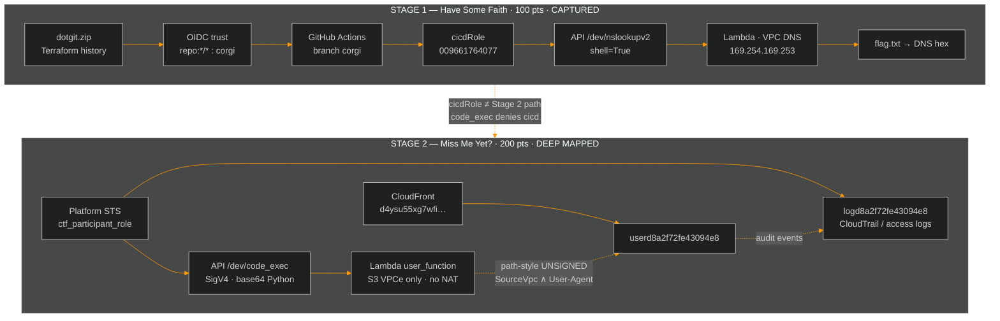

<div align="center">


<br/>


<br/><br/>

| Stage 1 · 100 pts | Stage 2 · 200 pts | Campaign |
|:---:|:---:|:---:|
|  |  |  |

</div>

---

## Mission brief

> [!IMPORTANT]
> Official writeup package for **Cloud Escape CTF 2026** (MAFAT / DDR&D).  
> **Stage 1 is solved and documented.** Stage 2 is fully reconned and policy-mapped; the live flag is **not** captured — never submit the decoy `000000…`.

| | |
|:---|:---|
| **Operator** | Agent freecandy |
| **Scope** | Multi-account AWS · OIDC · Lambda · S3 · VPC endpoints · API Gateway · CloudFront |
| **Repo role** | Public writeups + GHA PoCs on branch `corgi` |
| **Last focus** | Stage 2: participant STS surface, blind `code_exec`, S3 path-style + UA / SourceVpc |

<details>
<summary><b>Table of contents</b></summary>

- [Scoreboard](#scoreboard)
- [Campaign architecture](#campaign-architecture)
- [Stage 1 — Have Some Faith](#stage-1--have-some-faith)
- [Stage 2 — Miss Me Yet?](#stage-2--miss-me-yet)
- [Documentation hub](#documentation-hub)
- [GitHub Actions](#github-actions)
- [Hard rules](#hard-rules)
- [Ethics](#ethics)

</details>

---

## Scoreboard

```text
 ████████████████████░░░░░░░░░░░░  100 / 300 pts
 Stage 1 ████████████ COMPLETE
 Stage 2 ░░░░░░░░░░░░ DEEP MAPPED · FLAG PENDING
```

<div align="center">

| Stage | Challenge | Pts | Primary chain | Flag | Status |
|:---:|:---|:---:|:---|:---:|:---:|
| **01** | [Have Some Faith](cloud-escape/Stage_1_Have_Some_Faith.md) | 100 | OIDC wildcard → `cicdRole` → nslookup RCE → DNS exfil | `1a1jelrlfg2yi2s0` | ✅ **Captured** |
| **02** | [Miss Me Yet?](cloud-escape/Stage_2_Miss_Me_Yet.md) | 200 | Participant STS → blind `code_exec` → S3 via VPCe | — | 🟡 **Mapped** |

</div>

---

## Campaign architecture



---

## Stage 1 — Have Some Faith

<div align="center">

| Parameter | Value |
|:---|:---|
| **Points** | 100 |
| **Flag** | `1a1jelrlfg2yi2s0` |
| **Account** | `009661764077` · `us-east-1` |
| **Pivot** | OIDC wildcard on branch `corgi` |
| **Writeup** | [Stage_1_Have_Some_Faith.md](cloud-escape/Stage_1_Have_Some_Faith.md) |

</div>

**Kill chain**

```text
dotgit forensics  →  OIDC repo:*/*:ref:refs/heads/corgi
                  →  assume cicdRole via GHA
                  →  command injection on /dev/nslookupv2
                  →  read S3 flag inside VPC
                  →  exfil via Route 53 Resolver (169.254.169.253)
                  →  external DNS log → hex decode → FLAG
```

<details>
<summary><b>One-paragraph narrative</b></summary>

Stage 1 started with forensic review of a leaked `.git` archive. An old Terraform commit exposed an IAM OIDC trust policy that accepted any repository on the `corgi` branch. GitHub Actions on that branch assumed `cicdRole`, which could invoke a nslookup Lambda vulnerable to shell injection. Network isolation blocked classic outbound channels, so the flag was encoded into DNS labels and recovered from an external resolver log.

</details>

---

## Stage 2 — Miss Me Yet?

<div align="center">

| Parameter | Value |
|:---|:---|
| **Points** | 200 |
| **Flag** | `[NOT CAPTURED]` — do **not** submit `000000…` |
| **Test site** | [d4ysu55xg7wfi.cloudfront.net](https://d4ysu55xg7wfi.cloudfront.net/) |
| **code_exec** | `…execute-api.us-east-1.amazonaws.com/dev/code_exec` |
| **Buckets** | `userd8a2f72fe43094e8` · `logd8a2f72fe43094e8` |
| **Identity** | `ctf_participant_role` (player STS) — **not** Stage 1 `cicdRole` |
| **Docs** | [Writeup](cloud-escape/Stage_2_Miss_Me_Yet.md) · [Deep enum](cloud-escape/Stage2_Deep_Enumeration.md) · [AWS map](cloud-escape/Stage2_AWS_Environment.md) |

</div>

**Designed chain (current understanding)**

```text
platform STS → ctf_participant_role
            → log-bucket forensics + SigV4 code_exec
            → blind Python inside Lambda (stdout majority-masked)
            → path-style S3 over VPCe (virtual-host DNS fails)
            → satisfy bucket policy Stmt2: SourceVpc AND User-Agent
            → read flag object · confirm via oracle / logs
```

### Surface map (verified)

| Capability | `ctf_participant_role` | `cicdRole` (GHA OIDC) | `lambdaRole` (inside code_exec) |
|:---|:---:|:---:|:---:|
| Invoke Stage 2 `code_exec` | ✅ | ❌ denied | n/a |
| Read log bucket | ✅ | ❌ | limited / via side-channel |
| Direct user-bucket GetObject | ❌ resource deny until conditions | ❌ | identity deny on signed calls |
| S3 path-style from Lambda | n/a | n/a | ✅ required |
| Virtual-hosted S3 from Lambda | n/a | n/a | ❌ DNS fail |

### Key findings

| Finding | Implication |
|:---|:---|
| Participant surface is intentionally tiny | Only **log read** + **code_exec** matter for progress |
| Dual bucket-policy shape | Stmt1: public-ish keys + UA; Stmt2: `/*` needs **SourceVpc ∧ UA** |
| Path-style S3 required in Lambda | Virtual-host style fails DNS inside the function |
| `lambdaRole` signed S3 → identity deny | Prefer unsigned / principal `*` style where policy allows |
| UA can be forced into CloudTrail / access logs | Useful oracle & UA discovery channel |
| **0 successful S3 data events** observed so far | Correct UA (or full condition set) still unknown |
| GHA `cicdRole` cannot invoke Stage 2 | Stage 1 OIDC is **not** the Stage 2 RCE path |

> [!WARNING]
> Stage 2 remains **open**. Deep mapping ≠ flag. Residual work: recover Statement2 `User-Agent` (or equivalent condition) and land a real `GetObject` / flag read from the VPC.

---

## Documentation hub

<div align="center">

| Document | Audience | Contents |
|:---|:---|:---|
| **[cloud-escape/README.md](cloud-escape/README.md)** | Quick nav | Animated stage index |
| **[Stage 1 full writeup](cloud-escape/Stage_1_Have_Some_Faith.md)** | Full solve | OIDC · injection · DNS tunnel · flag |
| **[Stage 2 full writeup](cloud-escape/Stage_2_Miss_Me_Yet.md)** | Methodology | Policy model · oracles · attack plan |
| **[Stage 2 deep enumeration](cloud-escape/Stage2_Deep_Enumeration.md)** | Operators | Secrets · hints · logs · runtime probes |
| **[Stage 2 AWS environment](cloud-escape/Stage2_AWS_Environment.md)** | Mappers | Full allow / deny as participant |
| **[Combined summary](cloud-escape/WRITEUP.md)** | Reviewers | Short campaign narrative |

</div>

```text
MAFAT-2026/
├── README.md                          ← you are here (mission control)
├── .github/workflows/
│   ├── stage1.yml                     OIDC → cicdRole → nslookup PoC
│   └── stage2.yml                     participant STS → code_exec probes
└── cloud-escape/
    ├── README.md                      writeups index
    ├── WRITEUP.md                     combined summary
    ├── Stage_1_Have_Some_Faith.md
    ├── Stage_2_Miss_Me_Yet.md
    ├── Stage2_Deep_Enumeration.md
    └── Stage2_AWS_Environment.md
```

---

## GitHub Actions

| Workflow | Trigger | Identity | Purpose |
|:---|:---|:---|:---|
| [`.github/workflows/stage1.yml`](.github/workflows/stage1.yml) | push / dispatch on `corgi` | OIDC → `cicdRole` | Stage 1 nslookup / DNS exfil PoC |
| [`.github/workflows/stage2.yml`](.github/workflows/stage2.yml) | `workflow_dispatch` + STS inputs | **Participant** temporary creds | Stage 2 `code_exec` probes (not cicdRole) |

> Stage 2 automation **must** use platform-issued participant credentials. Reusing Stage 1 OIDC is a known dead end.

---

## Hard rules

| Rule | Why |
|:---|:---|
| Never submit `00000000000000000000` | Decoy / invalid Stage 2 answer |
| Prefer participant STS for Stage 2 | Only identity that can invoke `code_exec` |
| Use path-style S3 inside Lambda | Virtual-host DNS fails in the isolated VPC |
| Treat stdout as majority-masked | Design around boolean / log / side-channel oracles |
| Document before spraying UA lists | Policy is dual-statement; blind fuzz alone has not unlocked data events |

---

## Ethics

This repository documents **authorized CTF research** against intentionally vulnerable lab infrastructure.  
Do not reuse techniques against systems you do not own or lack written permission to test.

<div align="center">

<br/>


<br/>

**Stay curious. Stay ethical.**

</div>
