<div align="center">
  

  <br/>

  
  
  
  

  <br/><br/>

  
  
  
</div>

---

## Campaign overview

> [!IMPORTANT]
> Official writeup package for **Cloud Escape CTF 2026**. Stage 1 is fully solved and documented. Stage 2 recon is deep-mapped; the live flag is still pending (do **not** submit `000000…`).

<div align="center">

| Stage | Challenge | Pts | Core technique | Status | Docs |
|:---:|:---|:---:|:---|:---:|:---|
| **1** | Have Some Faith | 100 | OIDC wildcard → RCE → DNS exfil | ✅ **Captured** | [Writeup](cloud-escape/Stage_1_Have_Some_Faith.md) |
| **2** | Miss Me Yet? | 200 | Blind code_exec + S3 VPC/UA policy | 🟡 **Mapped** | [Writeup](cloud-escape/Stage_2_Miss_Me_Yet.md) · [Deep enum](cloud-escape/Stage2_Deep_Enumeration.md) |

</div>

---

## Architecture

```mermaid
%%{init: {'theme':'dark', 'themeVariables': { 'primaryColor':'#232F3E','primaryTextColor':'#fff','lineColor':'#F79211','secondaryColor':'#FF9900'}}}%%
flowchart TB
    subgraph S1["Stage 1 — Have Some Faith"]
        GHA["GitHub Actions<br/>branch corgi"]
        OIDC["IAM OIDC Provider"]
        CICD["cicdRole<br/>009661764077"]
        NS["API /dev/nslookupv2"]
        L1["Lambda nslookupv2<br/>VPC + DNS 169.254.169.253"]
        B1["S3 codec…/flag.txt"]
        DNS["External DNS log"]
        GHA --> OIDC --> CICD --> NS --> L1
        L1 --> B1
        L1 --> DNS
    end

    subgraph S2["Stage 2 — Miss Me Yet?"]
        STS["Platform STS<br/>ctf_participant_role"]
        CE["API /dev/code_exec"]
        L2["Lambda user_function<br/>S3 VPCe only"]
        CF["CloudFront test site"]
        BU["userd8a2f72fe43094e8"]
        BL["logd8a2f72fe43094e8"]
        STS --> CE --> L2
        STS --> BL
        CF --> BU
        L2 -.->|path-style UNSIGNED<br/>UA + SourceVpc| BU
        BU -.->|CloudTrail| BL
    end
```



---

## Documentation hub

<div align="center">

| 📘 Document | Description |
|:---|:---|
| **[cloud-escape/README.md](cloud-escape/README.md)** | Animated writeups index |
| **[Stage 1 full writeup](cloud-escape/Stage_1_Have_Some_Faith.md)** | OIDC · injection · DNS tunnel · flag `1a1jelrlfg2yi2s0` |
| **[Stage 2 full writeup](cloud-escape/Stage_2_Miss_Me_Yet.md)** | Methodology · policy · oracles |
| **[Stage 2 deep enumeration](cloud-escape/Stage2_Deep_Enumeration.md)** | Secrets · hints · logs · runtime probes |
| **[Stage 2 AWS env map](cloud-escape/Stage2_AWS_Environment.md)** | Full allow/deny as participant |
| **[Combined summary](cloud-escape/WRITEUP.md)** | Short campaign narrative |

</div>

### Stage 1 result

```text
FLAG = 1a1jelrlfg2yi2s0
```

### Stage 2 status

```text
FLAG = [NOT CAPTURED]
```

> Participant surface is intentionally tiny: **log bucket read** + **code_exec invoke**.  
> Flag path = Lambda VPC + path-style S3 + correct `aws:UserAgent` (Statement2).  
> **cicdRole (GHA OIDC) cannot invoke Stage 2 code_exec** — confirmed.

---

## GitHub Actions

| Workflow | Purpose |
|:---|:---|
| [stage1.yml](.github/workflows/stage1.yml) | OIDC → `cicdRole` → nslookup DNS exfil PoC |
| [stage2.yml](.github/workflows/stage2.yml) | `workflow_dispatch` + **participant STS** → code_exec probes |

---

<div align="center">
  
</div>
