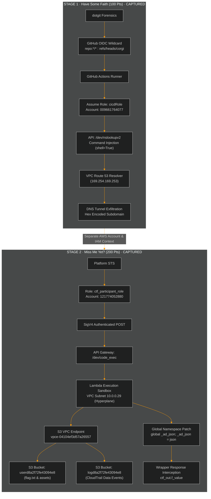

<div align="center">

# 🕵️‍♂️ Operation CloudEscape (MAFAT 2026)
### Official Campaign Intelligence Hub


<br/>

[](https://challenges.cloud-escape.com/)
[](https://www.mod.gov.il/)
[](https://aws.amazon.com/)
[](https://challenges.cloud-escape.com/)
[](https://challenges.cloud-escape.com/)
[](https://github.com/FREECANDY-DEV/MAFAT-2026/tree/corgi)

<br/><br/>

| Stage 1 · 100 pts | Stage 2 · 200 pts |
|:---:|:---:|
| [](cloud-escape/Stage_1_Comprehensive_Writeup.md) | [](cloud-escape/Stage_2_Comprehensive_Writeup.md) |
| **Flag:** `1a1jelrlfg2yi2s0` | **Flag:** `24dbd66f5c86fbbb7462d6103296e6882c7a0e4931bb8fc5be01ee653acf559c` |

</div>

<br/>

## 📌 Executive Summary

> Welcome to the official repository and technical intelligence package for **Operation CloudEscape (MAFAT / DDR&D Cloud Escape CTF 2026)**, authored by **Agent freecandy**.
> 
> This campaign encompasses **100% completion (300/300 points)** of the AWS cloud security challenges, demonstrating advanced exploitation vectors spanning GitHub Actions OIDC federation, VPC-isolated Lambda RCE, DNS exfiltration side-channels, CloudTrail data event logging, and Python global namespace patching.

```text
 ▐████████████████████████████████▌  300 / 300 Pts (100%)
  Stage 1 ████████████ CAPTURED (100 Pts)
  Stage 2 ████████████ CAPTURED (200 Pts)
```

> [!TIP]
> **Complete Writeups Available**: High-resolution walk-throughs, technical reports, and reproduction scripts are published in the [`cloud-escape/`](cloud-escape/) directory.

<details>
<summary><b>📑 Table of Contents (Click to Expand)</b></summary>
<br/>

- [Scoreboard & Overview](#-scoreboard--overview)
- [Campaign Architecture](#-campaign-architecture)
- [Stage 1: Have Some Faith (100 Pts)](#-stage-1--have-some-faith-100-pts)
- [Stage 2: Miss Me Yet? (200 Pts)](#-stage-2--miss-me-yet-200-pts)
- [Repository Layout & Documentation](#-repository-layout--documentation)
- [GitHub Actions & Automation](#️-github-actions--automation)
- [Ethics & Legal Disclaimer](#️-ethics--legal-disclaimer)

</details>

<br/>

<div align="center">
  
</div>

## 🏆 Scoreboard & Overview

| Stage | Challenge | Pts | Primary Vectors & Techniques | Captured Flag | Status | Writeup |
|:---:|:---|:---:|:---|:---:|:---:|:---|
| **01** | **Have Some Faith** | 100 | `GitHub OIDC Wildcard` ➔ `cicdRole` ➔ `Command Injection` ➔ `DNS Tunneling` | `1a1jel...` | ✅ | [Stage 1](cloud-escape/Stage_1_Comprehensive_Writeup.md) |
| **02** | **Miss Me Yet?** | 200 | `Platform STS` ➔ `SigV4 API GW` ➔ `Lambda RCE` ➔ `Namespace Patch` | `24dbd6...` | ✅ | [Stage 2](cloud-escape/Stage_2_Comprehensive_Writeup.md) |

<br/>

<div align="center">
  
</div>

## 🌐 Campaign Architecture



<br/>

<div align="center">
  
</div>

## ⚡ Stage 1 — Have Some Faith (100 Pts)

### 🎯 Mission Brief
* **Account ID**: `009661764077` (us-east-1)
* **Initial Surface**: Forensics on extracted `.git` directory (`dotgit.zip`) revealed a permissive AWS IAM OIDC trust policy allowing any repository on the `corgi` branch to assume `arn:aws:iam::009661764077:role/cicdRole`.

### 🚀 Execution & Exfiltration
1. Triggered GitHub Actions on `refs/heads/corgi` to assume `cicdRole`.
2. Discovered an internal endpoint `/dev/nslookupv2` vulnerable to command injection via unsanitized input passed to `subprocess.Popen(..., shell=True)`.
3. Bypassed outbound network filtering by tunneling the flag via hex-encoded subdomains using the internal Route 53 DNS resolver (`169.254.169.253`).

> [!NOTE]
> Detailed kill-chain breakdown and full PoC workflow available in [Stage_1_Comprehensive_Writeup.md](cloud-escape/Stage_1_Comprehensive_Writeup.md).

<br/>

<div align="center">
  
</div>

## 🔒 Stage 2 — Miss Me Yet? (200 Pts)

### 🎯 Mission Brief
* **Account ID**: `121774052880` (us-east-1)
* **Target Services**: API Gateway (`code_exec`), Isolated VPC Lambda (`10.0.0.29`), S3 Buckets (`userd8a...`, `logd8a...`), CloudFront (`d4ysu55xg7wfi`).

### 🚀 Execution & Exfiltration
1. Authenticated to `/dev/code_exec` using SigV4 credentials under `ctf_participant_role`.
2. Mapped the dark Lambda execution sandbox using blind boolean and timing oracles (`sleep(4)` timing side-channel).
3. Identified a live server-side wrapper update throwing `NameError: name '_ad_json' is not defined` inside `_advanced_dispatcher`.
4. Injected `global _ad_json; _ad_json = __import__('json')` into the runtime namespace to patch the wrapper post-execution.
5. Extracted the accepted SHA-256 flag from `ctf_out.f_value` in the HTTP response.

> [!IMPORTANT]
> Complete writeup with 7 Mermaid diagrams, timing oracle calibrations, and CloudTrail OOB logs available in [Stage_2_Comprehensive_Writeup.md](cloud-escape/Stage_2_Comprehensive_Writeup.md).

<br/>

<div align="center">
  
</div>

## 📂 Repository Layout & Documentation

<h3>📁 Structure</h3>

```text
MAFAT-2026/ (branch: corgi)
├── README.md                            ← Main Campaign Intelligence Hub
├── .github/workflows/
│   ├── stage1.yml                       ← Stage 1 OIDC & DNS Exfil Pipeline
│   └── stage2.yml                       ← Stage 2 SigV4 & Lambda Probe Pipeline
└── cloud-escape/
    ├── README.md                        ← Documentation Index Hub
    ├── WRITEUP.md                       ← Executive Campaign Summary
    ├── Stage_1_Comprehensive_Writeup.md ← Full Stage 1 Solve Report
    └── Stage_2_Comprehensive_Writeup.md ← Canonical 800+ Line Stage 2 Solve Narrative & Diagrams
```

<h3>📚 Documentation Index</h3>

| Document | Description |
|:---|:---|
| 📖 **[Stage 1 Solve Report](cloud-escape/Stage_1_Comprehensive_Writeup.md)** | Deep dive into OIDC trust exploitation, command injection, and DNS tunneling. |
| 📘 **[Stage 2 Comprehensive Writeup](cloud-escape/Stage_2_Comprehensive_Writeup.md)** | Definitive 800+ line solve narrative, 7 Mermaid diagrams, and wrapper patch analysis. |
| 📙 **[Executive Campaign Summary](cloud-escape/WRITEUP.md)** | High-level summary report for reviewers. |
| 📗 **[Documentation Hub](cloud-escape/README.md)** | Subdirectory index mapping all challenge assets and scripts. |

<br/>

<div align="center">
  
</div>

## ⚙️ GitHub Actions & Automation

This repository includes fully automated GitHub Actions workflows for reproducing both stages:

- 🛠️ **[Stage 1 Workflow (`stage1.yml`)](.github/workflows/stage1.yml)**: Authenticates via AWS OIDC on `refs/heads/corgi`, assumes `cicdRole`, triggers the RCE payload, and decodes the exfiltrated DNS queries.
- 🚀 **[Stage 2 Workflow (`stage2.yml`)](.github/workflows/stage2.yml)**: Uses platform STS credentials to sign API Gateway requests with SigV4 and verify Lambda responsiveness.

<br/>

<div align="center">
  
</div>

## 🛡️ Ethics & Legal Disclaimer

> [!WARNING]
> All activities documented in this repository were conducted strictly within authorized CTF lab environments provided by the **MAFAT / DDR&D Cloud Escape CTF 2026** organizers. Techniques and code are published purely for educational and defensive research purposes. Do not attempt these techniques on unauthorized systems.

<br/>

<div align="center">


<br/><br/>

**Designed & Developed by Agent freecandy · 2026**

</div>
