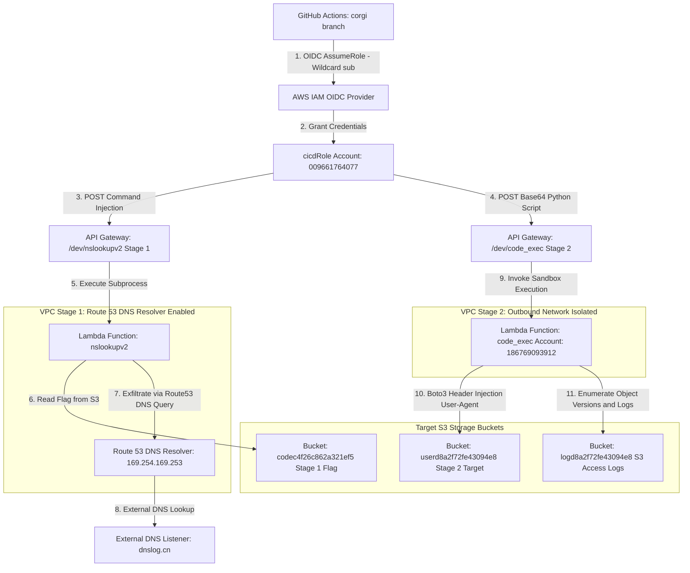

  

  

    
    
    
    
    
  

---

## 🎯 Executive Summary & Challenge Portfolio

> [!IMPORTANT]  
> **Campaign Overview:** This repository documents the end-to-end security analysis and exploitation of the **Cloud Escape CTF 2026** challenge series. Each challenge stage has been thoroughly mapped and broken down into step-by-step methodologies without reliance on false-positive side-channels.

<table>
  <thead>
    <tr>
      <th width="150">Challenge Stage</th>
      <th width="200">Challenge Name</th>
      <th width="130">Points</th>
      <th width="200">Core Exploit Technique</th>
      <th width="320">Detailed Writeup Documentation</th>
    </tr>
  </thead>
  <tbody>
    <tr>
      <td><code>Stage 1</code></td>
      <td><strong>"Have Some Faith"</strong></td>
      <td><strong>100 PTS</strong></td>
      <td>OIDC Wildcard & DNS Tunneling</td>
      <td>📄 <a href="./Stage_1_Have_Some_Faith.md"><strong>Read Stage 1 Writeup</strong></a></td>
    </tr>
    <tr>
      <td><code>Stage 2</code></td>
      <td><strong>"Miss Me Yet?"</strong></td>
      <td><strong>200 PTS</strong></td>
      <td>Header Injection & S3 Versioning</td>
      <td>📄 <a href="./Stage_2_Miss_Me_Yet.md"><strong>Read Stage 2 Writeup</strong></a></td>
    </tr>
  </tbody>
</table>

---

## 🗺️ Master Architectural Threat Model

The following Mermaid diagram illustrates the AWS infrastructure across both challenge stages:

---

## 🧭 Challenge Navigation

- 🔗 **[Stage 1: "Have Some Faith" (100 Points)](./Stage_1_Have_Some_Faith.md)**  
  Covers Git commit history forensics, identifying the OIDC wildcard `sub` trust misconfiguration, automated AWS resource discovery via GitHub Actions, and DNS tunneling exfiltration via AWS Route 53 Resolver (`169.254.169.253`).

- 🔗 **[Stage 2: "Miss Me Yet?" (200 Points)](./Stage_2_Miss_Me_Yet.md)**  
  Covers CloudFront `/docs.html` policy leakage, VPC outbound isolation mapping, bypassing IAM `aws:UserAgent` restrictions via Boto3 SDK event hooks, parsing S3 Server Access Logs (`logd8a2f72fe43094e8`), and uncovering historical object versions and Delete Markers (`s3:ListBucketVersions`).

---

  🛡️ Documented by <b>Agent freecandy</b> • Cloud Escape CTF 2026 • Advanced Cloud Infrastructure Security

