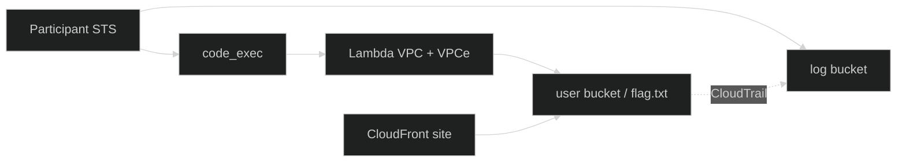

  

  

    
    
    
  

---

## Navigation

<table>
  <tr>
    <td width="50%" valign="top">

### Stage 1 — Have Some Faith
**100 PTS** · Flag **captured**

| Link | What |
|:---|:---|
| [Full writeup](Stage_1_Have_Some_Faith.md) | OIDC wildcard, injection, DNS exfil |
| Flag | `1a1jelrlfg2yi2s0` |

    </td>
    <td width="50%" valign="top">

### Stage 2 — Miss Me Yet?
**200 PTS** · Flag **pending**

| Link | What |
|:---|:---|
| [Full writeup](Stage_2_Miss_Me_Yet.md) | Attack methodology |
| [Deep enumeration](Stage2_Deep_Enumeration.md) | Secrets · hints · logs · runtime |
| [AWS environment map](Stage2_AWS_Environment.md) | Full allow/deny matrix |
| Flag | `[NOT CAPTURED]` |

    </td>
  </tr>
</table>

### Campaign

| Link | What |
|:---|:---|
| [WRITEUP.md](WRITEUP.md) | Combined short narrative |
| [../README.md](../README.md) | Master hub (animated) |

---

## Stage 2 at a glance

| Asset | Value |
|:---|:---|
| Test site | `https://d4ysu55xg7wfi.cloudfront.net/` |
| code_exec | `…/dev/code_exec` |
| User bucket | `userd8a2f72fe43094e8` |
| Log bucket | `logd8a2f72fe43094e8` |

> [!WARNING]
> Do **not** submit `00000000000000000000`.  
> Stage 2 requires **participant STS**, not Stage 1 `cicdRole` OIDC (API denies cicdRole).

---

  

