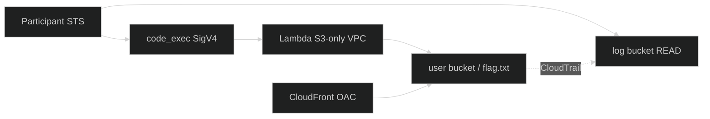

 

---

## How to read this package

| Order | Document | Audience |
|:---:|:---|:---|
| 1 | [../README.md](../README.md) | Everyone — main mission control |
| 2 | [WRITEUP.md](WRITEUP.md) | Reviewers — executive campaign summary |
| 3 | [Stage_1_Comprehensive_Writeup.md](Stage_1_Comprehensive_Writeup.md) | Stage 1 — Full OIDC & DNS solve report |
| 4 | [Stage_2_Comprehensive_Writeup.md](Stage_2_Comprehensive_Writeup.md) | Stage 2 — Full 800+ line solve report & diagrams |

---

## Stage documents

<table>
  <tr>
    <td width="50%" valign="top">

### Stage 1 — Have Some Faith
**100 PTS** · Flag **captured**

| Link | Content |
|:---|:---|
| [Full writeup](Stage_1_Comprehensive_Writeup.md) | OIDC · injection · DNS exfil |
| **Flag** | `1a1jelrlfg2yi2s0` |

    </td>
    <td width="50%" valign="top">

### Stage 2 — Miss Me Yet?
**200 PTS** · Flag **captured**

| Link | Content |
|:---|:---|
| [Full writeup](Stage_2_Comprehensive_Writeup.md) | Attack methodology & wrapper patch |
| **Flag** | `24dbd66f5c86fbbb7462d6103296e6882c7a0e4931bb8fc5be01ee653acf559c` |

    </td>
  </tr>
</table>

---

## Stage 2 at a glance

| Asset | Value |
|:---|:---|
| Test site | `https://d4ysu55xg7wfi.cloudfront.net/` |
| code_exec | `https://l8ssyaz69f.execute-api.us-east-1.amazonaws.com/dev/code_exec` |
| User bucket | `userd8a2f72fe43094e8` (owner `186769093912`) |
| Log bucket | `logd8a2f72fe43094e8` |
| S3 VPCe | `vpce-04104ef3d57a26557` · ENI `10.0.0.29` |

---

## Status legend

| Badge | Meaning |
|:---|:---|
| ✅ Captured | Flag recovered and documented |
| 🟡 Mapped | Surface + policy + network fully understood |
| 🔴 Closed / denied | Path proven non-viable |

  

