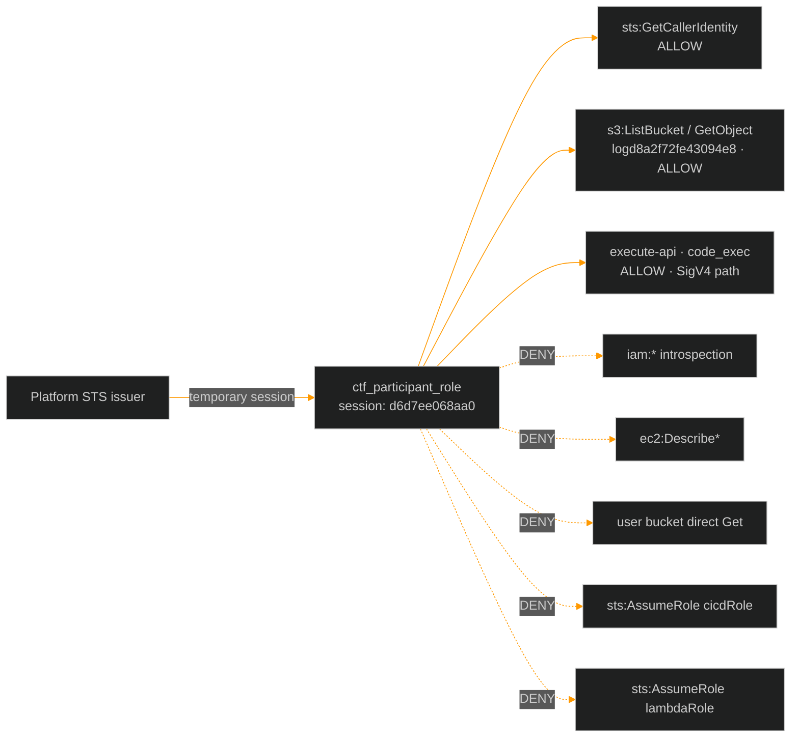
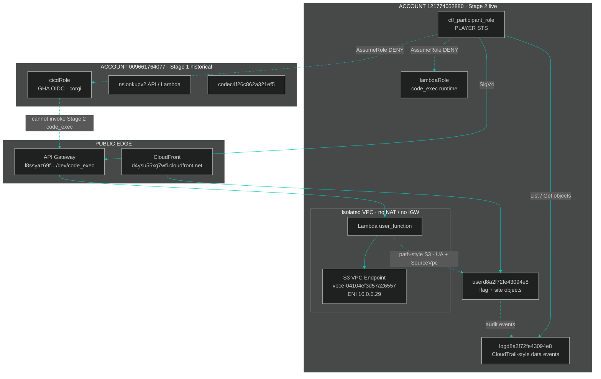
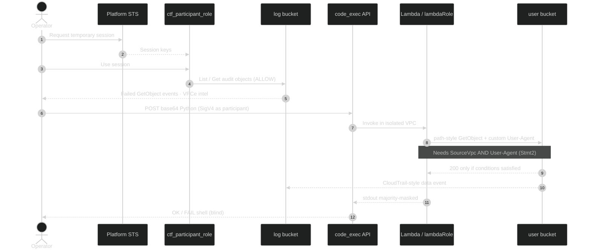
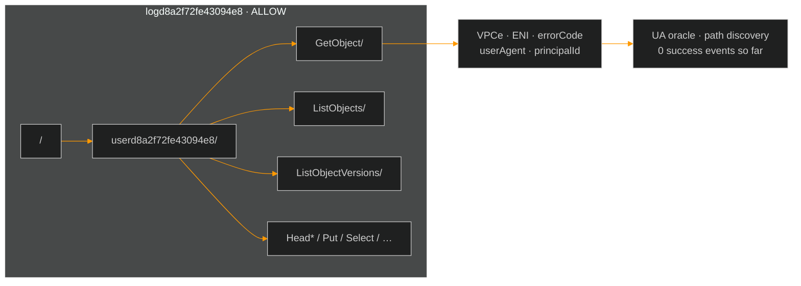
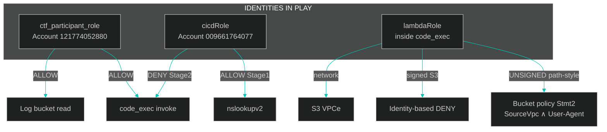

<div align="center">


<br/>


<br/><br/>

| Related docs |
|:---:|
| [Stage 2 writeup](Stage_2_Miss_Me_Yet.md) · [Deep enumeration](Stage2_Deep_Enumeration.md) · [Campaign hub](../README.md) |

</div>

---

## Executive summary

> [!IMPORTANT]
> As `ctf_participant_role`, the AWS control-plane surface is **intentionally minimal**.  
> The only high-value footholds are:
>
> 1. **Read** audit objects in `logd8a2f72fe43094e8`
> 2. **Invoke** Stage 2 `code_exec` via SigV4 (tested separately from this probe matrix)
>
> All IAM introspection, EC2/VPC describe APIs, Lambda listing, CloudFront admin, Secrets Manager, and direct access to the user / Stage 1 buckets are **denied**.

| Field | Value |
|:---|:---|
| **Assessment type** | Live identity-based surface enumeration |
| **Principal** | `arn:aws:sts::121774052880:assumed-role/ctf_participant_role/d6d7ee068aa0` |
| **Caller account** | `121774052880` |
| **Stage 1 account (cross)** | `009661764077` (`cicdRole` — not assumable from here) |
| **Probe result** | **5 ALLOW** · **134 DENY** |
| **Strategic takeaway** | Stage 2 is not an “enumerate AWS and find the flag” challenge — it is a **two-door** problem: logs + blind code_exec |

<details>
<summary><b>Table of contents</b></summary>

- [1. Identity card](#1-identity-card)
- [2. Multi-account topology](#2-multi-account-topology)
- [3. Trust boundaries & data flow](#3-trust-boundaries--data-flow)
- [4. Effective permission model](#4-effective-permission-model)
- [5. S3 access matrix](#5-s3-access-matrix)
- [6. Log-bucket intelligence](#6-log-bucket-intelligence)
- [7. Service-by-service results](#7-service-by-service-results)
- [8. Cross-identity comparison](#8-cross-identity-comparison)
- [9. Attack-surface conclusions](#9-attack-surface-conclusions)
- [10. Appendix — raw STS identity](#10-appendix--raw-sts-identity)

</details>

---

## 1. Identity card



| Attribute | Observed value |
|:---|:---|
| **UserId** | `AROARYWSMSYIPWMOE25U2:d6d7ee068aa0` |
| **Account** | `121774052880` |
| **ARN** | `arn:aws:sts::121774052880:assumed-role/ctf_participant_role/d6d7ee068aa0` |
| **Session style** | Temporary role session (not long-lived IAM user keys) |
| **Can mint new session tokens** | ❌ `sts:GetSessionToken` denied |
| **Can assume Stage 1 `cicdRole`** | ❌ `AccessDenied` (cross-account `009661764077`) |
| **Can assume `lambdaRole`** | ❌ `AccessDenied` (same account) |

---

## 2. Multi-account topology



### Known Stage assets

| Asset | Value | Role in Stage 2 |
|:---|:---|:---|
| **code_exec API** | `https://l8ssyaz69f.execute-api.us-east-1.amazonaws.com/dev/code_exec` | Blind Python RCE foothold |
| **Test site** | [d4ysu55xg7wfi.cloudfront.net](https://d4ysu55xg7wfi.cloudfront.net/) | Public edge · policy leak at `/docs.html` |
| **User bucket** | `userd8a2f72fe43094e8` | Flag + site objects (gated) |
| **Log bucket** | `logd8a2f72fe43094e8` | Participant-readable audit trail |
| **S3 VPCe (from logs)** | `vpce-04104ef3d57a26557` | Dominant source of data-plane attempts |
| **VPCe ENI** | `10.0.0.29` | Private path into S3 from Lambda VPC |
| **Stage 1 API (historical)** | `…/dev/nslookupv2` | Not usable for Stage 2 flag |
| **Stage 1 role** | `arn:aws:iam::009661764077:role/cicdRole` | Separate trust domain |

---

## 3. Trust boundaries & data flow



| Boundary | Crossing allowed? | Notes |
|:---|:---:|:---|
| Internet → CloudFront → public keys | ✅ (with Stmt1 UA) | `index.html`, `docs.html`, image |
| Internet → user bucket as participant | ❌ | Resource / identity deny |
| Participant → log bucket objects | ✅ | Primary recon channel |
| Participant → code_exec | ✅ | Separate SigV4 invoke path |
| Lambda → S3 virtual-hosted | ❌ | DNS failure inside VPC |
| Lambda → S3 path-style via VPCe | 🟡 | Network OK; policy UA still open |
| Participant → `lambdaRole` / `cicdRole` | ❌ | No lateral assume |

---

## 4. Effective permission model

### What this principal can do

```text
 ALLOW surface (probe matrix)
 ┌────────────────────────────────────────────────────────────┐
 │  sts:GetCallerIdentity                                     │
 │  s3:ListBucket   on logd8a2f72fe43094e8                    │
 │  s3:HeadBucket   on logd8a2f72fe43094e8                    │
 │  s3:ListBucket   prefix walk  log…/userd8…/<ApiName>/      │
 │  (+ execute-api invoke code_exec — confirmed outside probe)│
 └────────────────────────────────────────────────────────────┘

 DENY surface (everything else of note)
 ┌────────────────────────────────────────────────────────────┐
 │  iam:* · lambda:List* · apigateway:* · ec2:Describe*       │
 │  cloudfront:List* · logs:* · cloudtrail:* · ssm:*          │
 │  secretsmanager:* · kms:* · dynamodb:* · rds:* · ecs/eks   │
 │  s3:* on user / Stage1 / platform / site buckets           │
 │  sts:AssumeRole · sts:GetSessionToken                      │
 └────────────────────────────────────────────────────────────┘
```

### Permission heat map (by service family)

| Service family | Result | Signal |
|:---|:---:|:---|
| **STS identity** | 🟢 partial | `GetCallerIdentity` only |
| **S3 log bucket** | 🟢 object list/read path | Foothold #1 |
| **S3 user / Stage1 / platform** | 🔴 full deny | No direct flag grab |
| **IAM** | 🔴 full deny | Cannot self-introspect policies |
| **Lambda control plane** | 🔴 deny | Must use API Gateway entry |
| **API Gateway admin** | 🔴 deny | Invoke-only via known URL |
| **EC2 / VPC describe** | 🔴 deny | VPC facts come from **logs + runtime** |
| **CloudFront admin** | 🔴 deny | Public GET only via distribution URL |
| **Secrets / KMS / SSM** | 🔴 deny | No secret store walk |
| **Compute / data plane (ECS, EKS, RDS, DDB)** | 🔴 deny | Out of scope for this identity |
| **execute-api code_exec** | 🟢 (external test) | Foothold #2 |

---

## 5. S3 access matrix

### Bucket-level outcomes

| Bucket | Purpose | `ListBucket` | `HeadBucket` | `GetObject flag.txt` | Verdict |
|:---|:---|:---:|:---:|:---:|:---|
| **`logd8a2f72fe43094e8`** | Audit / data events | ✅ | ✅ | `NoSuchKey` (not present) | **Player log store** |
| **`userd8a2f72fe43094e8`** | Site + flag | ❌ | ❌ 403 | ❌ | **Target — not direct** |
| **`codec4f26c862a321ef5`** | Stage 1 flag store | ❌ | ❌ 403 | ❌ | Historical / out of band |
| **`platform-bucket-009661764077-us-east-1`** | Platform | ❌ | ❌ 403 | ❌ | Cross-account style deny |
| **`site781fe43f26b9eba3`** | Site-related | ❌ | ❌ 403 | ❌ | Denied |

### User bucket — denied control-plane APIs

All of the following returned **AccessDenied / 403** as participant on `userd8a2f72fe43094e8`:

| Category | APIs probed |
|:---|:---|
| Inventory | `ListBucket`, `ListBucketVersions`, `HeadBucket` |
| Policy / ACL | `GetBucketPolicy`, `GetBucketAcl`, `GetBucketOwnershipControls` |
| Config | `GetBucketLocation`, `GetBucketVersioning`, `GetBucketEncryption`, `GetBucketLogging`, `GetBucketTagging`, `GetBucketCORS`, `GetBucketWebsite`, `GetBucketNotification`, `GetPublicAccessBlock` |
| Objects | `GetObject(flag.txt)`, `GetObject(index.html)`, `HeadObject(flag.txt)` |

> Direct participant → user bucket is a dead end. Flag path is **through Lambda + policy conditions**, not through this role’s identity policy.

### Log bucket — allowed vs denied

| Operation | Result | Notes |
|:---|:---:|:---|
| `ListBucket` (root + prefixes) | ✅ | Full API-name tree visible |
| `HeadBucket` | ✅ | Exists + reachable |
| Object GET under known keys | ✅ | Used for forensics (see deep enum) |
| `GetBucketPolicy` / ACL / encryption / … | ❌ | Metadata locked down |
| `GetObject(flag.txt)` | ❌ `NoSuchKey` | Flag is not stored here |

---

## 6. Log-bucket intelligence

Even without EC2 describe rights, the log bucket reconstructs the data-plane topology.

### Prefix taxonomy

```text
s3://logd8a2f72fe43094e8/
└── userd8a2f72fe43094e8/          ← source bucket being audited
    ├── CopyObject/
    ├── GetObject/                 ← majority of events
    ├── GetObjectAcl/
    ├── GetObjectAttributes/
    ├── GetObjectTagging/
    ├── HeadBucket/
    ├── HeadObject/
    ├── ListObjectVersions/
    ├── ListObjects/
    ├── PutObject/
    ├── RestoreObject/
    └── SelectObjectContent/
```



### What the prefixes prove

| Observation | Implication |
|:---|:---|
| Top-level prefix = user bucket name | Logs are **scoped data events** for that bucket |
| API folders mirror S3 API names | Trail is action-oriented (CloudTrail-like layout) |
| Dominant source `vpce-04104ef3d57a26557` | S3 access from Lambda goes through **one VPCe** |
| ENI `10.0.0.29` | Concrete private path / network footprint |
| **0 success-like events** in sampled set | No one (including us) has satisfied Stmt2 yet |

---

## 7. Service-by-service results

### STS

| Probe | Result | Detail |
|:---|:---:|:---|
| `get_caller_identity` | ✅ ALLOW | Full ARN / account |
| `get_session_token` | ❌ DENY | Cannot refresh as IAM user |
| `assume_role(cicdRole)` | ❌ DENY | Cross-account Stage 1 role |
| `assume_role(lambdaRole)` | ❌ DENY | Cannot steal runtime role |
| `get_access_key_info` | ❌ DENY | — |

### IAM

| Probe | Result |
|:---|:---:|
| `ListRoles` / `ListUsers` / `ListPolicies` | ❌ |
| `GetUser` / `GetRole` | ❌ |
| `ListAttachedRolePolicies` / `ListRolePolicies` | ❌ |
| `SimulatePrincipalPolicy` | ❌ |

> No self-service policy dump. Effective rights must be **inferred from allow/deny probes** and challenge leaks (`docs.html`).

### Lambda / API Gateway (control plane)

| Probe | Result |
|:---|:---:|
| `lambda:ListFunctions` | ❌ |
| `apigateway:GET /restapis` | ❌ |
| `apigatewayv2:GetApis` | ❌ |

Invoke of the **known** `code_exec` URL is a separate data path (SigV4) and is **allowed** for this principal.

### EC2 / networking

| Probe | Result |
|:---|:---:|
| `DescribeVpcs` / `Subnets` / `SecurityGroups` | ❌ |
| `DescribeInstances` / `NetworkInterfaces` | ❌ |
| `DescribeVpcEndpoints` / `RouteTables` | ❌ |
| `DescribeNatGateways` / `InternetGateways` | ❌ |

VPC topology is reconstructed from **runtime + logs**, not from describe APIs.

### CloudFront

| Probe | Result |
|:---|:---:|
| `ListDistributions` | ❌ |

Public edge remains available via the known distribution hostname only.

### Other services (smoke — all DENY)

| Cluster | Probes |
|:---|:---|
| **Secrets plane** | SSM parameters/instances · Secrets Manager · KMS |
| **Data plane** | DynamoDB · RDS · SQS · SNS |
| **Containers** | ECS · EKS · ECR |
| **Observability** | CloudWatch Logs · CloudTrail · EventBridge |
| **Delivery / CI** | CloudFormation · CodeBuild · CodePipeline |
| **Identity pools** | Cognito IdP · Cognito Identity |

---

## 8. Cross-identity comparison



| Capability | Participant | cicdRole (GHA) | lambdaRole (runtime) |
|:---|:---:|:---:|:---:|
| Stage 2 `code_exec` invoke | ✅ | ❌ | n/a |
| Log bucket read | ✅ | ❌ | side-channel only |
| Direct user-bucket GetObject | ❌ | ❌ | needs policy conditions |
| Path-style S3 from VPC | n/a | n/a | ✅ required |
| Virtual-hosted S3 from VPC | n/a | n/a | ❌ DNS fail |
| Assume the other roles | ❌ | n/a | n/a |

---

## 9. Attack-surface conclusions

### Design intent (inferred)

The organizers gave the player a **deliberately starved** IAM principal:

1. **Just enough** to read their own audit trail  
2. **Just enough** to enter the blind execution sandbox  
3. **Nothing** that lets them dump infrastructure or self-read policies  

That forces the real puzzle into:

```text
logs  →  learn VPCe / failures / UA artifacts
code_exec  →  act from SourceVpc
bucket policy Stmt2  →  match User-Agent (unknown)
path-style UNSIGNED  →  avoid lambdaRole identity deny + DNS fail
```

### Operator checklist

| # | Action | Status |
|:---:|:---|:---:|
| 1 | Confirm identity with `GetCallerIdentity` | ✅ |
| 2 | Enumerate log prefixes under `userd8a2f72fe43094e8/` | ✅ |
| 3 | Harvest VPCe / ENI / error codes / user agents | ✅ (deep enum) |
| 4 | Stop wasting probes on IAM/EC2/CF admin APIs | ✅ dead |
| 5 | Invoke `code_exec` only with **participant** STS | ✅ required |
| 6 | From Lambda: path-style S3 + UA search | 🟡 residual |
| 7 | Never submit `000000…` | ⚠️ hard rule |

### Bottom line

| Question | Answer |
|:---|:---|
| Can this role own the AWS account? | **No** — nearly total control-plane deny |
| Can this role read the flag directly? | **No** — user bucket denied |
| Can this role still win Stage 2? | **Yes** — via log intel + `code_exec` + policy match |
| Is GHA `cicdRole` a Stage 2 shortcut? | **No** — invoke denied |

---

## 10. Appendix — raw STS identity

<details>
<summary><b>sts:GetCallerIdentity response (200)</b></summary>

```json
{
  "UserId": "AROARYWSMSYIPWMOE25U2:d6d7ee068aa0",
  "Account": "121774052880",
  "Arn": "arn:aws:sts::121774052880:assumed-role/ctf_participant_role/d6d7ee068aa0",
  "ResponseMetadata": {
    "RequestId": "befeeea3-1e4d-47c7-be97-091a558cbe8f",
    "HTTPStatusCode": 200,
    "HTTPHeaders": {
      "x-amzn-requestid": "befeeea3-1e4d-47c7-be97-091a558cbe8f",
      "x-amz-sts-extended-request-id": "MTp1cy1lYXN0LTE6UzoxNzg1ODMxMTkzMDU4OlI6SmZ2eHdKNlk=",
      "content-type": "text/xml",
      "content-length": "451",
      "date": "Tue, 04 Aug 2026 08:13:13 GMT"
    },
    "RetryAttempts": 0
  }
}
```

</details>

<details>
<summary><b>Full deny catalogue (condensed)</b></summary>

**IAM** — `ListRoles`, `ListUsers`, `ListPolicies`, `GetUser`, `ListAttachedRolePolicies`, `ListRolePolicies`, `GetRole`, `SimulatePrincipalPolicy`  

**S3 (non-log buckets)** — full inventory of list/head/get policy/acl/versioning/cors/website/logging/tagging/encryption/ownership/notification + object get/head on `userd8a2f72fe43094e8`, `codec4f26c862a321ef5`, `platform-bucket-009661764077-us-east-1`, `site781fe43f26b9eba3`  

**S3 (log bucket metadata)** — location, policy, acl, versioning, list versions, public access block, cors, website, logging, tagging, encryption, ownership, notification  

**Lambda / API GW** — `ListFunctions`, REST + HTTP API list  

**EC2** — VPCs, subnets, SGs, instances, VPC endpoints, route tables, NAT, IGW, ENIs  

**CloudFront** — `ListDistributions`  

**Other** — SSM, Secrets Manager, KMS, DynamoDB, RDS, ECS, EKS, ECR, SNS, SQS, EventBridge, Logs, CloudTrail, CloudFormation, CodeBuild, CodePipeline, Cognito IdP, Cognito Identity, `sts:GetAccessKeyInfo`

</details>

---

<div align="center">


<br/>

**Cloud Escape CTF 2026 · Stage 2 · Environment assessment**  
Agent freecandy · generated from live participant probes

</div>
