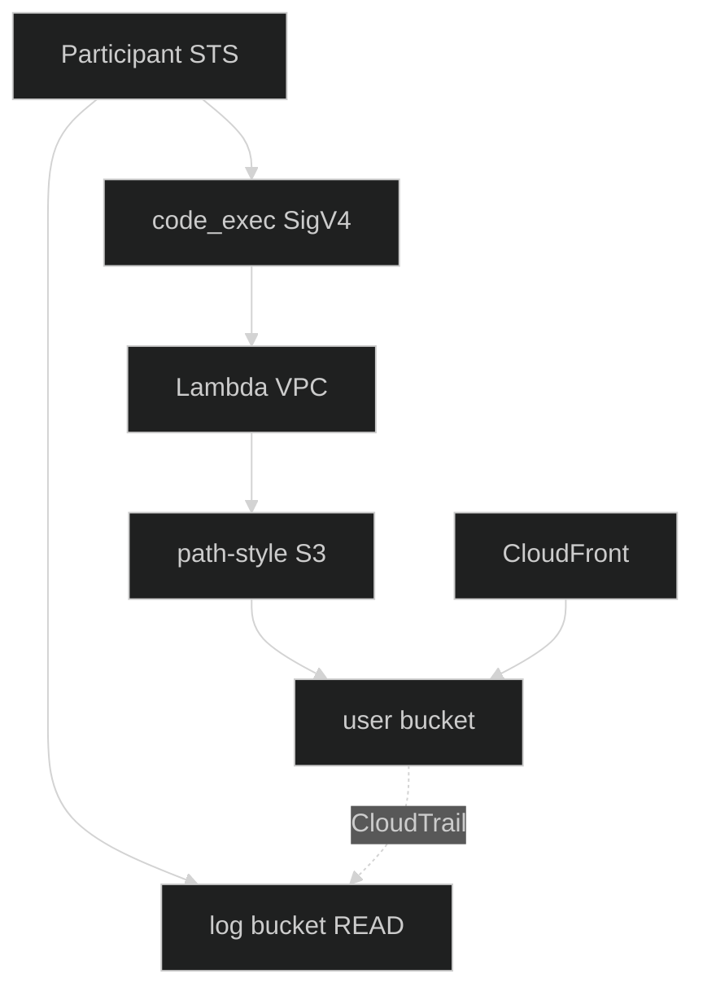

<div align="center">
  

  <p>
    
    
    
  </p>
</div>

---

> [!NOTE]
> Live recon as `ctf_participant_role`. No invented flags. Do **not** submit `000000…`.  
> Canonical consolidation: **[Stage2_Technical_Report.md](Stage2_Technical_Report.md)**.

## Latest network findings (pivot)

| Probe from `code_exec` | Result |
|:---|:---|
| IMDS `169.254.169.254` | **Connection refused** — no `vpc-xxxx` recovery |
| STS endpoint | Unreachable |
| Path-style S3 | Reaches S3 via VPCe → HTTP **403** (wrong UA) |
| Virtual-hosted S3 DNS | Fail |
| Hyperplane | DNS/GW `169.254.100.5` · src `169.254.100.6` · iface `vint_runtime` |
| Log successes | **0** successful data-plane events in large samples |
| Doctrine | Stop blind multi-k UA spray; residual is exact Stmt2 UA |

## Campaign assets

| Asset | Value |
|:---|:---|
| Test site | [`d4ysu55xg7wfi.cloudfront.net`](https://d4ysu55xg7wfi.cloudfront.net/) |
| code_exec | `https://l8ssyaz69f.execute-api.us-east-1.amazonaws.com/dev/code_exec` |
| User bucket | `userd8a2f72fe43094e8` |
| Log bucket | `logd8a2f72fe43094e8` |
| VPCe (logs) | `vpce-04104ef3d57a26557` · ENI `10.0.0.29` |



---

## 1. CloudFront surface

| Path | Status | Size | Note |
|:---|:---:|---:|:---|
| `/` · `index.html` | **200** | 1972 | Narrative + title `???` |
| `/docs.html` | **200** | 3099 | **Leaked dual-statement policy** |
| `/junior_developer.png` | **200** | 3,052,187 | Clean PNG · no post-IEND payload |
| `/flag.txt` | **403** | 263 | Exists / gated (not 404) |
| Other guesses (`.git`, `secret`, `.env`, …) | **404** | — | Missing |

### Site narrative (hints)

> I worked hard on this site, but I had a lot of fun doing it!  
> I made sure not to include any secret information here—pretty sure I deleted it all.

<details>
<summary><b>Leaked bucket policy structure (REDACTED values)</b></summary>

```json
{
  "Version": "2012-10-17",
  "Statement": [
    {
      "Sid": "Statement1",
      "Effect": "Allow",
      "Principal": "*",
      "Action": ["s3:GetObject", "s3:ListBucket"],
      "Resource": ["…/index.html", "…/docs.html", "…/junior_developer.png", "bucket"],
      "Condition": { "StringEquals": { "aws:UserAgent": "REDACTED" } }
    },
    {
      "Sid": "Statement2",
      "Effect": "Allow",
      "Principal": "*",
      "Action": ["s3:GetObject", "s3:ListBucket"],
      "Resource": ["bucket/*", "bucket"],
      "Condition": {
        "StringEquals": {
          "aws:SourceVpc": "REDACTED",
          "aws:UserAgent": "REDACTED"
        }
      }
    }
  ]
}
```

| Field | Observation |
|:---|:---|
| Operators | `StringEquals` only (no `StringLike`) |
| SourceVpce | **Not** in leaked HTML |
| Stmt2 | **AND** of SourceVpc + UserAgent on `/*` (includes flag) |

</details>

---

## 2. Log forensics (sampled ~140 events)

### Layout

```text
logd8a2f72fe43094e8/userd8a2f72fe43094e8/<ApiName>/<timestamp>.json
```

| Metric | Value |
|:---|:---|
| Success-like (no `errorCode`) | **0** |
| Dominant VPCe | `vpce-04104ef3d57a26557` |
| Dominant ENI IP | `10.0.0.29` |

### API mix

| API | Count | API | Count |
|:---|---:|:---|---:|
| GetObject | 80 | SelectObjectContent | 6 |
| ListObjects | 13 | PutObject | 5 |
| ListObjectVersions | 13 | HeadObject | 4 |
| GetObjectAcl / Tagging | 7 each | Copy / Restore / Attr | few |

### Principals

| Count | Principal |
|---:|:---|
| 85 | anonymous |
| 50 | `ctf_participant_role/d6d7ee068aa0` |
| 3 | `lambdaRole/user_function` |
| 1 | CognitoIdentityCredentials |
| 1 | cicdRole/GitHubActions |

### Keys requested

| Count | Key |
|---:|:---|
| 53 | `flag.txt` |
| 45 | `index.html` |
| 2–3 | docs/png/secret probes, put/copy tests |

### Top User-Agents (intel)

| Count | UA |
|---:|:---|
| 27 | `Amazon CloudFront` |
| 13+ | Full Boto3/Botocore strings (Windows/Linux) |
| 6 | `aws-internal/3`, `AWS Internal`, `Python-urllib/3.1x`, empty, narrative tokens |

> Anonymous GetObject with UA `Amazon CloudFront` via VPCe still **Access Denied** → that string is **not** the secret Statement2 UA (or not sufficient alone).

---

## 3. code_exec runtime

| Probe | Result |
|:---|:---|
| Smoke pass / fail | True / False |
| Handler only file, **571 bytes** | True |
| Function name `user_function` | True |
| No FLAG/secret env | True |
| `s3.us-east-1.amazonaws.com` DNS | True |
| `{bucket}.s3…` DNS | **Fails** (use path-style) |
| Path-style UNSIGNED → 403 | True (reaches S3) |
| lambdaRole signed GetObject | **identity** deny |
| Lambda list log bucket | deny |
| IMDS | blocked |

**Handler:** pure `base64` + `exec` sandbox — no embedded UA/flag/bucket secrets.

---

## 4. Secrets & hints board

| # | Finding | Type | Relevance |
|---:|:---|:---|:---|
| 1 | Dual-statement redacted policy | Hint | Stmt1 UA · Stmt2 VPC+UA |
| 2 | “pretty sure I deleted it all” | Hint | Versioning hypothesis |
| 3 | Title `???` | Hint | Possible UA joke/literal |
| 4 | CF `flag.txt` 403 ≠ 404 | Intel | Object exists |
| 5 | Log read + code_exec only | Access | Designed foothold |
| 6 | Path-style required in Lambda | Intel | DNS trap avoided |
| 7 | Do not sign as lambdaRole | Intel | Use UNSIGNED |
| 8 | CF UA ≠ Stmt2 secret | Intel | Falsified under VPCe |
| 9 | cicdRole ≠ Stage2 code_exec | Intel | Use participant STS |
| 10 | 0 success data events | Intel | No free UA leak yet |
| 11 | PNG clean (no stego payload) | Negative | Visual only |
| 12 | Handler has no secrets | Intel | Policy is elsewhere |

---

## 5. Account map

```text
121774052880  participant + lambdaRole
009661764077  Stage1 cicdRole (OIDC corgi) — not Stage2 API
186769093912  user-bucket owner (CloudTrail recipient)
```

---

## 6. Next steps

1. Participant STS → code_exec only  
2. Path-style UNSIGNED `GetObject flag.txt` + recovered UA  
3. Boolean oracle → real flag  
4. Never submit placeholder zeros  

---

<div align="center">
  
</div>
