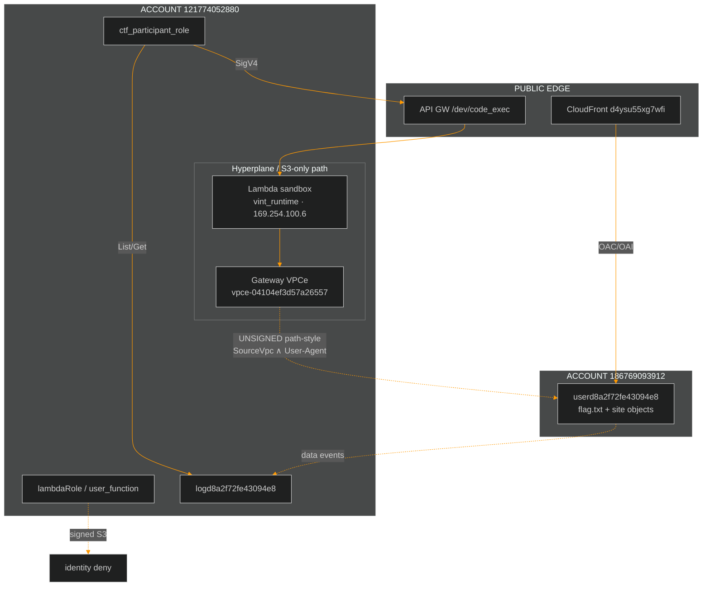

<div align="center">


<br/>


</div>

---

## Document control

| Field | Value |
|:---|:---|
| **Title** | Cloud Escape CTF 2026 — Stage 2 Technical Report |
| **Challenge** | “Miss Me Yet?” |
| **Operator** | Agent freecandy |
| **Role of this file** | Canonical consolidation of all Stage 2 research |
| **Related** | [Writeup](Stage_2_Miss_Me_Yet.md) · [Deep enum](Stage2_Deep_Enumeration.md) · [AWS map](Stage2_AWS_Environment.md) · [Campaign WRITEUP](WRITEUP.md) |
| **Flag status** | **NOT CAPTURED** |

> [!CAUTION]
> Never submit `00000000000000000000` (decoy / false positive).  
> Never invent a flag body that has not been recovered from `GetObject`.

---

## 1. Executive summary

Stage 2 recon is **complete at the infrastructure and policy-taxonomy level**. Multiple independent lines of evidence (participant probes, blind `code_exec`, log forensics, CloudFront analysis, network mapping) converge on a single residual exploit step:

```text
From Lambda VPC via S3 gateway VPCe:
  UNSIGNED + path-style HTTPS
  + aws:SourceVpc match (likely already true)
  + exact aws:UserAgent (UNKNOWN)
  → s3:GetObject flag.txt → HTTP 200
```

Everything else that was tested either:

- is **denied by design** (IAM surface, control plane, lambdaRole identity), or  
- is a **confirmed non-path** (cicdRole, virtual-hosted S3, public Stmt1 UA spoof, CF OAC).

---

## 2. Asset inventory

### 2.1 Public / platform

| Asset | Value |
|:---|:---|
| CloudFront distribution | `https://d4ysu55xg7wfi.cloudfront.net/` |
| code_exec API | `https://l8ssyaz69f.execute-api.us-east-1.amazonaws.com/dev/code_exec` |
| Region | `us-east-1` |
| Participant role | `arn:aws:sts::121774052880:assumed-role/ctf_participant_role/<session>` |
| Participant principalId (logs) | `AROARYWSMSYIPWMOE25U2:…` |

### 2.2 S3

| Bucket | Owner / notes | Participant access |
|:---|:---|:---|
| `userd8a2f72fe43094e8` | Owner / `recipientAccountId` **186769093912** | Data plane denied until Stmt1/2 |
| `logd8a2f72fe43094e8` | Audit trail for user-bucket events | **ListObjectsV2 + GetObject** on log objects |

Log key layout:

```text
userd8a2f72fe43094e8/<ApiName>/<YYYY-MM-DD-HH-MM-SS-ffffff>.json
```

### 2.3 Identities & network

| Item | Value |
|:---|:---|
| Player / Lambda account | `121774052880` |
| User-bucket owner account | `186769093912` |
| Lambda execution role | `lambdaRole/user_function` |
| Lambda principalId | `AROARYWSMSYIHGV6HRCCY:user_function` |
| Function name | `user_function` |
| S3 gateway VPCe | `vpce-04104ef3d57a26557` |
| CloudTrail sourceIP (VPCe path) | `10.0.0.29` |
| VPCe account id (logs) | `121774052880` |
| Stage 1 residual | `cicdRole` @ `009661764077` (not Stage 2 path) |

### 2.4 CloudFront object surface

| Path | Via CF | Notes |
|:---|:---|:---|
| `/`, `/index.html` | **200** | Narrative “test site”; “pretty sure I deleted” |
| `/docs.html` | **200** | Redacted dual-statement policy |
| `/junior_developer.png` | **200** | ~3.0 MB; clean PNG; screen shows same redacted docs |
| `/flag.txt` | **403** | Exists / gated (not 404) |
| Policy-ish keys (`bucket_policy.json`, …) | **404** | Do not exist at origin for OAC |

CF responses include `Server: AmazonS3`, SSE-AES256. Public objects lack useful version ids. Origin auth is almost certainly **OAC/OAI**, not Statement1 UA spoof.

---

## 3. Architecture



---

## 4. Leaked bucket policy structure

From live `docs.html` (values redacted on page; structure intact):

```json
{
  "Version": "2012-10-17",
  "Statement": [
    {
      "Sid": "Statement1",
      "Effect": "Allow",
      "Principal": "*",
      "Action": ["s3:GetObject", "s3:ListBucket"],
      "Resource": [
        "arn:aws:s3:::REDACTED/index.html",
        "arn:aws:s3:::REDACTED/docs.html",
        "arn:aws:s3:::REDACTED/junior_developer.png",
        "arn:aws:s3:::REDACTED"
      ],
      "Condition": {
        "StringEquals": { "aws:UserAgent": "REDACTED" }
      }
    },
    {
      "Sid": "Statement2",
      "Effect": "Allow",
      "Principal": "*",
      "Action": ["s3:GetObject", "s3:ListBucket"],
      "Resource": [
        "arn:aws:s3:::REDACTED/*",
        "arn:aws:s3:::REDACTED"
      ],
      "Condition": {
        "StringEquals": {
          "aws:SourceVpc": "REDACTED",
          "aws:UserAgent": "REDACTED"
        }
      }
    }
  ]
}
```

| Observation | Detail |
|:---|:---|
| Operators | `StringEquals` only (no `StringLike` in leak) |
| Stmt2 | **AND** of SourceVpc + UserAgent on `/*` (includes `flag.txt`) |
| SourceVpce | **Not** present in leaked HTML |
| Live ETag of docs | Stable since 2026-07-29 (`ea5850c0e504e2e3dadbd78af26e34ee`) |

---

## 5. code_exec sandbox

| Property | Value |
|:---|:---|
| Success body | `{"result":"Code executed successfully"}` |
| Failure body | `{"error":"Something went wrong!"}` |
| Handler | `/var/task/lambda_function.py` only |
| Behaviour | base64-decode event `code` → `exec` |
| Embedded secrets | **None** (no flag, UA, boto3 in handler) |
| `/opt` | Empty (no layers) |
| Timeout | ~15 s practical budget for probes |
| Stdout | Majority-masked / not returned for payload prints |

**Oracle rule:** majority vote on exact OK/FAIL bodies; ignore junk multi-tenant responses.

---

## 6. Network reality inside Lambda

| Target | Result from code_exec |
|:---|:---|
| IMDS `169.254.169.254` | Connection **refused** — no `vpc-xxxx` |
| STS endpoint | Unreachable |
| Virtual-hosted S3 DNS | Fail (`OSError` / busy) |
| Path-style `s3.us-east-1.amazonaws.com` | **OK** → HTTP 403 with wrong UA |
| Dualstack / `s3.amazonaws.com` | Fail |
| DNS | `169.254.100.5` · search `ec2.internal` |
| Process view | iface `vint_runtime` only · UDP src `169.254.100.6` |

**Implication:** the function is an **S3-only prison** behind a gateway VPC endpoint. Classic “read VPC id from IMDS” does not work.

---

## 7. Authorization taxonomy

| Caller | Network | S3 style | Typical outcome |
|:---|:---|:---|:---|
| `lambdaRole` | VPCe | signed path | **Identity** AccessDenied |
| `ctf_participant_role` | outside VPC | signed | **Resource** AccessDenied |
| `ctf_participant_role` | inside Lambda | signed path | **Resource** AccessDenied |
| Principal `*` UNSIGNED | VPCe | path-style | HTTP **403** (conditions) |
| Principal `*` UNSIGNED | public IP | path/virtual | HTTP **403** |
| `cicdRole` | GHA | n/a | **Cannot invoke** Stage 2 code_exec |

### Recovered deny message (participant, path-style)

```text
User: arn:aws:sts::121774052880:assumed-role/ctf_participant_role/<session>
is not authorized to perform: s3:ListBucket
on resource: "arn:aws:s3:::userd8a2f72fe43094e8"
because no resource-based policy allows the s3:ListBucket action
```

(AWS surfaces GetObject failures with ListBucket-style wording when policy evaluation fails this way.)

### Cross-account evaluation model

```text
Signed principal needs:  identity ALLOW  AND  resource ALLOW
UNSIGNED / Principal *:  resource ALLOW only
  → Statement2: SourceVpc + UserAgent

lambdaRole:  fails identity first
participant: passes identity, fails resource conditions
UNSIGNED@VPCe: identity N/A, fails resource conditions (wrong UA / SourceVpc)
```

---

## 8. Log forensics summary

| Metric | Observed |
|:---|:---|
| Peak corpus size | Tens of thousands of objects (multi-solver flood) |
| Successful data-plane events (`errorCode` absent) | **0** in full/miner samples |
| Dominant VPCe | `vpce-04104ef3d57a26557` |
| Dominant private IP | `10.0.0.29` |
| Dominant API | `GetObject` |
| Principals | mostly `AWSAccount:anonymous`, then participant, then `lambdaRole` |

**Operational note:** `ListObjectsV2` is lexical. Using only `MaxKeys` without `StartAfter` near “now” returns the **oldest** window. Always jump near current UTC minute prefixes when hunting live markers.

---

## 9. Exfiltration & oracle toolkit

| Channel | Use |
|:---|:---|
| Boolean OK/FAIL | Assert HTTP 200 / ClientError class / substring in deny |
| UA-exfil | Set `User-Agent` to `MARKER+offset+chunk` on deliberate denied GetObject; read newest log objects |
| Handler recovery | Hex or base32 chunks of `/var/task/lambda_function.py` via UA-exfil |
| Message recovery | Participant ClientError Message → UA chunks → reassemble |

These channels are **proven** even though the flag is not.

---

## 10. Exhausted / falsified approaches

| Approach | Result |
|:---|:---|
| Literal `Amazon CloudFront` (+ case/space/bracket variants) | Fail Stmt1 & Stmt2 |
| Narrative / docs / PNG strings as UA | Fail |
| Large deliberate lists + log-mined UAs (1k–10k+) | Fail |
| ffuf Statement1 from public internet (thousands) | 0 HTTP 200 |
| Stage 1 cicdRole as Stage 2 RCE | API deny |
| Expect CF 200 to reveal Stmt1 UA | OAC/OAI, not UA |
| Expect current docs.html to un-redact | ETag stable |
| Common backup keys for raw policy | CF 404 · Lambda 403 |
| IMDS VPC id recovery | Connection refused |

**Doctrine change:** further blind dictionary UA spray is low value without new intelligence.

---

## 11. Residual problem (precise)

| Unknown | Status |
|:---|:---|
| Statement2 `aws:UserAgent` exact string | **Unknown** |
| Statement2 `aws:SourceVpc` exact `vpc-…` | **Unknown** (likely matches VPCe VPC, unproven) |

**Success procedure once UA known (and SourceVpc matches):**

```python
# inside code_exec
import urllib.request
url = "https://s3.us-east-1.amazonaws.com/userd8a2f72fe43094e8/flag.txt"
req = urllib.request.Request(url, headers={"User-Agent": "CORRECT_VALUE"})
body = urllib.request.urlopen(req, timeout=5).read()
# then boolean char oracle OR UA-exfil body to log bucket
```

---

## 12. Recommended next work (high signal only)

1. External / organizer intel for UA or VPC id  
2. Any new policy leak plane (misconfig, version, secondary site)  
3. Continuous log watch for the **first** non-`AccessDenied` GetObject (steal UA from `userAgent`)  
4. On first HTTP 200: recover flag → update this report’s flag field  

---

## 13. Ethics & scope

Authorized Cloud Escape CTF lab only. No production systems. No invented flags.

<div align="center">

**Agent freecandy · Cloud Escape CTF 2026 · Stage 2 Technical Report**

</div>

### 14. Latest Additions (Final Recon)

1. **Local environment networking**: Attempts to reach port 2000 (X-Ray daemon) at 169.254.100.1 and other local network meta-services from the Lambda resulted in Connection refused. The execution environment is completely isolated from all local metadata endpoints (no IAM role credential exfiltration via 169.254.170.2 or 169.254.169.254).
2. **Internal Credential tests**: Attempting to use the ctf_participant_role credentials directly *inside* the Lambda environment using oto3 to perform s3:ListBucket or s3:GetObject still returns AccessDenied due to the resource-based policy conditions (Statement2) not being met by the AWS Python SDK's default User-Agent.
3. **Session Expiry**: The ctf_participant_role credentials expire every 1 hour, requiring fresh credentials from the challenges platform to continue executing scripts via the API Gateway.
