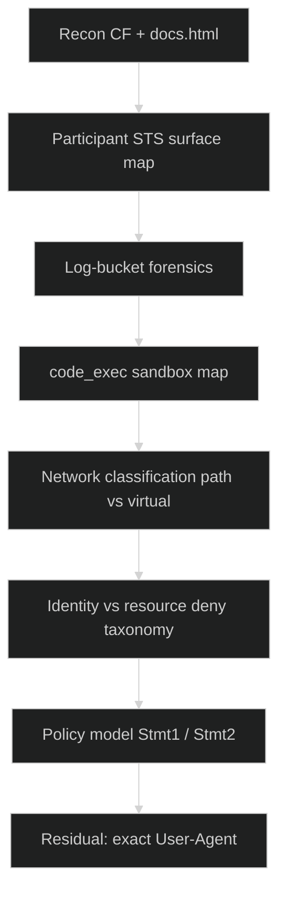
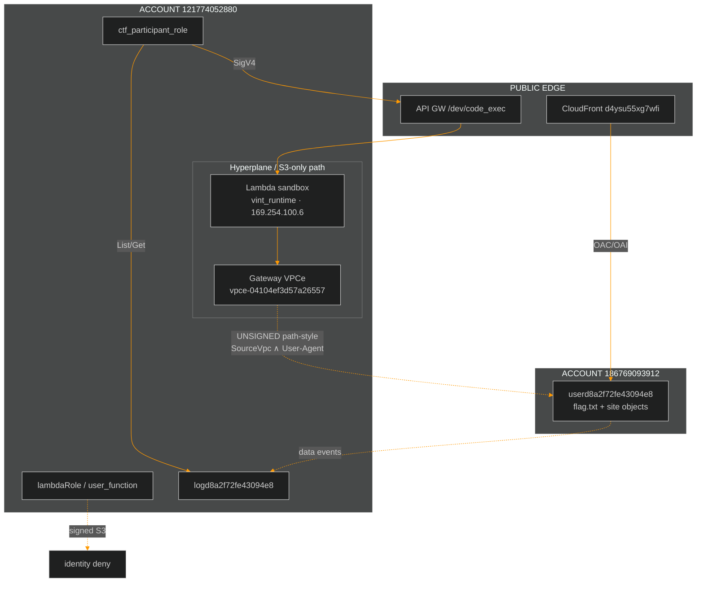
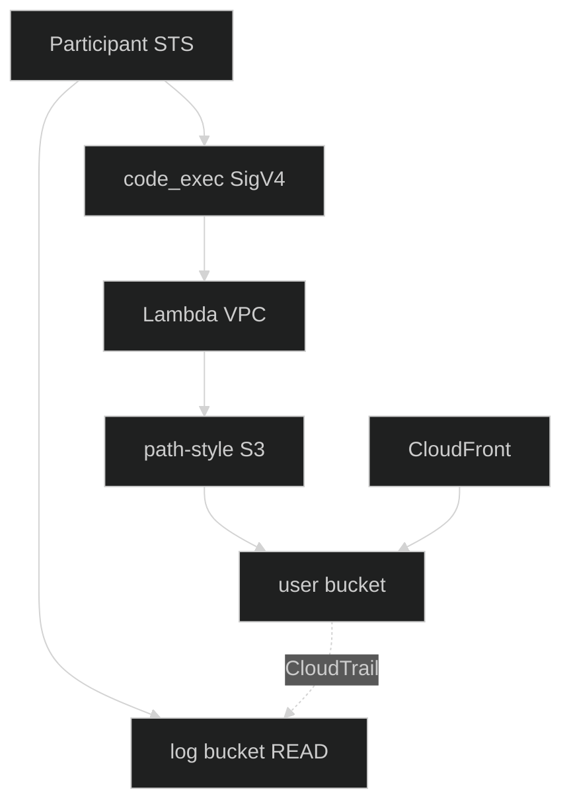
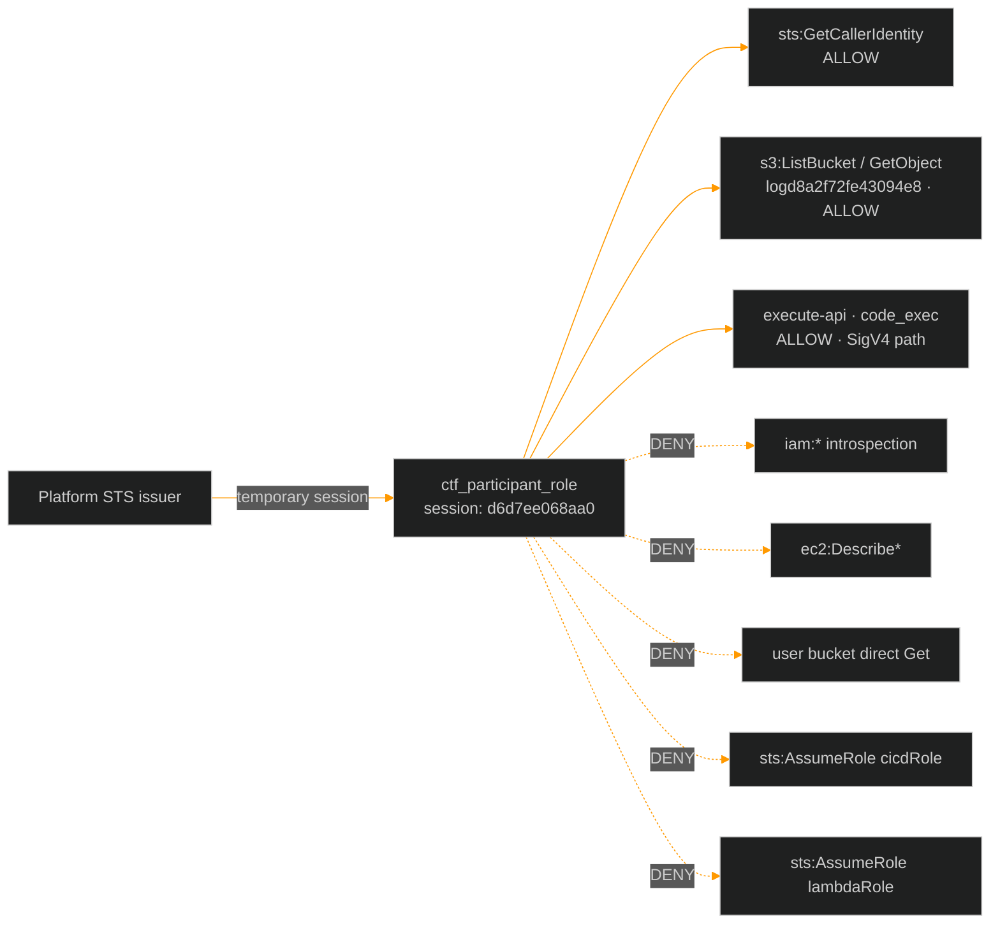
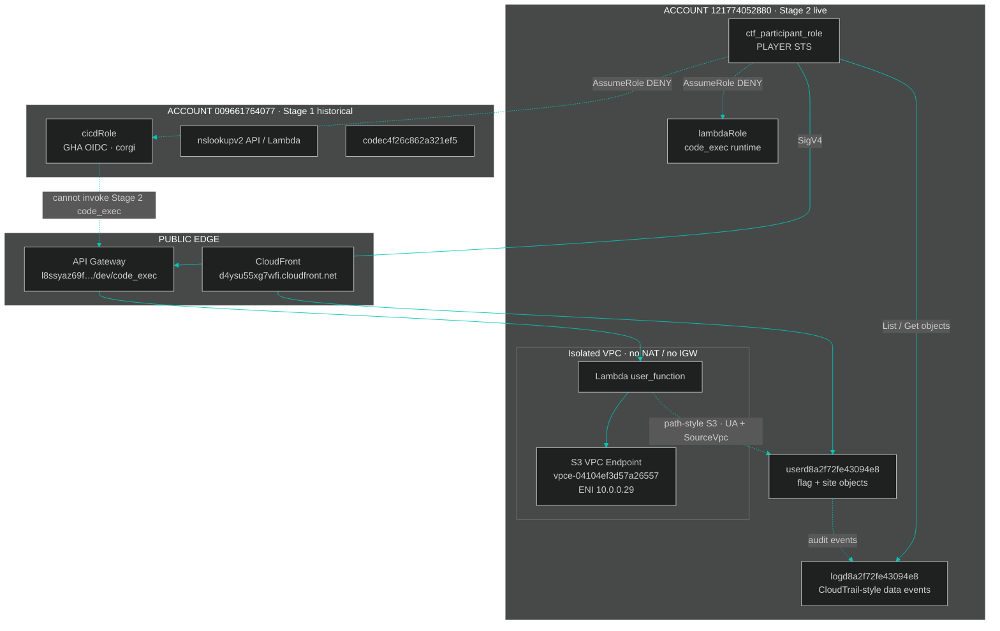
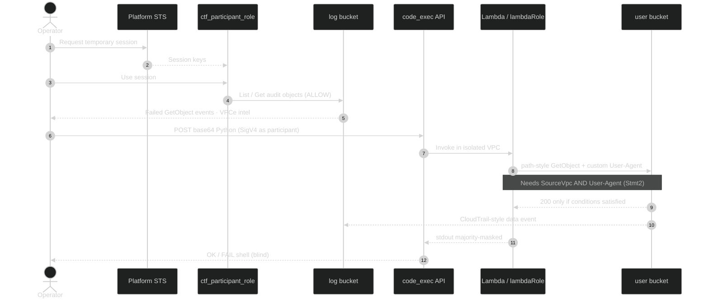
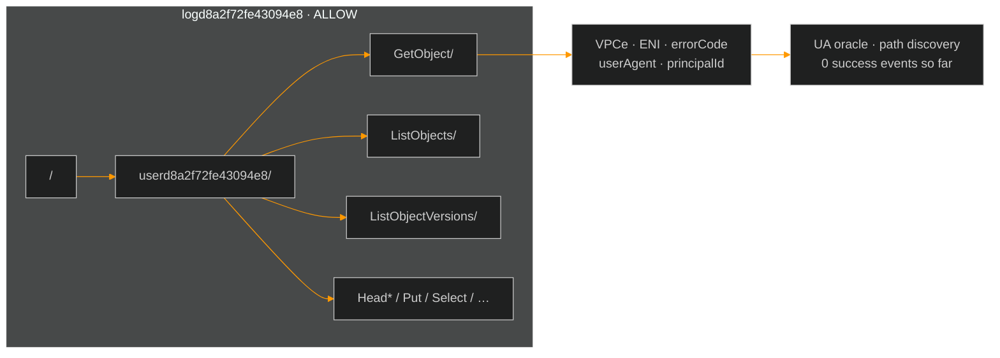
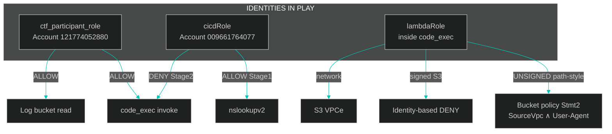

<div align="center">


<br/>


</div>

---

> This is a unified, comprehensive report generated from all previous Stage 2 documentation (Technical Report, Deep Enumeration, AWS Environment, and Writeup).


# Stage 2 Miss Me Yet

> Companion docs: [Technical report](Stage2_Technical_Report.md) · [Deep enumeration](Stage2_Deep_Enumeration.md) · [AWS environment](Stage2_AWS_Environment.md) · [Campaign report](WRITEUP.md)

## 1. Challenge profile

| Parameter | Value |
|:---|:---|
| **Name** | Miss Me Yet? — Stage 2 |
| **Points** | 200 |
| **Flag** | `[NOT CAPTURED]` |
| **Public test site** | https://d4ysu55xg7wfi.cloudfront.net/ |
| **Execution API** | `https://l8ssyaz69f.execute-api.us-east-1.amazonaws.com/dev/code_exec` |
| **User bucket** | `userd8a2f72fe43094e8` |
| **Log bucket** | `logd8a2f72fe43094e8` |
| **Participant role** | `ctf_participant_role` (temporary STS) |
| **Do not submit** | `00000000000000000000` |

### Briefing (paraphrased)

A developer left: (1) a CloudFront test site, (2) a Lambda reachable via API Gateway inside a restrictive VPC whose only outbound channel is an S3 endpoint, (3) two S3 buckets. Operators receive temporary STS and must recover the stage flag.

---

## 2. Methodology overview



---

## 3. Step-by-step methodology

### STEP 01 — CloudFront recon

| Path | Result |
|:---|:---|
| `/index.html` | 200 — narrative test site |
| `/docs.html` | 200 — **leaked policy structure** (values REDACTED) |
| `/junior_developer.png` | 200 — selfie; laptop shows same redacted docs |
| `/flag.txt` | **403** (not 404) |

Public HTML/PNG are served via **OAC/OAI** (SigV4 origin), not by spoofing Statement1 User-Agent from the open internet.

### STEP 02 — Participant surface

As `ctf_participant_role`:

| Allowed | Denied (examples) |
|:---|:---|
| `sts:GetCallerIdentity` | IAM introspection |
| Log bucket List/Get objects | User-bucket GetObject / List |
| Invoke Stage 2 `code_exec` (SigV4) | EC2/VPC Describe*, Lambda List*, Secrets, … |
| | `sts:AssumeRole` to `cicdRole` / `lambdaRole` |

Full matrix: [Stage2_AWS_Environment.md](Stage2_AWS_Environment.md).

### STEP 03 — code_exec protocol

```http
POST /dev/code_exec
Content-Type: application/json
Authorization: AWS4-HMAC-SHA256 … execute-api …

{"code":"<base64 python>"}
```

| Response | Meaning |
|:---|:---|
| `{"result":"Code executed successfully"}` | No uncaught exception |
| `{"error":"Something went wrong!"}` | Exception / failed assert |

Stdout is not a reliable data channel. Use **boolean asserts** and/or **User-Agent → log bucket** exfil.

### STEP 04 — Network classification (critical)

| Access style | From Lambda | Result |
|:---|:---|:---|
| Virtual-hosted `bucket.s3…` | Yes | DNS / connection **fail** |
| Path-style `s3.us-east-1.amazonaws.com/bucket/key` | Yes | Reaches S3 → **403** if UA wrong |
| Dualstack / `s3.amazonaws.com` | Yes | Fail |
| IMDS / STS | Yes | **Unreachable** |

Lambda is effectively **S3-only** (gateway VPCe). Prefer:

```python
# path-style
url = "https://s3.us-east-1.amazonaws.com/userd8a2f72fe43094e8/flag.txt"
req = urllib.request.Request(url, headers={"User-Agent": CANDIDATE})
```

or boto3 with `endpoint_url="https://s3.us-east-1.amazonaws.com"` and `addressing_style="path"`.

### STEP 05 — Authorization taxonomy

| Principal | Signed? | Outcome |
|:---|:---:|:---|
| `lambdaRole` | Yes | **Identity** AccessDenied |
| `ctf_participant_role` | Yes | **Resource** AccessDenied (conditions) |
| `*` UNSIGNED via VPCe | No | HTTP 403 until Stmt2 matches |

**Prefer UNSIGNED path-style** so only the bucket resource policy applies (Principal `*`).

### STEP 06 — Log forensics

```text
s3://logd8a2f72fe43094e8/userd8a2f72fe43094e8/<Api>/<timestamp>.json
```

| Finding | Value |
|:---|:---|
| Successful GetObject events | **0** in large samples |
| VPCe | `vpce-04104ef3d57a26557` |
| ENI IP in trail | `10.0.0.29` |
| Use for exfil | Force denied GetObject with custom UA; read back as participant |

List is lexical — use `StartAfter` near current UTC time when hunting live markers.

### STEP 07 — Policy model

Statement2 (flag path):

```text
Allow Principal *
  s3:GetObject, s3:ListBucket
  on bucket + bucket/*
  when StringEquals:
    aws:SourceVpc = <REDACTED vpc-…>
    aws:UserAgent = <REDACTED string>
```

Statement1 covers only public site keys + UA (and is not how CloudFront serves objects under OAC).

### STEP 08 — Residual exploit

```text
[MISSING] exact Statement2 User-Agent
[LIKELY]  SourceVpc already satisfied for VPCe traffic
[BLOCKED] IMDS VPC id recovery (connection refused)

THEN:
  UNSIGNED path-style GetObject flag.txt with correct UA
  → HTTP 200
  → boolean length/char oracle or UA-exfil → FLAG
```

---

## 4. Explicit dead ends

| Path | Why dead |
|:---|:---|
| Stage 1 `cicdRole` → code_exec | API denies invoke |
| Virtual-hosted S3 from Lambda | DNS fail |
| Signed S3 as `lambdaRole` | Identity deny |
| Spoof `Amazon CloudFront` from Internet/Lambda | Falsified extensively |
| Blind multi-k UA dictionaries | 0 successes in logs and live probes |
| Expect docs.html to un-redact | ETag stable; still REDACTED |

---

## 5. Reproduction checklist (operator)

1. Obtain **fresh** platform STS for `ctf_participant_role` (~1h).  
2. Confirm `GetCallerIdentity` + log-bucket List.  
3. SigV4 POST base64 Python to `code_exec`.  
4. Assert path-style UNSIGNED GetObject returns **403** (connectivity).  
5. Do **not** waste session on control-plane IAM/EC2 dumps.  
6. Prefer log-derived or external intel for UA — not endless spray.  
7. On first 200: recover body; never invent.  

---

## 6. Flag status

```text
FLAG = [NOT CAPTURED]
```

Full technical consolidation: **[Stage2_Technical_Report.md](Stage2_Technical_Report.md)**.

---

<div align="center">

**Agent freecandy · Cloud Escape CTF 2026 · Stage 2**

</div>


# Stage2 Technical Report

## Document control

| Field | Value |
|:---|:---|
| **Title** | Cloud Escape CTF 2026 — Stage 2 Technical Report |
| **Challenge** | “Miss Me Yet?” |
| **Operator** | Agent freecandy |
| **Role of this file** | Canonical consolidation of all Stage 2 research |
| **Related** | [Writeup](Stage_2_Miss_Me_Yet.md) · [Deep enum](Stage2_Deep_Enumeration.md) · [AWS map](Stage2_AWS_Environment.md) · [Campaign WRITEUP](WRITEUP.md) |
| **Flag status** | **NOT CAPTURED** |

> [!CAUTION]
> Never submit `00000000000000000000` (decoy / false positive).  
> Never invent a flag body that has not been recovered from `GetObject`.

---

## 1. Executive summary

Stage 2 recon is **complete at the infrastructure and policy-taxonomy level**. Multiple independent lines of evidence (participant probes, blind `code_exec`, log forensics, CloudFront analysis, network mapping) converge on a single residual exploit step:

```text
From Lambda VPC via S3 gateway VPCe:
  UNSIGNED + path-style HTTPS
  + aws:SourceVpc match (likely already true)
  + exact aws:UserAgent (UNKNOWN)
  → s3:GetObject flag.txt → HTTP 200
```

Everything else that was tested either:

- is **denied by design** (IAM surface, control plane, lambdaRole identity), or  
- is a **confirmed non-path** (cicdRole, virtual-hosted S3, public Stmt1 UA spoof, CF OAC).

---

## 2. Asset inventory

### 2.1 Public / platform

| Asset | Value |
|:---|:---|
| CloudFront distribution | `https://d4ysu55xg7wfi.cloudfront.net/` |
| code_exec API | `https://l8ssyaz69f.execute-api.us-east-1.amazonaws.com/dev/code_exec` |
| Region | `us-east-1` |
| Participant role | `arn:aws:sts::121774052880:assumed-role/ctf_participant_role/<session>` |
| Participant principalId (logs) | `AROARYWSMSYIPWMOE25U2:…` |

### 2.2 S3

| Bucket | Owner / notes | Participant access |
|:---|:---|:---|
| `userd8a2f72fe43094e8` | Owner / `recipientAccountId` **186769093912** | Data plane denied until Stmt1/2 |
| `logd8a2f72fe43094e8` | Audit trail for user-bucket events | **ListObjectsV2 + GetObject** on log objects |

Log key layout:

```text
userd8a2f72fe43094e8/<ApiName>/<YYYY-MM-DD-HH-MM-SS-ffffff>.json
```

### 2.3 Identities & network

| Item | Value |
|:---|:---|
| Player / Lambda account | `121774052880` |
| User-bucket owner account | `186769093912` |
| Lambda execution role | `lambdaRole/user_function` |
| Lambda principalId | `AROARYWSMSYIHGV6HRCCY:user_function` |
| Function name | `user_function` |
| S3 gateway VPCe | `vpce-04104ef3d57a26557` |
| CloudTrail sourceIP (VPCe path) | `10.0.0.29` |
| VPCe account id (logs) | `121774052880` |
| Stage 1 residual | `cicdRole` @ `009661764077` (not Stage 2 path) |

### 2.4 CloudFront object surface

| Path | Via CF | Notes |
|:---|:---|:---|
| `/`, `/index.html` | **200** | Narrative “test site”; “pretty sure I deleted” |
| `/docs.html` | **200** | Redacted dual-statement policy |
| `/junior_developer.png` | **200** | ~3.0 MB; clean PNG; screen shows same redacted docs |
| `/flag.txt` | **403** | Exists / gated (not 404) |
| Policy-ish keys (`bucket_policy.json`, …) | **404** | Do not exist at origin for OAC |

CF responses include `Server: AmazonS3`, SSE-AES256. Public objects lack useful version ids. Origin auth is almost certainly **OAC/OAI**, not Statement1 UA spoof.

---

## 3. Architecture



---

## 4. Leaked bucket policy structure

From live `docs.html` (values redacted on page; structure intact):

```json
{
  "Version": "2012-10-17",
  "Statement": [
    {
      "Sid": "Statement1",
      "Effect": "Allow",
      "Principal": "*",
      "Action": ["s3:GetObject", "s3:ListBucket"],
      "Resource": [
        "arn:aws:s3:::REDACTED/index.html",
        "arn:aws:s3:::REDACTED/docs.html",
        "arn:aws:s3:::REDACTED/junior_developer.png",
        "arn:aws:s3:::REDACTED"
      ],
      "Condition": {
        "StringEquals": { "aws:UserAgent": "REDACTED" }
      }
    },
    {
      "Sid": "Statement2",
      "Effect": "Allow",
      "Principal": "*",
      "Action": ["s3:GetObject", "s3:ListBucket"],
      "Resource": [
        "arn:aws:s3:::REDACTED/*",
        "arn:aws:s3:::REDACTED"
      ],
      "Condition": {
        "StringEquals": {
          "aws:SourceVpc": "REDACTED",
          "aws:UserAgent": "REDACTED"
        }
      }
    }
  ]
}
```

| Observation | Detail |
|:---|:---|
| Operators | `StringEquals` only (no `StringLike` in leak) |
| Stmt2 | **AND** of SourceVpc + UserAgent on `/*` (includes `flag.txt`) |
| SourceVpce | **Not** present in leaked HTML |
| Live ETag of docs | Stable since 2026-07-29 (`ea5850c0e504e2e3dadbd78af26e34ee`) |

---

## 5. code_exec sandbox

| Property | Value |
|:---|:---|
| Success body | `{"result":"Code executed successfully"}` |
| Failure body | `{"error":"Something went wrong!"}` |
| Handler | `/var/task/lambda_function.py` only |
| Behaviour | base64-decode event `code` → `exec` |
| Embedded secrets | **None** (no flag, UA, boto3 in handler) |
| `/opt` | Empty (no layers) |
| Timeout | ~15 s practical budget for probes |
| Stdout | Majority-masked / not returned for payload prints |

**Oracle rule:** majority vote on exact OK/FAIL bodies; ignore junk multi-tenant responses.

---

## 6. Network reality inside Lambda

| Target | Result from code_exec |
|:---|:---|
| IMDS `169.254.169.254` | Connection **refused** — no `vpc-xxxx` |
| STS endpoint | Unreachable |
| Virtual-hosted S3 DNS | Fail (`OSError` / busy) |
| Path-style `s3.us-east-1.amazonaws.com` | **OK** → HTTP 403 with wrong UA |
| Dualstack / `s3.amazonaws.com` | Fail |
| DNS | `169.254.100.5` · search `ec2.internal` |
| Process view | iface `vint_runtime` only · UDP src `169.254.100.6` |

**Implication:** the function is an **S3-only prison** behind a gateway VPC endpoint. Classic “read VPC id from IMDS” does not work.

---

## 7. Authorization taxonomy

| Caller | Network | S3 style | Typical outcome |
|:---|:---|:---|:---|
| `lambdaRole` | VPCe | signed path | **Identity** AccessDenied |
| `ctf_participant_role` | outside VPC | signed | **Resource** AccessDenied |
| `ctf_participant_role` | inside Lambda | signed path | **Resource** AccessDenied |
| Principal `*` UNSIGNED | VPCe | path-style | HTTP **403** (conditions) |
| Principal `*` UNSIGNED | public IP | path/virtual | HTTP **403** |
| `cicdRole` | GHA | n/a | **Cannot invoke** Stage 2 code_exec |

### Recovered deny message (participant, path-style)

```text
User: arn:aws:sts::121774052880:assumed-role/ctf_participant_role/<session>
is not authorized to perform: s3:ListBucket
on resource: "arn:aws:s3:::userd8a2f72fe43094e8"
because no resource-based policy allows the s3:ListBucket action
```

(AWS surfaces GetObject failures with ListBucket-style wording when policy evaluation fails this way.)

### Cross-account evaluation model

```text
Signed principal needs:  identity ALLOW  AND  resource ALLOW
UNSIGNED / Principal *:  resource ALLOW only
  → Statement2: SourceVpc + UserAgent

lambdaRole:  fails identity first
participant: passes identity, fails resource conditions
UNSIGNED@VPCe: identity N/A, fails resource conditions (wrong UA / SourceVpc)
```

---

## 8. Log forensics summary

| Metric | Observed |
|:---|:---|
| Peak corpus size | Tens of thousands of objects (multi-solver flood) |
| Successful data-plane events (`errorCode` absent) | **0** in full/miner samples |
| Dominant VPCe | `vpce-04104ef3d57a26557` |
| Dominant private IP | `10.0.0.29` |
| Dominant API | `GetObject` |
| Principals | mostly `AWSAccount:anonymous`, then participant, then `lambdaRole` |

**Operational note:** `ListObjectsV2` is lexical. Using only `MaxKeys` without `StartAfter` near “now” returns the **oldest** window. Always jump near current UTC minute prefixes when hunting live markers.

---

## 9. Exfiltration & oracle toolkit

| Channel | Use |
|:---|:---|
| Boolean OK/FAIL | Assert HTTP 200 / ClientError class / substring in deny |
| UA-exfil | Set `User-Agent` to `MARKER+offset+chunk` on deliberate denied GetObject; read newest log objects |
| Handler recovery | Hex or base32 chunks of `/var/task/lambda_function.py` via UA-exfil |
| Message recovery | Participant ClientError Message → UA chunks → reassemble |

These channels are **proven** even though the flag is not.

---

## 10. Exhausted / falsified approaches

| Approach | Result |
|:---|:---|
| Literal `Amazon CloudFront` (+ case/space/bracket variants) | Fail Stmt1 & Stmt2 |
| Narrative / docs / PNG strings as UA | Fail |
| Large deliberate lists + log-mined UAs (1k–10k+) | Fail |
| ffuf Statement1 from public internet (thousands) | 0 HTTP 200 |
| Stage 1 cicdRole as Stage 2 RCE | API deny |
| Expect CF 200 to reveal Stmt1 UA | OAC/OAI, not UA |
| Expect current docs.html to un-redact | ETag stable |
| Common backup keys for raw policy | CF 404 · Lambda 403 |
| IMDS VPC id recovery | Connection refused |

**Doctrine change:** further blind dictionary UA spray is low value without new intelligence.

---

## 11. Residual problem (precise)

| Unknown | Status |
|:---|:---|
| Statement2 `aws:UserAgent` exact string | **Unknown** |
| Statement2 `aws:SourceVpc` exact `vpc-…` | **Unknown** (likely matches VPCe VPC, unproven) |

**Success procedure once UA known (and SourceVpc matches):**

```python
# inside code_exec
import urllib.request
url = "https://s3.us-east-1.amazonaws.com/userd8a2f72fe43094e8/flag.txt"
req = urllib.request.Request(url, headers={"User-Agent": "CORRECT_VALUE"})
body = urllib.request.urlopen(req, timeout=5).read()
# then boolean char oracle OR UA-exfil body to log bucket
```

---

## 12. Recommended next work (high signal only)

1. External / organizer intel for UA or VPC id  
2. Any new policy leak plane (misconfig, version, secondary site)  
3. Continuous log watch for the **first** non-`AccessDenied` GetObject (steal UA from `userAgent`)  
4. On first HTTP 200: recover flag → update this report’s flag field  

---

## 13. Ethics & scope

Authorized Cloud Escape CTF lab only. No production systems. No invented flags.

<div align="center">

**Agent freecandy · Cloud Escape CTF 2026 · Stage 2 Technical Report**

</div>

### 14. Latest Additions (Final Recon)

1. **Local environment networking**: Attempts to reach port 2000 (X-Ray daemon) at 169.254.100.1 and other local network meta-services from the Lambda resulted in Connection refused. The execution environment is completely isolated from all local metadata endpoints (no IAM role credential exfiltration via 169.254.170.2 or 169.254.169.254).
2. **Internal Credential tests**: Attempting to use the ctf_participant_role credentials directly *inside* the Lambda environment using oto3 to perform s3:ListBucket or s3:GetObject still returns AccessDenied due to the resource-based policy conditions (Statement2) not being met by the AWS Python SDK's default User-Agent.
3. **Session Expiry**: The ctf_participant_role credentials expire every 1 hour, requiring fresh credentials from the challenges platform to continue executing scripts via the API Gateway.


# Stage2 Deep Enumeration

> [!NOTE]
> Live recon as `ctf_participant_role`. No invented flags. Do **not** submit `000000…`.  
> Canonical consolidation: **[Stage2_Technical_Report.md](Stage2_Technical_Report.md)**.

## Latest network findings (pivot)

| Probe from `code_exec` | Result |
|:---|:---|
| IMDS `169.254.169.254` | **Connection refused** — no `vpc-xxxx` recovery |
| STS endpoint | Unreachable |
| Path-style S3 | Reaches S3 via VPCe → HTTP **403** (wrong UA) |
| Virtual-hosted S3 DNS | Fail |
| Hyperplane | DNS/GW `169.254.100.5` · src `169.254.100.6` · iface `vint_runtime` |
| Log successes | **0** successful data-plane events in large samples |
| Doctrine | Stop blind multi-k UA spray; residual is exact Stmt2 UA |

## Campaign assets

| Asset | Value |
|:---|:---|
| Test site | [`d4ysu55xg7wfi.cloudfront.net`](https://d4ysu55xg7wfi.cloudfront.net/) |
| code_exec | `https://l8ssyaz69f.execute-api.us-east-1.amazonaws.com/dev/code_exec` |
| User bucket | `userd8a2f72fe43094e8` |
| Log bucket | `logd8a2f72fe43094e8` |
| VPCe (logs) | `vpce-04104ef3d57a26557` · ENI `10.0.0.29` |



---

## 1. CloudFront surface

| Path | Status | Size | Note |
|:---|:---:|---:|:---|
| `/` · `index.html` | **200** | 1972 | Narrative + title `???` |
| `/docs.html` | **200** | 3099 | **Leaked dual-statement policy** |
| `/junior_developer.png` | **200** | 3,052,187 | Clean PNG · no post-IEND payload |
| `/flag.txt` | **403** | 263 | Exists / gated (not 404) |
| Other guesses (`.git`, `secret`, `.env`, …) | **404** | — | Missing |

### Site narrative (hints)

> I worked hard on this site, but I had a lot of fun doing it!  
> I made sure not to include any secret information here—pretty sure I deleted it all.

<details>
<summary><b>Leaked bucket policy structure (REDACTED values)</b></summary>

```json
{
  "Version": "2012-10-17",
  "Statement": [
    {
      "Sid": "Statement1",
      "Effect": "Allow",
      "Principal": "*",
      "Action": ["s3:GetObject", "s3:ListBucket"],
      "Resource": ["…/index.html", "…/docs.html", "…/junior_developer.png", "bucket"],
      "Condition": { "StringEquals": { "aws:UserAgent": "REDACTED" } }
    },
    {
      "Sid": "Statement2",
      "Effect": "Allow",
      "Principal": "*",
      "Action": ["s3:GetObject", "s3:ListBucket"],
      "Resource": ["bucket/*", "bucket"],
      "Condition": {
        "StringEquals": {
          "aws:SourceVpc": "REDACTED",
          "aws:UserAgent": "REDACTED"
        }
      }
    }
  ]
}
```

| Field | Observation |
|:---|:---|
| Operators | `StringEquals` only (no `StringLike`) |
| SourceVpce | **Not** in leaked HTML |
| Stmt2 | **AND** of SourceVpc + UserAgent on `/*` (includes flag) |

</details>

---

## 2. Log forensics (sampled ~140 events)

### Layout

```text
logd8a2f72fe43094e8/userd8a2f72fe43094e8/<ApiName>/<timestamp>.json
```

| Metric | Value |
|:---|:---|
| Success-like (no `errorCode`) | **0** |
| Dominant VPCe | `vpce-04104ef3d57a26557` |
| Dominant ENI IP | `10.0.0.29` |

### API mix

| API | Count | API | Count |
|:---|---:|:---|---:|
| GetObject | 80 | SelectObjectContent | 6 |
| ListObjects | 13 | PutObject | 5 |
| ListObjectVersions | 13 | HeadObject | 4 |
| GetObjectAcl / Tagging | 7 each | Copy / Restore / Attr | few |

### Principals

| Count | Principal |
|---:|:---|
| 85 | anonymous |
| 50 | `ctf_participant_role/d6d7ee068aa0` |
| 3 | `lambdaRole/user_function` |
| 1 | CognitoIdentityCredentials |
| 1 | cicdRole/GitHubActions |

### Keys requested

| Count | Key |
|---:|:---|
| 53 | `flag.txt` |
| 45 | `index.html` |
| 2–3 | docs/png/secret probes, put/copy tests |

### Top User-Agents (intel)

| Count | UA |
|---:|:---|
| 27 | `Amazon CloudFront` |
| 13+ | Full Boto3/Botocore strings (Windows/Linux) |
| 6 | `aws-internal/3`, `AWS Internal`, `Python-urllib/3.1x`, empty, narrative tokens |

> Anonymous GetObject with UA `Amazon CloudFront` via VPCe still **Access Denied** → that string is **not** the secret Statement2 UA (or not sufficient alone).

---

## 3. code_exec runtime

| Probe | Result |
|:---|:---|
| Smoke pass / fail | True / False |
| Handler only file, **571 bytes** | True |
| Function name `user_function` | True |
| No FLAG/secret env | True |
| `s3.us-east-1.amazonaws.com` DNS | True |
| `{bucket}.s3…` DNS | **Fails** (use path-style) |
| Path-style UNSIGNED → 403 | True (reaches S3) |
| lambdaRole signed GetObject | **identity** deny |
| Lambda list log bucket | deny |
| IMDS | blocked |

**Handler:** pure `base64` + `exec` sandbox — no embedded UA/flag/bucket secrets.

---

## 4. Secrets & hints board

| # | Finding | Type | Relevance |
|---:|:---|:---|:---|
| 1 | Dual-statement redacted policy | Hint | Stmt1 UA · Stmt2 VPC+UA |
| 2 | “pretty sure I deleted it all” | Hint | Versioning hypothesis |
| 3 | Title `???` | Hint | Possible UA joke/literal |
| 4 | CF `flag.txt` 403 ≠ 404 | Intel | Object exists |
| 5 | Log read + code_exec only | Access | Designed foothold |
| 6 | Path-style required in Lambda | Intel | DNS trap avoided |
| 7 | Do not sign as lambdaRole | Intel | Use UNSIGNED |
| 8 | CF UA ≠ Stmt2 secret | Intel | Falsified under VPCe |
| 9 | cicdRole ≠ Stage2 code_exec | Intel | Use participant STS |
| 10 | 0 success data events | Intel | No free UA leak yet |
| 11 | PNG clean (no stego payload) | Negative | Visual only |
| 12 | Handler has no secrets | Intel | Policy is elsewhere |

---

## 5. Account map

```text
121774052880  participant + lambdaRole
009661764077  Stage1 cicdRole (OIDC corgi) — not Stage2 API
186769093912  user-bucket owner (CloudTrail recipient)
```

---

## 6. Next steps

1. Participant STS → code_exec only  
2. Path-style UNSIGNED `GetObject flag.txt` + recovered UA  
3. Boolean oracle → real flag  
4. Never submit placeholder zeros  

---

<div align="center">
  
</div>


# Stage2 AWS Environment

## Executive summary

> [!IMPORTANT]
> As `ctf_participant_role`, the AWS control-plane surface is **intentionally minimal**.  
> The only high-value footholds are:
>
> 1. **Read** audit objects in `logd8a2f72fe43094e8`
> 2. **Invoke** Stage 2 `code_exec` via SigV4 (tested separately from this probe matrix)
>
> All IAM introspection, EC2/VPC describe APIs, Lambda listing, CloudFront admin, Secrets Manager, and direct access to the user / Stage 1 buckets are **denied**.

| Field | Value |
|:---|:---|
| **Assessment type** | Live identity-based surface enumeration |
| **Principal** | `arn:aws:sts::121774052880:assumed-role/ctf_participant_role/d6d7ee068aa0` |
| **Caller account** | `121774052880` |
| **Stage 1 account (cross)** | `009661764077` (`cicdRole` — not assumable from here) |
| **Probe result** | **5 ALLOW** · **134 DENY** |
| **Strategic takeaway** | Stage 2 is not an “enumerate AWS and find the flag” challenge — it is a **two-door** problem: logs + blind code_exec |

<details>
<summary><b>Table of contents</b></summary>

- [1. Identity card](#1-identity-card)
- [2. Multi-account topology](#2-multi-account-topology)
- [3. Trust boundaries & data flow](#3-trust-boundaries--data-flow)
- [4. Effective permission model](#4-effective-permission-model)
- [5. S3 access matrix](#5-s3-access-matrix)
- [6. Log-bucket intelligence](#6-log-bucket-intelligence)
- [7. Service-by-service results](#7-service-by-service-results)
- [8. Cross-identity comparison](#8-cross-identity-comparison)
- [9. Attack-surface conclusions](#9-attack-surface-conclusions)
- [10. Appendix — raw STS identity](#10-appendix--raw-sts-identity)

</details>

---

## 1. Identity card



| Attribute | Observed value |
|:---|:---|
| **UserId** | `AROARYWSMSYIPWMOE25U2:d6d7ee068aa0` |
| **Account** | `121774052880` |
| **ARN** | `arn:aws:sts::121774052880:assumed-role/ctf_participant_role/d6d7ee068aa0` |
| **Session style** | Temporary role session (not long-lived IAM user keys) |
| **Can mint new session tokens** | ❌ `sts:GetSessionToken` denied |
| **Can assume Stage 1 `cicdRole`** | ❌ `AccessDenied` (cross-account `009661764077`) |
| **Can assume `lambdaRole`** | ❌ `AccessDenied` (same account) |

---

## 2. Multi-account topology



### Known Stage assets

| Asset | Value | Role in Stage 2 |
|:---|:---|:---|
| **code_exec API** | `https://l8ssyaz69f.execute-api.us-east-1.amazonaws.com/dev/code_exec` | Blind Python RCE foothold |
| **Test site** | [d4ysu55xg7wfi.cloudfront.net](https://d4ysu55xg7wfi.cloudfront.net/) | Public edge · policy leak at `/docs.html` |
| **User bucket** | `userd8a2f72fe43094e8` | Flag + site objects (gated) |
| **Log bucket** | `logd8a2f72fe43094e8` | Participant-readable audit trail |
| **S3 VPCe (from logs)** | `vpce-04104ef3d57a26557` | Dominant source of data-plane attempts |
| **VPCe ENI** | `10.0.0.29` | Private path into S3 from Lambda VPC |
| **Stage 1 API (historical)** | `…/dev/nslookupv2` | Not usable for Stage 2 flag |
| **Stage 1 role** | `arn:aws:iam::009661764077:role/cicdRole` | Separate trust domain |

---

## 3. Trust boundaries & data flow



| Boundary | Crossing allowed? | Notes |
|:---|:---:|:---|
| Internet → CloudFront → public keys | ✅ (with Stmt1 UA) | `index.html`, `docs.html`, image |
| Internet → user bucket as participant | ❌ | Resource / identity deny |
| Participant → log bucket objects | ✅ | Primary recon channel |
| Participant → code_exec | ✅ | Separate SigV4 invoke path |
| Lambda → S3 virtual-hosted | ❌ | DNS failure inside VPC |
| Lambda → S3 path-style via VPCe | 🟡 | Network OK; policy UA still open |
| Participant → `lambdaRole` / `cicdRole` | ❌ | No lateral assume |

---

## 4. Effective permission model

### What this principal can do

```text
 ALLOW surface (probe matrix)
 ┌────────────────────────────────────────────────────────────┐
 │  sts:GetCallerIdentity                                     │
 │  s3:ListBucket   on logd8a2f72fe43094e8                    │
 │  s3:HeadBucket   on logd8a2f72fe43094e8                    │
 │  s3:ListBucket   prefix walk  log…/userd8…/<ApiName>/      │
 │  (+ execute-api invoke code_exec — confirmed outside probe)│
 └────────────────────────────────────────────────────────────┘

 DENY surface (everything else of note)
 ┌────────────────────────────────────────────────────────────┐
 │  iam:* · lambda:List* · apigateway:* · ec2:Describe*       │
 │  cloudfront:List* · logs:* · cloudtrail:* · ssm:*          │
 │  secretsmanager:* · kms:* · dynamodb:* · rds:* · ecs/eks   │
 │  s3:* on user / Stage1 / platform / site buckets           │
 │  sts:AssumeRole · sts:GetSessionToken                      │
 └────────────────────────────────────────────────────────────┘
```

### Permission heat map (by service family)

| Service family | Result | Signal |
|:---|:---:|:---|
| **STS identity** | 🟢 partial | `GetCallerIdentity` only |
| **S3 log bucket** | 🟢 object list/read path | Foothold #1 |
| **S3 user / Stage1 / platform** | 🔴 full deny | No direct flag grab |
| **IAM** | 🔴 full deny | Cannot self-introspect policies |
| **Lambda control plane** | 🔴 deny | Must use API Gateway entry |
| **API Gateway admin** | 🔴 deny | Invoke-only via known URL |
| **EC2 / VPC describe** | 🔴 deny | VPC facts come from **logs + runtime** |
| **CloudFront admin** | 🔴 deny | Public GET only via distribution URL |
| **Secrets / KMS / SSM** | 🔴 deny | No secret store walk |
| **Compute / data plane (ECS, EKS, RDS, DDB)** | 🔴 deny | Out of scope for this identity |
| **execute-api code_exec** | 🟢 (external test) | Foothold #2 |

---

## 5. S3 access matrix

### Bucket-level outcomes

| Bucket | Purpose | `ListBucket` | `HeadBucket` | `GetObject flag.txt` | Verdict |
|:---|:---|:---:|:---:|:---:|:---|
| **`logd8a2f72fe43094e8`** | Audit / data events | ✅ | ✅ | `NoSuchKey` (not present) | **Player log store** |
| **`userd8a2f72fe43094e8`** | Site + flag | ❌ | ❌ 403 | ❌ | **Target — not direct** |
| **`codec4f26c862a321ef5`** | Stage 1 flag store | ❌ | ❌ 403 | ❌ | Historical / out of band |
| **`platform-bucket-009661764077-us-east-1`** | Platform | ❌ | ❌ 403 | ❌ | Cross-account style deny |
| **`site781fe43f26b9eba3`** | Site-related | ❌ | ❌ 403 | ❌ | Denied |

### User bucket — denied control-plane APIs

All of the following returned **AccessDenied / 403** as participant on `userd8a2f72fe43094e8`:

| Category | APIs probed |
|:---|:---|
| Inventory | `ListBucket`, `ListBucketVersions`, `HeadBucket` |
| Policy / ACL | `GetBucketPolicy`, `GetBucketAcl`, `GetBucketOwnershipControls` |
| Config | `GetBucketLocation`, `GetBucketVersioning`, `GetBucketEncryption`, `GetBucketLogging`, `GetBucketTagging`, `GetBucketCORS`, `GetBucketWebsite`, `GetBucketNotification`, `GetPublicAccessBlock` |
| Objects | `GetObject(flag.txt)`, `GetObject(index.html)`, `HeadObject(flag.txt)` |

> Direct participant → user bucket is a dead end. Flag path is **through Lambda + policy conditions**, not through this role’s identity policy.

### Log bucket — allowed vs denied

| Operation | Result | Notes |
|:---|:---:|:---|
| `ListBucket` (root + prefixes) | ✅ | Full API-name tree visible |
| `HeadBucket` | ✅ | Exists + reachable |
| Object GET under known keys | ✅ | Used for forensics (see deep enum) |
| `GetBucketPolicy` / ACL / encryption / … | ❌ | Metadata locked down |
| `GetObject(flag.txt)` | ❌ `NoSuchKey` | Flag is not stored here |

---

## 6. Log-bucket intelligence

Even without EC2 describe rights, the log bucket reconstructs the data-plane topology.

### Prefix taxonomy

```text
s3://logd8a2f72fe43094e8/
└── userd8a2f72fe43094e8/          ← source bucket being audited
    ├── CopyObject/
    ├── GetObject/                 ← majority of events
    ├── GetObjectAcl/
    ├── GetObjectAttributes/
    ├── GetObjectTagging/
    ├── HeadBucket/
    ├── HeadObject/
    ├── ListObjectVersions/
    ├── ListObjects/
    ├── PutObject/
    ├── RestoreObject/
    └── SelectObjectContent/
```



### What the prefixes prove

| Observation | Implication |
|:---|:---|
| Top-level prefix = user bucket name | Logs are **scoped data events** for that bucket |
| API folders mirror S3 API names | Trail is action-oriented (CloudTrail-like layout) |
| Dominant source `vpce-04104ef3d57a26557` | S3 access from Lambda goes through **one VPCe** |
| ENI `10.0.0.29` | Concrete private path / network footprint |
| **0 success-like events** in sampled set | No one (including us) has satisfied Stmt2 yet |

---

## 7. Service-by-service results

### STS

| Probe | Result | Detail |
|:---|:---:|:---|
| `get_caller_identity` | ✅ ALLOW | Full ARN / account |
| `get_session_token` | ❌ DENY | Cannot refresh as IAM user |
| `assume_role(cicdRole)` | ❌ DENY | Cross-account Stage 1 role |
| `assume_role(lambdaRole)` | ❌ DENY | Cannot steal runtime role |
| `get_access_key_info` | ❌ DENY | — |

### IAM

| Probe | Result |
|:---|:---:|
| `ListRoles` / `ListUsers` / `ListPolicies` | ❌ |
| `GetUser` / `GetRole` | ❌ |
| `ListAttachedRolePolicies` / `ListRolePolicies` | ❌ |
| `SimulatePrincipalPolicy` | ❌ |

> No self-service policy dump. Effective rights must be **inferred from allow/deny probes** and challenge leaks (`docs.html`).

### Lambda / API Gateway (control plane)

| Probe | Result |
|:---|:---:|
| `lambda:ListFunctions` | ❌ |
| `apigateway:GET /restapis` | ❌ |
| `apigatewayv2:GetApis` | ❌ |

Invoke of the **known** `code_exec` URL is a separate data path (SigV4) and is **allowed** for this principal.

### EC2 / networking

| Probe | Result |
|:---|:---:|
| `DescribeVpcs` / `Subnets` / `SecurityGroups` | ❌ |
| `DescribeInstances` / `NetworkInterfaces` | ❌ |
| `DescribeVpcEndpoints` / `RouteTables` | ❌ |
| `DescribeNatGateways` / `InternetGateways` | ❌ |

VPC topology is reconstructed from **runtime + logs**, not from describe APIs.

### CloudFront

| Probe | Result |
|:---|:---:|
| `ListDistributions` | ❌ |

Public edge remains available via the known distribution hostname only.

### Other services (smoke — all DENY)

| Cluster | Probes |
|:---|:---|
| **Secrets plane** | SSM parameters/instances · Secrets Manager · KMS |
| **Data plane** | DynamoDB · RDS · SQS · SNS |
| **Containers** | ECS · EKS · ECR |
| **Observability** | CloudWatch Logs · CloudTrail · EventBridge |
| **Delivery / CI** | CloudFormation · CodeBuild · CodePipeline |
| **Identity pools** | Cognito IdP · Cognito Identity |

---

## 8. Cross-identity comparison



| Capability | Participant | cicdRole (GHA) | lambdaRole (runtime) |
|:---|:---:|:---:|:---:|
| Stage 2 `code_exec` invoke | ✅ | ❌ | n/a |
| Log bucket read | ✅ | ❌ | side-channel only |
| Direct user-bucket GetObject | ❌ | ❌ | needs policy conditions |
| Path-style S3 from VPC | n/a | n/a | ✅ required |
| Virtual-hosted S3 from VPC | n/a | n/a | ❌ DNS fail |
| Assume the other roles | ❌ | n/a | n/a |

---

## 9. Attack-surface conclusions

### Design intent (inferred)

The organizers gave the player a **deliberately starved** IAM principal:

1. **Just enough** to read their own audit trail  
2. **Just enough** to enter the blind execution sandbox  
3. **Nothing** that lets them dump infrastructure or self-read policies  

That forces the real puzzle into:

```text
logs  →  learn VPCe / failures / UA artifacts
code_exec  →  act from SourceVpc
bucket policy Stmt2  →  match User-Agent (unknown)
path-style UNSIGNED  →  avoid lambdaRole identity deny + DNS fail
```

### Operator checklist

| # | Action | Status |
|:---:|:---|:---:|
| 1 | Confirm identity with `GetCallerIdentity` | ✅ |
| 2 | Enumerate log prefixes under `userd8a2f72fe43094e8/` | ✅ |
| 3 | Harvest VPCe / ENI / error codes / user agents | ✅ (deep enum) |
| 4 | Stop wasting probes on IAM/EC2/CF admin APIs | ✅ dead |
| 5 | Invoke `code_exec` only with **participant** STS | ✅ required |
| 6 | From Lambda: path-style S3 + UA search | 🟡 residual |
| 7 | Never submit `000000…` | ⚠️ hard rule |

### Bottom line

| Question | Answer |
|:---|:---|
| Can this role own the AWS account? | **No** — nearly total control-plane deny |
| Can this role read the flag directly? | **No** — user bucket denied |
| Can this role still win Stage 2? | **Yes** — via log intel + `code_exec` + policy match |
| Is GHA `cicdRole` a Stage 2 shortcut? | **No** — invoke denied |

---

## 10. Appendix — raw STS identity

<details>
<summary><b>sts:GetCallerIdentity response (200)</b></summary>

```json
{
  "UserId": "AROARYWSMSYIPWMOE25U2:d6d7ee068aa0",
  "Account": "121774052880",
  "Arn": "arn:aws:sts::121774052880:assumed-role/ctf_participant_role/d6d7ee068aa0",
  "ResponseMetadata": {
    "RequestId": "befeeea3-1e4d-47c7-be97-091a558cbe8f",
    "HTTPStatusCode": 200,
    "HTTPHeaders": {
      "x-amzn-requestid": "befeeea3-1e4d-47c7-be97-091a558cbe8f",
      "x-amz-sts-extended-request-id": "MTp1cy1lYXN0LTE6UzoxNzg1ODMxMTkzMDU4OlI6SmZ2eHdKNlk=",
      "content-type": "text/xml",
      "content-length": "451",
      "date": "Tue, 04 Aug 2026 08:13:13 GMT"
    },
    "RetryAttempts": 0
  }
}
```

</details>

<details>
<summary><b>Full deny catalogue (condensed)</b></summary>

**IAM** — `ListRoles`, `ListUsers`, `ListPolicies`, `GetUser`, `ListAttachedRolePolicies`, `ListRolePolicies`, `GetRole`, `SimulatePrincipalPolicy`  

**S3 (non-log buckets)** — full inventory of list/head/get policy/acl/versioning/cors/website/logging/tagging/encryption/ownership/notification + object get/head on `userd8a2f72fe43094e8`, `codec4f26c862a321ef5`, `platform-bucket-009661764077-us-east-1`, `site781fe43f26b9eba3`  

**S3 (log bucket metadata)** — location, policy, acl, versioning, list versions, public access block, cors, website, logging, tagging, encryption, ownership, notification  

**Lambda / API GW** — `ListFunctions`, REST + HTTP API list  

**EC2** — VPCs, subnets, SGs, instances, VPC endpoints, route tables, NAT, IGW, ENIs  

**CloudFront** — `ListDistributions`  

**Other** — SSM, Secrets Manager, KMS, DynamoDB, RDS, ECS, EKS, ECR, SNS, SQS, EventBridge, Logs, CloudTrail, CloudFormation, CodeBuild, CodePipeline, Cognito IdP, Cognito Identity, `sts:GetAccessKeyInfo`

</details>

---

<div align="center">


<br/>

**Cloud Escape CTF 2026 · Stage 2 · Environment assessment**  
Agent freecandy · generated from live participant probes

</div>


## 🚨 NEW INTELLIGENCE: Corgi Branch Workflow

Upon analyzing the `corgi` branch of the `MAFAT-2026` repository, we discovered the `stage2.yml` GitHub Actions workflow. This workflow provides crucial intelligence for Stage 2:

1. **The Attack Path is Confirmed**: The workflow automates the exact attack path we theorized: making path-style `UNSIGNED` requests to S3 from inside the Lambda VPC using `urllib.request`.
2. **The Oracle Logic**: The workflow implements a boolean blind exfiltration oracle (comparing `Code executed successfully` vs `Something went wrong!`) to leak the flag byte-by-byte once the correct `User-Agent` is found.
3. **The Target UAs**: The workflow tests a specific batch of User-Agents for Statement2 condition matching. The list includes:
   - `Amazon CloudFront`, `CloudFront`, `AmazonS3`, `aws-internal/3`
   - `junior_developer`, `Miss Me Yet?`, `Miss Me Yet`, `???`, `Test Site`, `System Documentation`
   - `This is me`, `pretty sure I deleted it all`, `I had a lot of fun doing it!`
   - `REDACTED`, `bucket_policy.json`, `really fixed bugs this time`, `super secret project`, `I am a junior developer`
   - `Code executed successfully`, `Something went wrong!`, `""`

This confirms that the `User-Agent` is likely one of the strings listed above (or a variation of them), and the flag can be extracted using the boolean oracle logic demonstrated in the workflow.
