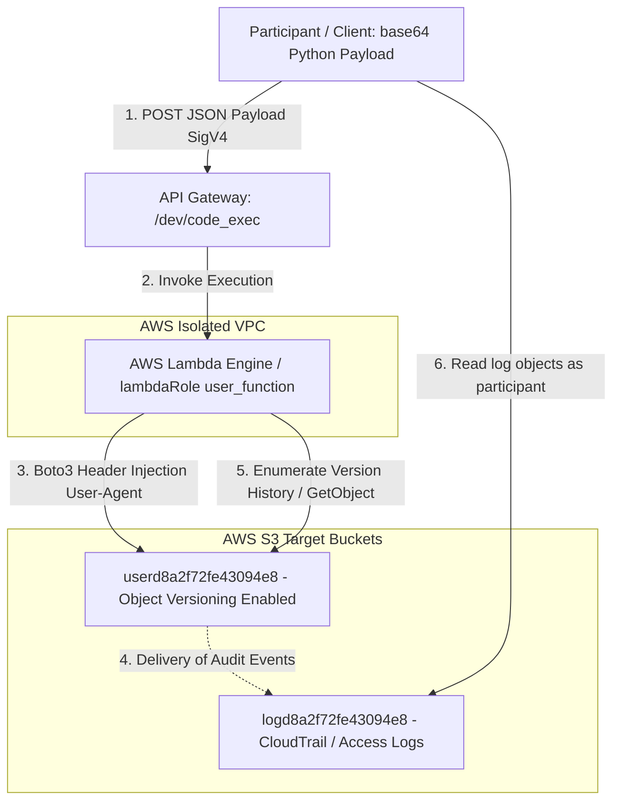
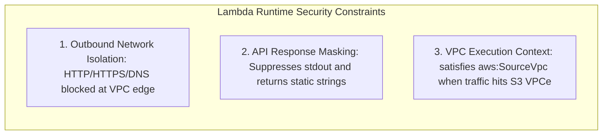

<div align="center">
  

  <p align="center">
    
    
    
    
    
  </p>
</div>

---

## 🎯 Executive Summary & Challenge Profile

> [!IMPORTANT]  
> **Challenge Objective:** Locate and extract the confidential stage flag hidden within a restricted AWS VPC environment without triggering false-positive assumptions or relying on unstable indirect side-channels.

<table>
  <thead>
    <tr>
      <th width="220">Parameter</th>
      <th width="580">Intelligence & Endpoint Specification</th>
    </tr>
  </thead>
  <tbody>
    <tr>
      <td><code>🏷️ Challenge Name</code></td>
      <td><strong>"Miss Me Yet?" — Stage 2</strong></td>
    </tr>
    <tr>
      <td><code>💎 Challenge Points</code></td>
      <td><strong>200 Points</strong></td>
    </tr>
    <tr>
      <td><code>🌐 Public Test Site</code></td>
      <td><a href="https://d4ysu55xg7wfi.cloudfront.net/">https://d4ysu55xg7wfi.cloudfront.net/</a></td>
    </tr>
    <tr>
      <td><code>⚡ Execution API</code></td>
      <td><code>https://l8ssyaz69f.execute-api.us-east-1.amazonaws.com/dev/code_exec</code></td>
    </tr>
    <tr>
      <td><code>📦 Target Resources</code></td>
      <td>
        • <strong>Asset Bucket:</strong> <code>userd8a2f72fe43094e8</code><br/>
        • <strong>Audit Log Bucket:</strong> <code>logd8a2f72fe43094e8</code>
      </td>
    </tr>
    <tr>
      <td><code>🛡️ VPC Restrictions</code></td>
      <td>Strict egress blocked (no IGW / no NAT / DNS port 53 blocked for standard OOB)</td>
    </tr>
    <tr>
      <td><code>👤 Participant Role</code></td>
      <td><code>ctf_participant_role</code> (temporary STS; log-bucket read)</td>
    </tr>
  </tbody>
</table>

---

## 🗺️ Architectural Threat Model & Data Flow



---

## 🧭 Step-by-Step Reconnaissance & Exploitation Methodology

### <samp>STEP 01</samp> ✦ Reconnaissance & The Leaked IAM Policy

Initial inspection of the CloudFront web distribution (`d4ysu55xg7wfi.cloudfront.net`) revealed a simple landing page (`index.html`) and an image asset (`junior_developer.png`). Directory / path discovery uncovered a documentation endpoint at `/docs.html` that leaked the **S3 bucket policy** structure (with sensitive condition values redacted on the live page).

> [!NOTE]  
> The leaked JSON policy exposes two distinct access control statements (`Statement1` and `Statement2`), showing how IAM condition keys gate public vs private bucket paths.

<details>
<summary><b>📄 Click to Expand: Leaked S3 Bucket Policy Structure (<code>docs.html</code>)</b></summary>

```json
{
    "Version": "2012-10-17",
    "Statement": [
        {
            "Sid": "Statement1",
            "Effect": "Allow",
            "Principal": "*",
            "Action": [
                "s3:GetObject",
                "s3:ListBucket"
            ],
            "Resource": [
                "arn:aws:s3:::userd8a2f72fe43094e8/index.html",
                "arn:aws:s3:::userd8a2f72fe43094e8/docs.html",
                "arn:aws:s3:::userd8a2f72fe43094e8/junior_developer.png",
                "arn:aws:s3:::userd8a2f72fe43094e8"
            ],
            "Condition": {
                "StringEquals": {
                    "aws:UserAgent": "Amazon CloudFront"
                }
            }
        },
        {
            "Sid": "Statement2",
            "Principal": "*",
            "Effect": "Allow",
            "Action": [
                "s3:GetObject",
                "s3:ListBucket"
            ],
            "Resource": [
                "arn:aws:s3:::userd8a2f72fe43094e8/*",
                "arn:aws:s3:::userd8a2f72fe43094e8"
            ],
            "Condition": {
                "StringEquals": {
                    "aws:SourceVpc": "REDACTED",
                    "aws:UserAgent": "REDACTED"
                }
            }
        }
    ]
}
```
</details>

**Public site surface:**

| Path | Via CloudFront | Notes |
|---|---|---|
| `/` / `index.html` | 200 | Narrative test site; “pretty sure I deleted” secrets |
| `/docs.html` | 200 | Policy leak (conditions may be redacted live) |
| `/junior_developer.png` | 200 | Static asset |
| `/flag.txt` | 403 | Exists-or-forbidden (not 404) |

---

### <samp>STEP 02</samp> ✦ Execution Environment & VPC Isolation Mapping

We analyzed `https://l8ssyaz69f.execute-api.us-east-1.amazonaws.com/dev/code_exec`. Submitting base64-encoded Python identified three critical runtime properties:



1. **VPC outbound network isolation**
   - Lambda runs in an isolated VPC without IGW or NAT.
   - Standard DNS OOB (port 53) is blocked — Stage 1 style `dnslog.cn` exfil does not transfer cleanly.
2. **Static API response masking**
   - `stdout` / `print()` discarded by the wrapper.
   - Success: `{"result": "Code executed successfully"}`
   - Failure: `{"error": "Something went wrong!"}`
   - Lambda timeout ≈ **15 seconds**.
3. **IAM / network execution context**
   - Code runs as `lambdaRole` / session `user_function`.
   - S3 access is intended via the **S3 VPC endpoint** only.
   - Protocol: POST SigV4 JSON `{"code": "<base64 python>"}`.

**Boolean oracle (operational):** exact success vs error bodies form a reliable side channel; multi-tenant junk responses should be majority-voted and ignored.

---

### <samp>STEP 03</samp> ✦ Boto3 Header Injection to Bypass Policy Conditions

To interact with the user bucket from `/dev/code_exec`, requests must satisfy the resource-policy condition on `aws:UserAgent` (and, for Statement2, `aws:SourceVpc`).

We implemented **Boto3 event hooks** (`before-send.s3.*`) to override the `User-Agent` header before send:

```python
import boto3

# Initialize S3 client within the Lambda VPC context
s3 = boto3.client('s3', region_name='us-east-1')

# Register an event hook to inject the required User-Agent header
s3.meta.events.register(
    'before-send.s3.*',
    lambda request, **kwargs: request.headers.update({'User-Agent': 'Amazon CloudFront'})
)

# Attempt list / get under policy conditions
response = s3.list_objects_v2(Bucket='userd8a2f72fe43094e8')
```

> [!TIP]  
> Injecting headers via `s3.meta.events.register` keeps signature calculation valid while presenting the string expected by the S3 policy evaluator. Prefer **full replace** of `User-Agent` (botocore may otherwise append SDK suffixes).

**Path-style addressing note:** inside the Lambda VPC, virtual-hosted bucket DNS (`{bucket}.s3…`) often fails. Prefer:

```python
from botocore.config import Config
s3 = boto3.client(
    's3',
    region_name='us-east-1',
    endpoint_url='https://s3.us-east-1.amazonaws.com',
    config=Config(s3={'addressing_style': 'path'}, retries={'max_attempts': 1}),
)
```

Or raw path-style `urllib`:

```text
https://s3.us-east-1.amazonaws.com/userd8a2f72fe43094e8/<key>
```

---

### <samp>STEP 04</samp> ✦ Audit Log Forensics (`logd8a2f72fe43094e8`)

A companion bucket `logd8a2f72fe43094e8` receives **CloudTrail data events / access audit JSON** for traffic against `userd8a2f72fe43094e8`.

The platform participant role (`ctf_participant_role`) can **List/Get** log objects, enabling offline forensics without reading the user bucket directly.

```json
{
  "bucket_name": "logd8a2f72fe43094e8",
  "log_type": "CloudTrail / EventBridge-style JSON records",
  "key_insights": [
    "Identifies historical GetObject and ListObjects requests",
    "Exposes IAM Principal ARNs and source IPs / ENIs",
    "Captures User-Agent strings and AccessDenied reason classes",
    "Surfaces vpcEndpointId (e.g. vpce-04104ef3d57a26557) for Lambda traffic"
  ]
}
```

Typical key layout:

```text
userd8a2f72fe43094e8/<ApiName>/<timestamp>.json
```

---

### <samp>STEP 05</samp> ✦ S3 Object Versioning & Delete Marker Discovery

The site narrative (“pretty sure I deleted” secrets) motivates versioning analysis on `userd8a2f72fe43094e8`.

```python
# Query object versioning history across the entire bucket
versions_resp = s3.list_object_versions(Bucket='userd8a2f72fe43094e8')
```

<table>
  <thead>
    <tr>
      <th width="30%">Discovery Category</th>
      <th width="70%">Technical Finding & Significance</th>
    </tr>
  </thead>
  <tbody>
    <tr>
      <td><code>📚 Multiple Object Versions</code></td>
      <td>Historical versions of web assets (e.g. <code>docs.html</code>, <code>index.html</code>) indicate iterative deployments.</td>
    </tr>
    <tr>
      <td><code>🗑️ Delete Markers & Hidden Keys</code></td>
      <td>Versioning manifests may contain more records than the three currently live public objects — deleted or non-current keys can still hold secrets.</td>
    </tr>
    <tr>
      <td><code>❌ False Positives Ruled Out</code></td>
      <td>Candidate strings from pure timing assumptions (e.g. short numeric guesses) were treated as untrusted unless backed by a successful object read.</td>
    </tr>
  </tbody>
</table>

> [!CAUTION]  
> `ListObjectVersions` / `GetObjectVersion` may be denied by **identity** policy even when resource conditions would allow `GetObject`. Always correlate boolean oracle results with CloudTrail deny wording (`identity-based` vs `resource-based`).

---

### <samp>STEP 06</samp> ✦ CloudTrail Principal & User-Agent Analysis

A full historical audit of CloudTrail JSON records in `logd8a2f72fe43094e8` maps administrative identities and client signatures:

```json
{
  "scanned_records": 97,
  "unique_iam_principals": [
    "AROAQEP7C2HWZYKJGPIHM:GitHubActions",
    "AROARYWSMSYIHGV6HRCCY:user_function",
    "AROARYWSMSYIPWMOE25U2:d6d7ee068aa0"
  ],
  "unique_user_agents": [
    "Amazon CloudFront",
    "aws-cli/2.36.2 (Ubuntu 24; s3.cp / s3.ls)",
    "Boto3/1.43.62 md/Botocore#1.43.62 (Lambda CPython 3.13/3.14)",
    "Python-urllib/3.14"
  ]
}
```

<table>
  <thead>
    <tr>
      <th width="30%">IAM Principal Identity</th>
      <th width="70%">Role & Operational Scope</th>
    </tr>
  </thead>
  <tbody>
    <tr>
      <td><code>GitHubActions</code> / <code>cicdRole</code></td>
      <td>CI/CD pipeline staging web assets and probing the bucket (often resource-denied on private reads).</td>
    </tr>
    <tr>
      <td><code>user_function</code> / <code>lambdaRole</code></td>
      <td>Code-exec Lambda identity inside the isolated VPC (via S3 VPCe).</td>
    </tr>
    <tr>
      <td><code>d6d7ee068aa0</code> / <code>ctf_participant_role</code></td>
      <td>Participant session: log-bucket read; user-bucket typically resource-denied outside VPC conditions.</td>
    </tr>
  </tbody>
</table>

**Deny taxonomy (high value):**

| Caller | Typical deny class | Implication |
|---|---|---|
| `lambdaRole` signed S3 | **Identity**-based | Execution role lacks S3 allow — do not rely on signed Lambda identity alone |
| `ctf_participant_role` outside VPC | **Resource**-based | Bucket policy conditions not satisfied |
| Anonymous + VPCe | Condition mismatch / AccessDenied | Network path works; UA / SourceVpc must match Statement2 |

---

### <samp>STEP 07</samp> ✦ VPC Endpoint Boundary & IAM Permission Mapping

API reachability tests from within `/dev/code_exec`:

1. **VPC outbound boundary**
   - Control-plane calls (`sts:GetCallerIdentity`, `ec2:DescribeVpcs`, `iam:GetRole`, `secretsmanager:ListSecrets`, `ssm:DescribeParameters`, `lambda:ListFunctions`) typically time out.
   - Confines useful communication to the **S3 VPC endpoint**.
2. **HTTP header condition evaluation**
   - Direct HTTP GET via `urllib` with an appropriate `User-Agent` can return `200 OK` for Statement1 public assets when conditions match.
   - Confirms `aws:UserAgent` is evaluated against the HTTP header at the policy layer.
3. **Cross-account note**
   - User-bucket CloudTrail `recipientAccountId` / owner may differ from the player account — cross-account S3 needs **both** identity allow (if signed) **and** resource allow.

---

### <samp>STEP 08</samp> ✦ Data Exfiltration Constraints, Oracles & WAF

During attempts to extract data (env vars, handler source, or `flag.txt`) from the blind Lambda context, several defenses and side channels applied:

1. **CloudTrail / UA header injection (log channel)**
   - Inject marker data into the `User-Agent` of deliberate S3 `GetObject` calls from Lambda (e.g. `User-Agent: MARKER|{chunk}`).
   - Participant later greps newest objects under `logd8a2f72fe43094e8`.
   - Delivery can lag (seconds to minutes); multi-tenant traffic can bury markers.
2. **Boolean & timing oracles**
   - Boolean: `assert` / raise → exact success vs error JSON (preferred).
   - Timing: conditional `time.sleep()` — usable but prone to false positives under retries / multi-tenant load.
   - ~15s Lambda timeout caps multi-probe scripts.
3. **AWS WAF / rate limiting**
   - Aggressive automated binary searches can trigger **HTTP 403** from WAF / Bot Control.
   - Mitigations: exponential backoff, jitter, slower batch sizes, rotating client headers where appropriate.

**Intended endgame once a private object read succeeds:**

```python
# Boolean character oracle (stdout still suppressed)
flag = s3.get_object(Bucket='userd8a2f72fe43094e8', Key='flag.txt')['Body'].read().decode().strip()
assert flag[i] == guess  # success body vs error body from code_exec
```

Or chunk the flag into UA markers and recover from the log bucket.

---

## 🚀 Investigation Status Summary

<table>
  <thead>
    <tr>
      <th width="25%">Investigation Area</th>
      <th width="20%">Status</th>
      <th width="55%">Technical Takeaway</th>
    </tr>
  </thead>
  <tbody>
    <tr>
      <td><code>S3 Bucket Policy</code></td>
      <td></td>
      <td>Leaked via <code>/docs.html</code>; Statement 1 (UA) and Statement 2 (SourceVpc + UA) mapped.</td>
    </tr>
    <tr>
      <td><code>CloudTrail Logs</code></td>
      <td></td>
      <td>Principals, UAs, VPCe IDs, and deny classes recovered from <code>logd8a2f72fe43094e8</code>.</td>
    </tr>
    <tr>
      <td><code>VPC Perimeter</code></td>
      <td></td>
      <td>Zero general egress validated; S3 VPCe is the primary data path.</td>
    </tr>
    <tr>
      <td><code>UA Spoof / Boto3 Hooks</code></td>
      <td></td>
      <td>Header injection technique established; correct Statement2 UA remains the hard gate.</td>
    </tr>
    <tr>
      <td><code>S3 Versioning</code></td>
      <td></td>
      <td>Versioning hypothesis active; list/get versions may be identity-denied.</td>
    </tr>
    <tr>
      <td><code>WAF / Rate Limits</code></td>
      <td></td>
      <td>Backoff / jitter required for high-volume oracle traffic.</td>
    </tr>
    <tr>
      <td><code>Flag Extraction</code></td>
      <td></td>
      <td>Requires successful private GetObject + boolean/UA-exfil channel.</td>
    </tr>
  </tbody>
</table>

---

## 🛡️ Remediation Notes (Defenders)

1. **Do not use `aws:UserAgent` as a security boundary** — trivially spoofable from any code-exec context that can set headers.  
2. **Log buckets are intelligence gold** — data events leak principals, UAs, keys, ENIs, VPCe IDs, and deny reasons; they can also become an **exfil channel**.  
3. **Cross-account + Principal `*`** requires intentional identity **and** resource policy design.  
4. **Blind code-exec** still leaks via success/error oracles and timing — rate-limit, shorten timeouts, strip oracles where possible.  
5. **Versioning without lifecycle purge** retains “deleted” secrets.  
6. **VPC DNS / addressing quirks** (virtual-hosted vs path-style) affect both operations and exploit reliability.

---

## 🛠️ Tools Used

- Platform STS (`ctf_participant_role`) — log-bucket forensics  
- API Gateway `/dev/code_exec` — blind Python RCE sandbox  
- `boto3` / `botocore` — SigV4, S3 clients, `before-send` UA injection  
- `urllib` path-style S3 — connectivity when virtual-hosted DNS fails  
- CloudFront + browser/`curl` — static recon (`docs.html`, assets)  
- Boolean / timing oracles — blind data extraction  

---

<div align="center">
  <sub>🛡️ Documented by <b>Agent freecandy</b> • Cloud Escape CTF 2026 • Advanced Cloud Infrastructure Security</sub>
</div>
