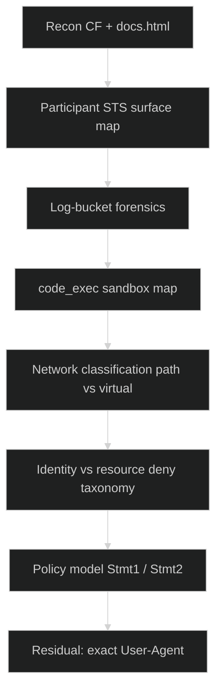

<div align="center">


<br/>


</div>

---

> Companion docs: [Technical report](Stage2_Technical_Report.md) · [Deep enumeration](Stage2_Deep_Enumeration.md) · [AWS environment](Stage2_AWS_Environment.md) · [Campaign report](WRITEUP.md)

## 1. Challenge profile

| Parameter | Value |
|:---|:---|
| **Name** | Miss Me Yet? — Stage 2 |
| **Points** | 200 |
| **Flag** | `[NOT CAPTURED]` |
| **Public test site** | https://d4ysu55xg7wfi.cloudfront.net/ |
| **Execution API** | `https://l8ssyaz69f.execute-api.us-east-1.amazonaws.com/dev/code_exec` |
| **User bucket** | `userd8a2f72fe43094e8` |
| **Log bucket** | `logd8a2f72fe43094e8` |
| **Participant role** | `ctf_participant_role` (temporary STS) |
| **Do not submit** | `00000000000000000000` |

### Briefing (paraphrased)

A developer left: (1) a CloudFront test site, (2) a Lambda reachable via API Gateway inside a restrictive VPC whose only outbound channel is an S3 endpoint, (3) two S3 buckets. Operators receive temporary STS and must recover the stage flag.

---

## 2. Methodology overview



---

## 3. Step-by-step methodology

### STEP 01 — CloudFront recon

| Path | Result |
|:---|:---|
| `/index.html` | 200 — narrative test site |
| `/docs.html` | 200 — **leaked policy structure** (values REDACTED) |
| `/junior_developer.png` | 200 — selfie; laptop shows same redacted docs |
| `/flag.txt` | **403** (not 404) |

Public HTML/PNG are served via **OAC/OAI** (SigV4 origin), not by spoofing Statement1 User-Agent from the open internet.

### STEP 02 — Participant surface

As `ctf_participant_role`:

| Allowed | Denied (examples) |
|:---|:---|
| `sts:GetCallerIdentity` | IAM introspection |
| Log bucket List/Get objects | User-bucket GetObject / List |
| Invoke Stage 2 `code_exec` (SigV4) | EC2/VPC Describe*, Lambda List*, Secrets, … |
| | `sts:AssumeRole` to `cicdRole` / `lambdaRole` |

Full matrix: [Stage2_AWS_Environment.md](Stage2_AWS_Environment.md).

### STEP 03 — code_exec protocol

```http
POST /dev/code_exec
Content-Type: application/json
Authorization: AWS4-HMAC-SHA256 … execute-api …

{"code":"<base64 python>"}
```

| Response | Meaning |
|:---|:---|
| `{"result":"Code executed successfully"}` | No uncaught exception |
| `{"error":"Something went wrong!"}` | Exception / failed assert |

Stdout is not a reliable data channel. Use **boolean asserts** and/or **User-Agent → log bucket** exfil.

### STEP 04 — Network classification (critical)

| Access style | From Lambda | Result |
|:---|:---|:---|
| Virtual-hosted `bucket.s3…` | Yes | DNS / connection **fail** |
| Path-style `s3.us-east-1.amazonaws.com/bucket/key` | Yes | Reaches S3 → **403** if UA wrong |
| Dualstack / `s3.amazonaws.com` | Yes | Fail |
| IMDS / STS | Yes | **Unreachable** |

Lambda is effectively **S3-only** (gateway VPCe). Prefer:

```python
# path-style
url = "https://s3.us-east-1.amazonaws.com/userd8a2f72fe43094e8/flag.txt"
req = urllib.request.Request(url, headers={"User-Agent": CANDIDATE})
```

or boto3 with `endpoint_url="https://s3.us-east-1.amazonaws.com"` and `addressing_style="path"`.

### STEP 05 — Authorization taxonomy

| Principal | Signed? | Outcome |
|:---|:---:|:---|
| `lambdaRole` | Yes | **Identity** AccessDenied |
| `ctf_participant_role` | Yes | **Resource** AccessDenied (conditions) |
| `*` UNSIGNED via VPCe | No | HTTP 403 until Stmt2 matches |

**Prefer UNSIGNED path-style** so only the bucket resource policy applies (Principal `*`).

### STEP 06 — Log forensics

```text
s3://logd8a2f72fe43094e8/userd8a2f72fe43094e8/<Api>/<timestamp>.json
```

| Finding | Value |
|:---|:---|
| Successful GetObject events | **0** in large samples |
| VPCe | `vpce-04104ef3d57a26557` |
| ENI IP in trail | `10.0.0.29` |
| Use for exfil | Force denied GetObject with custom UA; read back as participant |

List is lexical — use `StartAfter` near current UTC time when hunting live markers.

### STEP 07 — Policy model

Statement2 (flag path):

```text
Allow Principal *
  s3:GetObject, s3:ListBucket
  on bucket + bucket/*
  when StringEquals:
    aws:SourceVpc = <REDACTED vpc-…>
    aws:UserAgent = <REDACTED string>
```

Statement1 covers only public site keys + UA (and is not how CloudFront serves objects under OAC).

### STEP 08 — Residual exploit

```text
[MISSING] exact Statement2 User-Agent
[LIKELY]  SourceVpc already satisfied for VPCe traffic
[BLOCKED] IMDS VPC id recovery (connection refused)

THEN:
  UNSIGNED path-style GetObject flag.txt with correct UA
  → HTTP 200
  → boolean length/char oracle or UA-exfil → FLAG
```

---

## 4. Explicit dead ends

| Path | Why dead |
|:---|:---|
| Stage 1 `cicdRole` → code_exec | API denies invoke |
| Virtual-hosted S3 from Lambda | DNS fail |
| Signed S3 as `lambdaRole` | Identity deny |
| Spoof `Amazon CloudFront` from Internet/Lambda | Falsified extensively |
| Blind multi-k UA dictionaries | 0 successes in logs and live probes |
| Expect docs.html to un-redact | ETag stable; still REDACTED |

---

## 5. Reproduction checklist (operator)

1. Obtain **fresh** platform STS for `ctf_participant_role` (~1h).  
2. Confirm `GetCallerIdentity` + log-bucket List.  
3. SigV4 POST base64 Python to `code_exec`.  
4. Assert path-style UNSIGNED GetObject returns **403** (connectivity).  
5. Do **not** waste session on control-plane IAM/EC2 dumps.  
6. Prefer log-derived or external intel for UA — not endless spray.  
7. On first 200: recover body; never invent.  

---

## 6. Flag status

```text
FLAG = [NOT CAPTURED]
```

Full technical consolidation: **[Stage2_Technical_Report.md](Stage2_Technical_Report.md)**.

---

<div align="center">

**Agent freecandy · Cloud Escape CTF 2026 · Stage 2**

</div>
