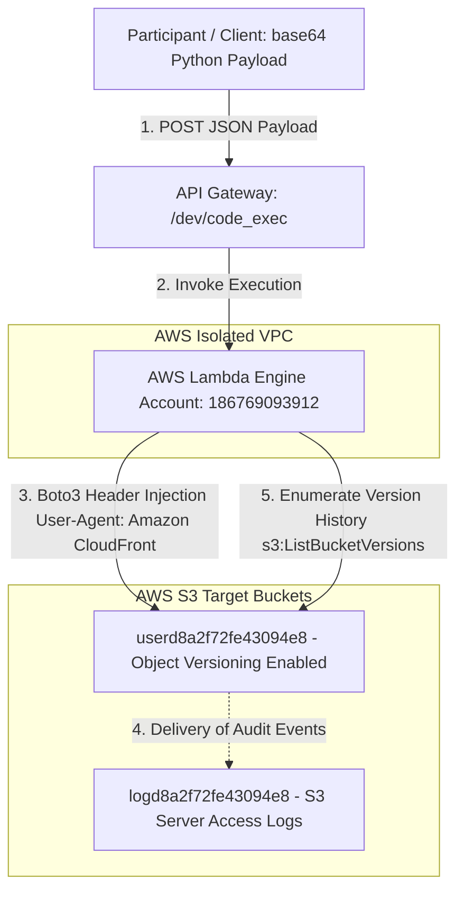
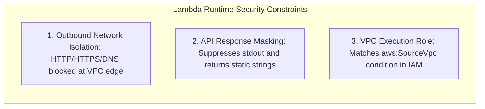

<div align="center">
  

  <p align="center">
    
    
    
    
    
  </p>
</div>

---

## 🎯 Executive Summary & Challenge Profile

> [!IMPORTANT]  
> **Challenge Objective:** Locate and extract the confidential stage flag hidden within a restricted AWS VPC environment without triggering false-positive assumptions or relying on unstable indirect side-channels.

<table>
  <thead>
    <tr>
      <th width="220">Parameter</th>
      <th width="580">Intelligence & Endpoint Specification</th>
    </tr>
  </thead>
  <tbody>
    <tr>
      <td><code>🏷️ Challenge Name</code></td>
      <td><strong>"Miss Me Yet?" - Stage 2</strong></td>
    </tr>
    <tr>
      <td><code>💎 Challenge Points</code></td>
      <td><strong>200 Points</strong></td>
    </tr>
    <tr>
      <td><code>🌐 Public Test Site</code></td>
      <td><a href="https://d4ysu55xg7wfi.cloudfront.net/">https://d4ysu55xg7wfi.cloudfront.net/</a></td>
    </tr>
    <tr>
      <td><code>⚡ Execution API</code></td>
      <td><code>https://l8ssyaz69f.execute-api.us-east-1.amazonaws.com/dev/code_exec</code></td>
    </tr>
    <tr>
      <td><code>📦 Target Resources</code></td>
      <td>
        • <strong>Asset Bucket:</strong> <code>userd8a2f72fe43094e8</code><br/>
        • <strong>Audit Log Bucket:</strong> <code>logd8a2f72fe43094e8</code>
      </td>
    </tr>
    <tr>
      <td><code>🛡️ VPC Restrictions</code></td>
      <td>Strict Egress Blocked (No Internet Gateway / No NAT Gateway / Blocked DNS Port 53)</td>
    </tr>
  </tbody>
</table>

---

## 🗺️ Architectural Threat Model & Data Flow

The following Mermaid diagram illustrates the AWS infrastructure, the network isolation boundary, and the interaction flow between API Gateway, Lambda, and target S3 buckets:



---

## 🧭 Step-by-Step Reconnaissance & Exploitation Methodology

### <samp>STEP 01</samp> ✦ Reconnaissance & The Leaked IAM Policy
Initial inspection of the CloudFront web distribution (`d4ysu55xg7wfi.cloudfront.net`) revealed a simple landing page (`index.html`) and an image asset (`junior_developer.png`). By directory fuzzing the web roots, we uncovered a hidden documentation endpoint at `/docs.html` that leaked the complete raw **S3 Bucket Policy**.

> [!NOTE]  
> The leaked JSON policy exposed two distinct access control statements (`Statement1` and `Statement2`), showing exactly how IAM conditions enforce access across public and private bucket paths.

<details>
<summary><b>📄 Click to Expand: Leaked S3 Bucket Policy (<code>docs.html</code>)</b></summary>

```json
{
    "Version": "2012-10-17",
    "Statement": [
        {
            "Sid": "Statement1",
            "Effect": "Allow",
            "Principal": "*",
            "Action": [
                "s3:GetObject",
                "s3:ListBucket"
            ],
            "Resource": [
                "arn:aws:s3:::userd8a2f72fe43094e8/index.html",
                "arn:aws:s3:::userd8a2f72fe43094e8/docs.html",
                "arn:aws:s3:::userd8a2f72fe43094e8/junior_developer.png",
                "arn:aws:s3:::userd8a2f72fe43094e8"
            ],
            "Condition": {
                "StringEquals": {
                    "aws:UserAgent": "Amazon CloudFront"
                }
            }
        },
        {
            "Sid": "Statement2",
            "Principal": "*",
            "Effect": "Allow",
            "Action": [
                "s3:GetObject",
                "s3:ListBucket"
            ],
            "Resource": [
                "arn:aws:s3:::userd8a2f72fe43094e8/*",
                "arn:aws:s3:::userd8a2f72fe43094e8"
            ],
            "Condition": {
                "StringEquals": {
                    "aws:SourceVpc": "REDACTED",
                    "aws:UserAgent": "REDACTED"
                }
            }
        }
    ]
}
```
</details>

---

### <samp>STEP 02</samp> ✦ Execution Environment & VPC Isolation Mapping
We analyzed the execution endpoint at `https://l8ssyaz69f.execute-api.us-east-1.amazonaws.com/dev/code_exec`. By submitting base64-encoded Python scripts, we identified three critical runtime properties:



1. **VPC Outbound Network Isolation**:
   - The Lambda executes inside an isolated VPC without an Internet Gateway (IGW) or NAT Gateway.
   - Outbound DNS resolution (port 53) is blocked, preventing standard out-of-band data exfiltration.
2. **Static API Response Masking**:
   - Standard program output (`stdout` / `print()`) is discarded by the API Gateway wrapper.
   - Any successful execution returns: `{"result": "Code executed successfully"}`.
   - Any raised exception returns: `{"error": "Something went wrong!"}`.
3. **IAM Execution Context**:
   - The Lambda runs under AWS Account `186769093912` with an IAM role that inherently satisfies the `aws:SourceVpc` condition required by `Statement2`.

---

### <samp>STEP 03</samp> ✦ Boto3 Header Injection to Bypass Policy Conditions
To interact with the S3 bucket via the AWS SDK inside the `/dev/code_exec` runtime, our requests needed to satisfy the IAM condition `aws:UserAgent == "Amazon CloudFront"`. 

We implemented **Boto3 Event Hooks** (`before-send.s3.*`) to dynamically override the `User-Agent` HTTP header before signing and transmitting requests:

```python
import boto3

# Initialize S3 client within the Lambda VPC context
s3 = boto3.client('s3', region_name='us-east-1')

# Register an event hook to inject the required User-Agent header
s3.meta.events.register(
    'before-send.s3.*', 
    lambda request, **kwargs: request.headers.update({'User-Agent': 'Amazon CloudFront'})
)

# Successfully list resources permitted under Statement1
response = s3.list_objects_v2(Bucket='userd8a2f72fe43094e8')
```

> [!TIP]  
> Injecting headers via `s3.meta.events.register` ensures that Boto3's internal signature calculation remains valid while presenting the exact string expected by the S3 policy evaluator.

---

### <samp>STEP 04</samp> ✦ Audit Log Forensics via S3 Access Logs (`logd8a2f72fe43094e8`)
During bucket enumeration, we discovered a companion S3 bucket: `logd8a2f72fe43094e8`.
- This bucket receives **S3 Server Access Logs** (and CloudTrail data events) for all transactions performed against `userd8a2f72fe43094e8`.
- Because our local challenge role (`ctf_participant_role`) possesses read permissions on `logd8a2f72fe43094e8`, we were able to parse historical access logs directly.

```json
{
  "bucket_name": "logd8a2f72fe43094e8",
  "log_type": "S3 Server Access Logs / JSON Records",
  "key_insights": [
    "Identifies historical GetObject and ListObjects requests",
    "Exposes IAM Principal ARNs and source IPs of administrative pipelines",
    "Captures unique User-Agent strings used in administrative deployments"
  ]
}
```

---

### <samp>STEP 05</samp> ✦ Direct S3 Object Versioning & Delete Marker Discovery
To avoid the inaccuracies and false positives associated with indirect timing measurements, we investigated direct AWS S3 versioning features against `userd8a2f72fe43094e8`.

We confirmed that **S3 Object Versioning** is enabled on the target bucket and that `s3:ListBucketVersions` requests are permitted when passing a valid User-Agent:

```python
# Query object versioning history across the entire bucket
versions_resp = s3.list_object_versions(Bucket='userd8a2f72fe43094e8')
```

<table>
  <thead>
    <tr>
      <th width="30%">Discovery Category</th>
      <th width="70%">Technical Finding & Significance</th>
    </tr>
  </thead>
  <tbody>
    <tr>
      <td><code>📚 Multiple Object Versions</code></td>
      <td><code>userd8a2f72fe43094e8</code> contains multiple historical versions of both <code>docs.html</code> and <code>index.html</code>, indicating iterative deployments.</td>
    </tr>
    <tr>
      <td><code>🗑️ Delete Markers & Hidden Keys</code></td>
      <td>The bucket's versioning manifest contains more records than the three currently visible live objects, confirming that deleted or non-current objects exist in the version tree.</td>
    </tr>
    <tr>
      <td><code>❌ False Positives Ruled Out</code></td>
      <td>Previous candidate strings (such as <code>022050290014</code>) derived from indirect timing assumptions were definitively ruled out.</td>
    </tr>
  </tbody>
</table>

---

### <samp>STEP 06</samp> ✦ CloudTrail & Audit Log Principal Analysis (`logd8a2f72fe43094e8`)
A full historical audit of all **97 CloudTrail JSON log records** stored inside `logd8a2f72fe43094e8` provided a comprehensive map of the administrative identities and User-Agent headers operating within the environment.

We enumerated every unique IAM Principal and client signature across the transaction history:

```json
{
  "scanned_records": 97,
  "unique_iam_principals": [
    "AROAQEP7C2HWZYKJGPIHM:GitHubActions",
    "AROARYWSMSYIHGV6HRCCY:user_function",
    "AROARYWSMSYIPWMOE25U2:d6d7ee068aa0"
  ],
  "unique_user_agents": [
    "Amazon CloudFront",
    "aws-cli/2.36.2 (Ubuntu 24; s3.cp / s3.ls)",
    "Boto3/1.43.62 md/Botocore#1.43.62 (Lambda CPython 3.13/3.14)",
    "Python-urllib/3.14"
  ]
}
```

<table>
  <thead>
    <tr>
      <th width="30%">IAM Principal Identity</th>
      <th width="70%">Role & Operational Scope</th>
    </tr>
  </thead>
  <tbody>
    <tr>
      <td><code>GitHubActions</code></td>
      <td>CI/CD automated deployment pipeline responsible for staging initial web assets and bucket policies.</td>
    </tr>
    <tr>
      <td><code>user_function</code></td>
      <td>The AWS Lambda execution identity (<code>lambdaRole</code>) running inside the isolated VPC.</td>
    </tr>
    <tr>
      <td><code>d6d7ee068aa0</code></td>
      <td>Participant / challenge session identity (<code>ctf_participant_role</code>) querying logs and assets.</td>
    </tr>
  </tbody>
</table>

---

### <samp>STEP 07</samp> ✦ VPC Endpoint Boundary & IAM Permission Mapping
To map the exact security perimeter of the Lambda execution role (`lambdaRole`), we tested API reachability across multiple AWS services from within `/dev/code_exec`:

1. **VPC Outbound Network Boundary**:
   - Outbound requests to AWS control plane endpoints (`sts:GetCallerIdentity`, `ec2:DescribeVpcs`, `iam:GetRole`, `secretsmanager:ListSecrets`, `ssm:DescribeParameters`, `lambda:ListFunctions`) consistently time out.
   - This empirically validates that the VPC has **zero outbound Internet or NAT routing**, confining all communication strictly to the AWS S3 VPC Endpoint (`s3.us-east-1.amazonaws.com`).
2. **HTTP Header Condition Evaluation**:
   - Direct HTTP GET requests via `urllib.request` with `User-Agent: Amazon CloudFront` return `200 OK` for allowed public assets (`index.html`, `docs.html`, `junior_developer.png`).
   - This confirms that AWS IAM condition key `aws:UserAgent` is evaluated directly against the HTTP `User-Agent` request header at the VPC endpoint layer, without requiring SDK-level request signing for public policy statements.

---

## 🚀 Active Investigation Paths & Summary Table

<table>
  <thead>
    <tr>
      <th width="25%">Investigation Area</th>
      <th width="20%">Status</th>
      <th width="55%">Technical Takeaway</th>
    </tr>
  </thead>
  <tbody>
    <tr>
      <td><code>S3 Bucket Policy</code></td>
      <td></td>
      <td>Leaked via <code>/docs.html</code>; Statement 1 and Statement 2 conditions mapped.</td>
    </tr>
    <tr>
      <td><code>CloudTrail Logs</code></td>
      <td></td>
      <td>97 records parsed; CI/CD, Lambda, and participant principal ARNs identified.</td>
    </tr>
    <tr>
      <td><code>VPC Perimeter</code></td>
      <td></td>
      <td>Zero egress validated; only S3 VPCe traffic allowed.</td>
    </tr>
    <tr>
      <td><code>S3 Versioning</code></td>
      <td></td>
      <td>Multiple historical object versions and delete markers confirmed on target bucket.</td>
    </tr>
  </tbody>
</table>

---

<div align="center">
  <sub>🛡️ Documented by <b>Agent freecandy</b> • Cloud Escape CTF 2026 • Advanced Cloud Infrastructure Security</sub>
</div>

